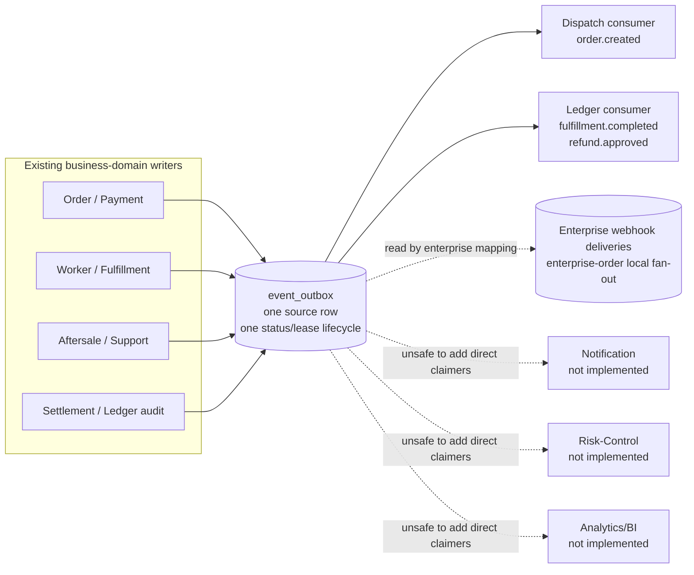
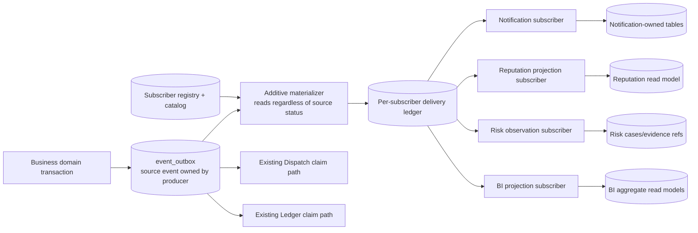

# Phase 26 — XLB Platform Foundation

> Status: **ACCEPTED — DESIGN ONLY**. Human acceptance covers the Phase26 architecture design and D2/E2/F2 PASS reviews only. Phase 26 has not implemented or authorized any runtime, migration, route, API client, page, realtime transport, subscription, or Provider.

## 1. Purpose and factual baseline

Phase 26 defines the platform boundary required before Notification, Review/Reputation, Marketing, Risk-Control, and Analytics/BI can be implemented. It is based on locked Phase 25 `main` and the actual repository, not on a target blueprint.

Verified facts:

- `event_outbox` is a city-scoped, leased work-claim queue with one mutable status/lease/attempt/dead-letter lifecycle per source row.
- Dispatch claims `order.created`; Ledger claims `fulfillment.completed` and `refund.approved`. A successful consumer changes the source row to `published`.
- That lifecycle is not a multi-subscriber fan-out contract. A second independent consumer cannot acknowledge the same source row without stealing or overwriting the first consumer's progress.
- Enterprise Webhook has its own `business_webhook_subscriptions` and `business_webhook_deliveries`, but it is enterprise-order scoped and is only a local design reference, not the platform event backbone.
- Review already owns the real `order_reviews` writer and one-review-per-city/order invariant. No `review.created` source event exists.
- `Campaign` is a Phase 25 visual/theme/banner consumption contract. There is no Marketing/Coupon runtime.
- Pricing owns city/SKU base-price facts; Order owns the final quote snapshot and total; Payment copies the order total into payment facts.
- Security rate limiting, settlement governance risk flags, Compliance qualification, Audit placeholders, and operational metrics are not a general Risk-Control domain.
- Prometheus HTTP metrics intentionally expose only bounded `method`, `route`, and `status` labels. They are not BI storage.
- OA and Dashboard remain Phase 0 placeholders with no `src` runtime or approved data/product contract.
- No SMS, Push, WeChat, or Email Provider exists. Unconfigured channels must remain truthfully unavailable/not-configured.

## 2. Current truthful architecture

The dotted paths to Notification, Risk-Control, and Analytics/BI are architectural gaps, not implemented integrations.

## 3. Target boundary after a future approved implementation

The accepted target should add a platform-owned delivery control plane without changing the ownership of source events or protected business data.

The platform layer owns subscriber registration, candidate-scan checkpoints, retained-source anti-join reconciliation, delivery state, attempts, replay audit, and operational retention. A checkpoint is only a scan optimization, never completeness proof. The platform never owns or rewrites the business event payload, domain state machine, order amount, payment status, worker profile, ledger, settlement, or support ticket.

## 4. Five-domain scope

| Domain | Owns in its future phase | Does not own |
| --- | --- | --- |
| Notification | In-app notification records, templates, preference policy, read state, channel intent and delivery audit | Source business facts, Support conversation, external Provider success without a configured Provider |
| Review/Reputation | Existing Review remains the only review writer; Reputation is a derived aggregate/read model; future moderation/reply/appeal/visibility records | Worker profile truth, dispatch eligibility, a second rating/review table |
| Marketing | Business campaign/coupon definition, grant, eligibility, reservation/redemption and a quote-validated discount decision | Phase 25 visual Campaign semantics, including non-authoritative `Campaign.discountRuleId`; Pricing base price; Order total/payment/quote-snapshot writes |
| Risk-Control | Business-risk observation, immutable signals, cases, evidence references, manual review and handoff | Security controls, generic audit trail, certification, Support ticket state, automatic punishment or money movement |
| Analytics/BI | Governed metric definitions and city/role-scoped aggregate read models | Prometheus storage, business-domain writes, raw cross-domain PII lake, fake realtime Dashboard data |

## 5. Existing-domain boundary

| Existing domain | Canonical writer ownership | Allowed platform integration | Forbidden platform/five-domain write |
| --- | --- | --- | --- |
| Order | `orders`, `order_price_snapshots`, order lifecycle | Publish/consume approved minimal events; read approved snapshots | Direct status, total, quote snapshot, address or contact mutation |
| Payment | `payment_orders`, payment facts | Publish minimal payment events; risk may create a manual-review reference | Provider execution, payment status/amount mutation |
| Pricing | City/SKU rules, fee items, service standards | Marketing submits a discount decision to an approved quote orchestration boundary | Base-price/rule/fee mutation by Marketing |
| Worker | Worker profile, availability and worker-owned operational facts | Reputation read model may be displayed beside Worker data | Reputation/Risk/BI direct profile, penalty or availability mutation |
| Dispatch | Tasks, offers, ranking/reassignment state | Existing `order.created` claim path remains isolated | Subscriber failure changing Dispatch state or eligibility |
| Fulfillment | Fulfillment lifecycle and evidence references | Minimal events to approved subscribers | Reputation/Notification/Risk direct fulfillment mutation |
| Ledger | Ledger entries/accrual/reversal and replay proof | Existing typed consumer remains isolated; read-only BI aggregates after approval | Any five-domain ledger entry or accrual mutation |
| Settlement/governance | Settlement facts and settlement-specific review packets | Read-only evidence references | General Risk-Control reuse of settlement tables or flags |
| Support | Tickets, routing, conversations, KB, CSAT and quality | Notification or Risk receives approved minimal events; handoff creates Support-owned ticket through its API | Risk/Notification direct ticket, assignment, SLA or conversation mutation |
| Security | Authentication-adjacent technical controls and route rate limits | Emits technical security evidence after a future contract | Business-risk case ownership |
| Audit | Cross-cutting append-only evidence contract; current generic module is still a placeholder | Receive audit records through approved audit API/event | Business workflow decisions or corrective writes |
| Compliance | Certification, qualification and dispatch eligibility | Risk may reference a compliance decision | Risk direct certification or eligibility mutation |
| Observability | Low-cardinality operational metrics, logs and traces | Delivery health metrics with bounded labels | BI facts or city/user/order labels |
| Providers | Truthful local/mock object storage and deterministic/mock Support NLU; enterprise Webhook has separate provider envelope | Future channels only through separately approved truthful envelopes | Claiming SMS/Push/WeChat/Email success while absent |

## 6. Writer-owner and cross-domain write matrix

Legend: `W` canonical writer; `P` proposed future canonical writer; `R` scoped read/reference only; `E` event-only; `—` forbidden.

| Data target | Order/Payment/Pricing | Worker/Dispatch/Fulfillment | Support | Notification | Review/Reputation | Marketing | Risk-Control | Analytics/BI | Platform delivery |
| --- | ---: | ---: | ---: | ---: | ---: | ---: | ---: | ---: | ---: |
| Order/payment/quote facts | W | R | R | E | E | E | E | R | E |
| Pricing base rules | W | R | R | — | — | — | — | R | — |
| Worker profile/eligibility | R | W | R | E | R | E | E | R | E |
| Dispatch/fulfillment state | R | W | R | E | E | E | E | R | E |
| Support ticket/conversation | R | R | W | E | E | E | E | R | E |
| Notification records/read state | — | — | — | P | — | — | — | R | E |
| Order review | — | — | — | E | W | — | E | R | E |
| Reputation projection | — | R | — | E | P | — | E | R | E |
| Coupon/discount decision | R | — | — | E | — | P | E | R | E |
| Risk signal/case | E | E | E | E | E | E | P | R | E |
| BI aggregate read model | E | E | E | — | E | E | E | P | E |
| Subscriber/delivery/attempt/replay audit | — | — | — | R | R | R | R | R | P |
| Ledger/settlement facts | W | — | R | — | — | — | — | R | E |

`E` permits producing or consuming an approved event; it never grants table-write authority.

## 7. Common platform rules

### 7.1 City and tenant scope

- Every platform business row carries a real `city_code`; `__global__` is an admin permission marker, never a business-row city.
- Request paths follow `RequestContext → CityCode → Contract → Guard`.
- Admin/operator/auditor access requires an explicit requested city and `admin_city_scopes`; cross-city reads and writes fail closed.
- Foreign keys between city-scoped tables use matching composite city keys. A globally defined template or metric definition must be explicitly classified as control-plane metadata and may not contain city business data.

### 7.2 Actor and role scope

- Current roles are customer, worker, admin, operator, and auditor; app types also include readiness-only OA and Dashboard.
- Customer/worker reads are self/ownership scoped. Admin/operator mutations are city scoped and audited. Auditor is read-only unless a later contract explicitly says otherwise.
- Service subscribers use a registered non-human `subscriber_id`; that identity does not inherit admin permissions.

### 7.3 Data and PII classification

| Level | Meaning | Event rule |
| --- | --- | --- |
| P0 | Public/non-personal taxonomy or bounded operational fact | May be included when necessary |
| P1 | Pseudonymous IDs and ordinary business metadata | Internal subscribers only; city and purpose scoped |
| P2 | Contact details, free text, precise location, Support/review content, evidence metadata | Exclude by default; subscriber needs explicit allowlist and audit |
| P3 | Secrets, credentials, tokens, payment-provider identifiers, sensitive finance/evidence bytes | Never place in general platform delivery payload; use protected source lookup if explicitly authorized |

Payloads contain references and decision facts, not raw addresses, phone numbers, message bodies, evidence bytes, secrets, or unrestricted JSON snapshots. Subscriber access is deny-by-default by event type, version, city, purpose, and maximum PII level.

### 7.4 Retention, deletion, and legal hold

- Source-event retention belongs to the Producer and Privacy owner. Before any subscription is activated, they must approve that retention covers candidate materialization, anti-join reconciliation, commit-skew/long-transaction overlap and incident recovery.
- Platform delivery must not silently or unilaterally extend source PII retention. If the approved source horizon is insufficient, activation is rejected or requires a separately approved minimum-data tombstone/redaction and reconciliation contract.
- Delivery attempts keep sanitized error code/message only. Provider bodies, credentials, and raw PII do not enter the platform ledger.
- User-facing deletion/hiding is executed only by the canonical domain. Derived projections receive a tombstone/visibility event or approved reconciliation job; they never delete source facts.
- Purge is blocked by a non-terminal source work claim; any eligible Enterprise Webhook event not yet materialized or with non-terminal delivery; any missing/non-terminal platform delivery; unresolved source/enterprise/platform DLQ; active replay; reconciliation gap; legal hold; or FK dependency.
- Cleanup order is attempts → terminal Enterprise/platform deliveries → source event → independently retained audit. Source and delivery FKs use `ON DELETE RESTRICT/NO ACTION`; audit must never use cascade deletion and retains copied identifiers/hash through a non-destructive or nullable linkage.
- Legal hold, regulatory minimums, exact durations, redaction fields, tombstone form, unresolved-DLQ disposition and physical-deletion policy are human decisions. Until accepted, no automated destructive purge is authorized.

### 7.5 Audit and idempotency

- Every mutation records actor/service identity, city, reason/action, trace/correlation ID where available, source event ID, version, and timestamp.
- Delivery is at-least-once. Each consumer needs a durable inbox or target unique key containing `subscriber_id + event_id`; process-memory deduplication is forbidden.
- Business commands also retain their domain idempotency key and optimistic version/CAS. Event deduplication does not replace business concurrency control.

Materialization correctness is also idempotent: active subscriptions are exact `(city_code,subscriber_id,event_type,event_major_version)` allowlist rows, and retained source events are periodically anti-joined to deliveries to insert every missing `(subscriber_id,event_id)`. `created_at,event_id` checkpoints only accelerate scans because `created_at` is not a commit sequence and long transactions can commit behind a cursor.

### 7.6 Ordering and concurrency

- The only future ordering promise is within `city_code + aggregate_type + aggregate_id + aggregate_version/sequence`.
- There is no cross-city, cross-aggregate, or platform-global order.
- Existing implicit-v0 events without aggregate sequence have no business-order guarantee. `(created_at,event_id)` is neither a global order nor completeness boundary; new projections reconcile from retained source truth.
- Subscriber leases use token/owner CAS, expiry, bounded renewal, retry, reaper, and dead letter independently per subscriber.

### 7.7 Rollback

- All later migrations are append-only after locked `053`; Phase 26 creates none.
- Rollback disables a subscriber/materializer first, drains or freezes new deliveries, preserves audit rows, and reverts reads to the previous authoritative path.
- No rollback rewrites source `event_outbox`, Dispatch, Ledger, Order, Payment, Pricing, Worker, Support, or historical migrations.
- Backfills and replays are bounded by city/type/exact major version/time/event IDs, dry-run counted and human-approved. Ordinary replay reuses the canonical `(subscriber_id,event_id)` delivery/idempotency boundary; a projection rebuild uses a separately approved subscriber/target generation and is reversible by changing the derived read pointer rather than deleting source facts.

## 8. Phase 26 gates

| Gate | Required evidence | Exit condition |
| --- | --- | --- |
| G0 — Baseline and scope | Clean Session Sync; Phase 25 lock/tag; factual source inventory; five-file allowlist | **PASS** — baseline recorded with no runtime write |
| G1 — Delivery ADR | Three options compared; additive MySQL per-subscriber ledger selected; source `published` semantics preserved | **PASS** — Option A accepted for Phase26 design |
| G2 — Event catalog | Existing/future events, producer, implicit/explicit version, PII, aggregate, ordering, city, subscribers, retention and idempotency | **PASS WITH APPROVED DEFERRED DECISIONS** — exact retention/redaction and initial allowlists move to affected implementation entry Gates |
| G3 — Domain ownership | Five domain chapters, writer matrix, protected-domain zero-write rules, Phase 27–31 entry/exit gates | **PASS WITH APPROVED DEFERRED DECISIONS** — Notification, Marketing, Risk and BI product rules move to their owning Phase entry Gates |
| G4 — Privacy/operations | PII access, retention, audit, DLQ, replay, Provider truthfulness and rollback decisions | **PASS WITH APPROVED DEFERRED DECISIONS** — exact retention, legal hold, redaction and activation policy require owner confirmation before use |
| G5 — Migration/compatibility | Field-level `054+` design ledger, indexes, composite city FKs, unique keys, backfill, dual-read and rollback; no SQL | **PASS (design review)** — D2/E2/F2 focused review accepted; no migration or numbering is authorized |
| G6 — Test and human acceptance | G1–G5 signed off or covered by explicit itemized human-approved deferral; design test matrix recorded | **PASS — DESIGN ONLY** — G1–G5 are signed off or have the approved deferrals below |

The human accepted D2/E2/F2 as PASS, accepted G1 and the G5 design review, and accepted G2/G3/G4 with the following itemized deferrals: exact retention/legal-hold/PII-redaction policy; initial subscriber allowlists; Notification rules at Phase 27 entry; Marketing rules at Phase 29 entry; Risk-Control rules at Phase 30 entry; and Analytics/BI rules at Phase 31 entry. Producer/Privacy/Legal/Operations own lifecycle decisions; Producer/Privacy plus each subscriber domain own allowlists; the named product/domain owners own their Phase rules.

Deferral is not authorization. No affected subscription or Provider may be activated before its exact retention, legal-hold, redaction, allowlist and product prerequisites are independently confirmed. Every Phase 27–31 entry rechecks its relevant deferrals. A material change to the ADR, event catalog or migration ledger automatically reopens the affected G2 and/or G5 review plus every impacted row of the test matrix. Phase 27 runtime remains blocked despite G6 design acceptance.

## 9. Explicit non-authorization

This document does not authorize:

- `backend/src/notification`, rating/reputation, marketing, risk-control, analytics/BI, or any other runtime module;
- migration `054` or later, SQL, schema mutation, backfill, replay, or data write;
- TypeScript union changes, contracts in code, routes, API clients, app/OA/Dashboard pages, or realtime transport;
- SMS, Push, WeChat, Email, payment, map, object-storage, or any other real Provider;
- modification of `event_outbox`, Dispatch, Ledger, existing domain semantics, `CURRENT_STATE`, phase registry, tags, or historical evidence.

The output is an accepted Phase26 design only. It authorizes neither implementation nor production readiness. After an independent design-document submission, only Phase27 read-only discovery and entry design may begin; runtime construction still requires a new explicit authorization.
