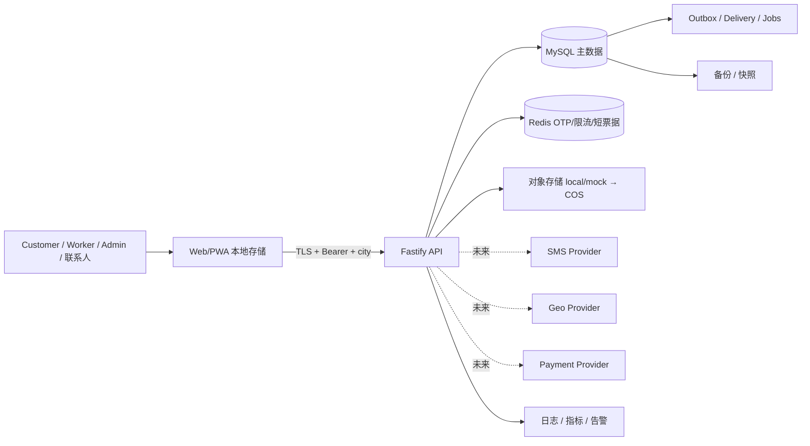

# XLB 个人信息与重要数据清单

状态：**UNIT C LOCKED — 工程盘点基线，不是生产保留/删除授权**

盘点日期：2026-07-19

覆盖范围：Customer、Worker、Admin、Enterprise、Fastify API、MySQL、Redis、对象存储、Outbox/Jobs、浏览器存储及计划中的外部 Provider。

## 1. 使用规则

本清单记录仓库当前事实。它不表示所有字段都已获得合法处理依据，也不授权自动删除、跨境提供或公开披露。正式运营前必须由业务、隐私、法务、安全和运营负责人补齐每行的最终目的、必要性、保留期限、接收方和数据主体权利处理方式。

敏感等级：

- `P0`：公开或聚合信息，不直接识别自然人；
- `P1`：一般个人信息或稳定主体标识；
- `P2`：敏感个人信息、精确位置、金融账户、身份认证凭据、私密通信或能显著影响权益的信息；
- `S`：Secret/凭据，不属于普通业务数据，泄露可直接导致账户或系统失陷。

## 2. 数据主体与系统

| 主体 | 当前标识 | 主要系统 |
|---|---|---|
| Customer | `customers.id`、手机号 | Customer Web/PWA、订单、售后、客服、评价、营销 |
| Worker | `worker_profiles.worker_id`、手机号哈希 | Worker Web/PWA、认证、位置、履约、收款账户、评价申诉 |
| Admin/Operator/Auditor | `admin_users.id`、用户名 | Admin、内部管理 API、安全审计日志 |
| Enterprise 联系人 | `business_client_contacts.contact_id` | Enterprise OpenAPI、合同价格、Webhook |
| 订单联系人/服务对象 | 订单或地址中的姓名、电话、地址 | 可能不是登录 Customer 本人，仍应作为个人信息主体处理 |
| 客服参与人及评价对象 | requester/sender/reviewer/worker IDs | 工单、会话、CSAT、质量审核、评价与申诉 |

## 3. 全量处理活动登记

| ID | 数据类别与字段示例 | 主体/来源 | 存储与流向 | 目的 | 等级 | 当前控制 | 当前保留/删除事实 | 上线前结论 |
|---|---|---|---|---|---|---|---|---|
| D01 | 手机号、姓名、头像、默认城市 | Customer 输入/登录 | `customers`；Customer/Admin API | 登录、联系、档案 | P1；手机号可构成敏感场景入口 | API 对外展示掩码；城市/角色鉴权 | 手机号明文；无账户级删除流程 | **阻断：需最小化、访问审计、注销和删除/匿名化方案** |
| D02 | OTP 身份摘要、验证码哈希、尝试次数、签发/过期时间 | Customer/Worker/Admin | Redis | 身份验证、反滥用 | S/P2 | 身份 SHA-256 key、验证码 HMAC、TTL、次数和锁定；生产禁 debug 回读 | Redis TTL；开发模式可存 debugCode | 真实短信接入时完成委托处理清单；持续禁止生产 debug |
| D03 | JWT `sub/role/appType/jti/iat/exp` | 登录服务 | 浏览器、HTTP Authorization | 会话和授权 | S | issuer/audience/kid/role-app 绑定、过期校验、日志头脱敏 | Customer/Admin Token 当前在 `localStorage`；无服务端撤销表 | **阻断：W1/W2 决定存储、撤销、CSP 和 XSS 防护** |
| D04 | 联系人姓名、电话、省市区、详细地址、默认地址 | Customer/订单联系人 | `customer_addresses`、`orders` | 上门履约、联系 | P2 | Customer/城市作用域；部分 API 返回掩码 | 地址可单条删除；订单快照无统一到期/匿名化 | **阻断：目的告知、最小披露、角色可见字段、期限和法律保留** |
| D05 | SKU、服务时间、订单状态、价格、Customer/Worker ID | Customer/平台 | `orders`、价格快照、履约/派单表 | 履约、售后、核算 | P1/P2 | 城市、用户、角色隔离；事务/幂等 | 财务相关与普通订单生命周期尚未统一 | 定义关闭时间、争议/税务/法定义务和法律保留规则 |
| D06 | 支付单号、Provider 交易号、金额、退款原因和状态 | Customer/支付 Provider（未来） | `payment_orders`、退款/账本/Outbox | 支付、退款、对账 | P2 | 金额不变量、状态机、幂等/审计基础 | 当前 Provider 为 mock；部分事件 `financial_7y` | 真实支付前完成单独 Provider 清单、回调最小化和财务期限复核 |
| D07 | Worker 姓名/展示名、手机号掩码/哈希、状态、城市绑定 | Worker/运营 | `worker_profiles`、绑定表 | 身份、派单、运营 | P1/P2 | 手机号不可逆哈希与掩码；城市范围 | 无 Worker 注销/离场数据生命周期 | **阻断：Worker 告知、实名/资质范围、离场与争议保留** |
| D08 | 认证材料引用、认证状态、审核人/时间 | Worker/Admin | `worker_certifications`、媒体引用 | 资质审核、服务安全 | P2 | 角色/城市隔离、审核轨迹 | 无明确材料期限、重新认证或受控销毁 | **阻断：材料清单、敏感信息单独同意、访问者和期限** |
| D09 | 精确经纬度、精度、采集时间、位置开关、服务半径 | Worker 设备 | `worker_locations`、派单排名 | 附近派单和 ETA | P2 | 默认关闭共享；精确位置标记 `private_exact`；记录有 `expires_at` | 行有业务过期时间，但未见统一物理清理 Job | **阻断：单独同意、前台显著状态、停止后清理、最小展示** |
| D10 | 订单目标经纬度、Geo Provider envelope | 地址地理编码 | `dispatch_tasks` | 距离/派单 | P2 | 城市隔离；当前本地 mock | 与订单生命周期绑定，无独立删除规则 | 地图接入前确定接收字段、坐标精度、缓存和 Provider 期限 |
| D11 | 履约照片、原文件名、对象 key/URI、备注、上传者 | Worker/Customer | `media_assets`、对象存储、`fulfillment_evidence` | 履约证明、争议处理 | P2 | 类型/尺寸约束、私有对象模型基础、主体/订单关联 | 当前 local/mock；无 EXIF 清除和统一销毁执行器 | **阻断：私有 COS、恶意文件扫描、EXIF 清理、签名 URL、期限** |
| D12 | 完工确认/争议说明和证据快照 | Customer | `fulfillment_customer_confirmations` | 确认履约、售后证据 | P2 | Customer/订单/城市范围 | 无明确期限/红action | 与订单、争议和法律保留统一处理 |
| D13 | 工单主题、描述、评论、关联订单/Worker、处理人 | Customer/Worker/Admin/Enterprise | `support_tickets`、`support_ticket_events` | 客服和争议处理 | P2 | 参与人/角色/城市控制、事件审计 | 无内容分级、统一期限或按字段涂黑执行器 | **阻断：提示勿提交无关敏感信息；内容访问/涂黑/期限** |
| D14 | 实时会话文本、图片引用、参与人、在线状态元数据 | 客服参与人 | `support_conversations/messages`、Redis/WebSocket | 实时客服 | P2 | 一次性 60 秒 WS ticket、participant scope、消息幂等 | 消息长期落库；无会话到期/删除机制 | 定义客服证据期限、用户导出/删除边界和图片联动删除 |
| D15 | CSAT 评分/评论、质量审核 finding、客服人员绩效 | Customer/Admin/客服人员 | `support_csat_records`、质量表 | 服务改进和管理 | P1/P2 | 城市/角色控制、审核快照 | 无最终期限；员工权益影响规则未定 | 定义用途、访问范围、异议和保存期限；不得超范围用于自动惩罚 |
| D16 | 订单评价、评论、可见性、申诉理由和处理记录 | Customer/Worker/Admin | `order_reviews`、Phase28 表、投影/Outbox | 口碑、治理、申诉 | P1/P2 | Worker 侧最小化，不暴露原评论/Customer；审核版本 | 设计明确无自动 purge；正式期限待决 | 定义公开范围、匿名展示、申诉、隐藏与法定删除 |
| D17 | 营销活动、Customer ID、优惠券、使用/补偿记录 | Customer/运营 | Phase29 表、Outbox | 优惠和核算 | P1/P2 | 城市/用户范围；财务决策快照 | 已接受财务记录 10 年设计；展示/过期 grant 期限不同 | 法务/税务复核期限；营销同意与退出不得影响基础服务 |
| D18 | 银行账户持有人、银行/支行、卡号掩码/后四位/不可逆哈希 | Worker | `worker_bank_accounts` | 提现账户识别 | P2 | 不保存完整卡号；哈希去重；Worker/城市范围 | 无账户停用后的删除/保留规则 | **阻断：单独同意、真实打款 Provider 清单、期限、强访问审计** |
| D19 | 提现、结算、账本、审核人、金额和备注 | Worker/Admin | Worker finance、ledger、settlement 表 | 应收、结算、财务审计 | P2 | 账本不可变、状态机、角色/城市控制 | 多数财务记录预期长期保存；准确法定期限待复核 | 与税务、会计、反欺诈及争议规则统一，删除请求使用限制处理 |
| D20 | 企业联系人姓名、电话、邮箱、地址 | Enterprise/运营 | `business_clients/contacts` | 企业服务和账单联系 | P1 | 企业/城市范围 | 无联系人离职、替换和删除流程 | 建立联系人更新/删除和企业授权证明 |
| D21 | API key 前缀/哈希、Webhook URL、签名密文、投递错误 | Enterprise/系统 | credential/subscription/delivery 表 | API 鉴权和事件投递 | S/P1 | secret 哈希/密文、scope、过期/撤销基础 | 失败 payload 和 error 可能长期保存 | 凭据轮换、KMS、错误脱敏、SSRF 防护和投递期限 |
| D22 | 通知收件人、模板快照、业务引用、读取/归档状态 | Customer/Worker/系统 | notification 表、事件投影 | 服务通知 | P1/P2 | 收件人从认证上下文确定；隐藏不出现在列表 | 不得超过 canonical source 生命周期；无通用 purge | 定义通知与源记录联动删除、外部渠道另行告知 |
| D23 | Outbox payload、aggregate ID、投递/重试/错误 | 各业务域 | `event_outbox`、platform delivery 表 | 可靠异步处理、审计 | P1/P2 | 事件目录、PII ceiling、哈希、租约、法律保留判断 | 目录已有 90 天/2 年/7 年；下游依赖阻止清理 | **阻断：逐事件字段清单、下游完成证明、红action/tombstone 和 purge Job** |
| D24 | IP、User-Agent、路由、城市、appType、actor ID、trace ID、错误 | 网络请求/运行时 | Fastify 日志、指标、告警平台（未来） | 安全审计、故障定位 | P1/P2 | Authorization/cookie/code/password/token/API key/secret 脱敏；指标限制高基数 | 日志平台和保存期限尚未落地；Admin mutation 记 actor | 定义日志字段 allowlist、IP 截断/用途、期限、查询权限和导出审计 |
| D25 | 浏览器本地 Token、userId、用户名/手机号、城市、订单 ID 历史 | Customer/Admin 浏览器 | `localStorage` | 会话、体验恢复 | P1/P2/S | API 仍做服务端鉴权 | 同源脚本可读；清理依赖客户端操作 | **阻断：W1/W2 完成会话/CSP/XSS方案；订单真相迁移服务端** |
| D26 | 设备/系统权限与 Capacitor/PWA 标识（未来） | 终端设备 | OS、WebView、SDK | 推送、定位、媒体上传 | P1/P2 | 当前无完整原生工程/真实 SDK 清单 | 未形成权限调用台账 | 原生发布前另做权限、SDK、设备标识和首次启动合规审计 |
| D27 | 短信接收号码、模板参数、发送结果（未来） | Customer/Worker/Admin | SMS Provider、Provider envelope | 登录验证码/服务通知 | P1/P2 | 当前仅 mock，生产 Provider fail-closed | 无真实接收方或期限 | 真实 Provider 前完成委托协议、区域、日志、模板和删除条款 |
| D28 | COS 对象和访问日志（未来） | 上传者/访问者 | Tencent COS | 私有媒体保存 | P2 | Terraform 目标为私有、版本化、不允许 force destroy | 尚未真实开通；版本对象也必须纳入删除 | 配置区域、KMS、生命周期、版本删除、访问日志和恢复规则 |
| D29 | 支付/退款 Provider 数据（未来） | Customer/Worker/银行/Provider | 外部支付渠道 | 资金交易 | P2 | 当前只有 mock/dry-run/mark-paid 能力 | 未处理真实渠道数据 | 真实支付属于 W7；必须另行 PIA、合同、字段和跨境核验 |
| D30 | 备份、快照、灾备副本 | 所有主体 | MySQL/COS/日志备份 | 灾备恢复 | 与源数据相同 | 已有备份/恢复脚本基础 | 真实备份拓扑、加密、到期和删除传播无证据 | **阻断：W6 确定加密、访问、期限、恢复后再删除和销毁证明** |

## 4. 已存在的保护控制

- API 使用认证上下文、角色、应用类型和城市范围控制，多数业务查询同时绑定主体与城市。
- OTP 使用身份摘要、验证码 HMAC、Redis TTL、尝试次数和锁定；生产环境禁止 debug-code 注册。
- JWT 校验算法、`kid`、issuer、audience、`tokenUse` 及 app/role 绑定。
- Worker 手机号保存为不可逆哈希和掩码；银行卡不保存完整卡号，只保留掩码、后四位和哈希。
- Worker 精确位置默认不共享，并带业务过期时间。
- Fastify 日志对 Authorization、Cookie、验证码、密码、Token、API key 和 Secret 做字段脱敏。
- 事件和财务域已有幂等、状态机、法律保留和部分保留类别基础。
- 客服 WebSocket 使用短期一次性票据，不把票据写入数据库或浏览器持久存储。

这些控制降低风险，但不能替代用户告知、合法性基础、单独同意、访问审计、权利响应和实际删除执行器。

## 5. 保留和删除决策登记

下表是 W5B/W6/W7 的决策输入，不是已批准期限：

| 类别 | 当前代码事实 | 待确认触发点 | 删除/匿名化要求 |
|---|---|---|---|
| OTP/限流 | 秒/分钟级 Redis TTL | 过期、验证成功或锁定结束 | 自动过期；不得进入日志/Outbox |
| Worker 精确位置 | 行有 `expires_at` | 位置失效或关闭共享 | 失效后从在线派单排除；补建短周期物理清理与最小审计 |
| 运行日志 | 无生产期限事实 | 日志写入时间 | 短周期、字段 allowlist；安全事件可分层延长 |
| 客服/评价/履约证据 | 无统一期限 | 工单/订单/争议关闭 | 先字段涂黑或匿名化，再按争议/法定期限受控删除 |
| 订单/支付/退款/账本/结算 | 部分事件 7 年；营销设计含 10 年 | 订单关闭、财务年度、争议终结 | 法务/税务确认；删除请求期间限制处理，不破坏账本证据 |
| Outbox/投递 | 90 天/2 年/7 年目录基础 | 终态 + 下游完成 + 保留期满 | 先下游 attempt/delivery，再源事件；法律保留阻断 |
| 浏览器存储 | 无服务端控制 | 退出、过期、注销 | 主动清理；不再作为订单事实源 |
| 备份/版本对象 | 无生产事实 | 源删除 + 备份到期 | 不从旧备份恢复已删除数据；建立销毁记录 |

## 6. 数据主体权利能力差距

| 权利 | 当前能力 | W5B 必须补齐 |
|---|---|---|
| 查阅/复制 | 分散的本人页面/API | 统一申请入口、身份复核、结构化导出、时限与审计 |
| 更正 | Customer 档案/地址有部分能力 | 覆盖 Worker/Enterprise 联系人及不可更改的审计事实说明 |
| 删除 | Customer 地址可单条删除 | 按数据地图执行删除、匿名化、限制处理、备份传播和结果通知 |
| 撤回同意 | Worker 位置开关基础 | 分目的撤回；撤回非必要同意不得影响基础服务 |
| 注销 | 未形成端到端闭环 | 申请、冷静期（如采用）、风险校验、法定保留、Token 失效和完成通知 |
| 解释/拒绝自动化决策 | 暂无统一入口 | 派单/营销/评价治理如产生重大影响时提供规则说明、选择和人工复核 |
| 投诉 | 有客服系统但未形成隐私专线 | 公布渠道、负责人、工单类别、承诺时限和升级路径 |

## 7. 数据接收方与委托处理登记

生产前必须逐一填入法定名称、联系方式、目的、字段、区域、期限和合同依据：

| 接收方类别 | 当前状态 | 可能字段 | 必备控制 |
|---|---|---|---|
| SMS Provider | 未接入 | 手机号、模板参数、发送结果 | 委托协议、最小字段、境内区域、日志期限、事件响应 |
| Tencent COS | 未接入 | 图片/对象、上传者/订单引用、访问日志 | 私有桶、KMS、签名 URL、版本生命周期、访问审计 |
| 地图/Geo Provider | 本地 mock | 地址或坐标、城市 | 单独同意判断、降精度、禁止二次用途、缓存/日志期限 |
| 支付/退款 Provider | mock/未接入 | 订单号、金额、支付人/渠道标识 | 共享法律基础、回调验签、对账、合同和数据区域 |
| 监控/日志平台 | 未开通生产 | IP、路由、actor/trace、错误 | 字段 allowlist、脱敏、RBAC、期限和跨境核验 |
| Enterprise Webhook | blocked/mock | 订阅事件的最小业务字段 | 明确接收方、签名、SSRF 防护、重试、撤销和审计 |

## 8. 数据流与信任边界

每条出境箭头、每个外部接收方和每个跨主体读取都必须在上线前完成合法性、必要性、最小字段和安全控制复核。

## 9. W5A Lock 边界

本清单完成的是“知道有哪些数据、在哪里、为什么处理、目前缺什么”。以下事项明确不在本 Lock 中：

- 不创建 consent/rights/deletion 表；
- 不实施账号注销或物理删除；
- 不改变认证、Token 或授权边界；
- 不接入真实 SMS、COS、Geo、支付或日志 Provider；
- 不批准任何具体生产保留期限、法律保留或跨境安排；
- 不允许把协议草案直接发布给用户。

## 9.1 重要数据识别状态

`IMPORTANT_DATA_CLASSIFICATION = NOT_DETERMINED`。

本清单中的金融、位置、交易、运行和平台治理数据不能仅凭字段名称自行断言为国家“重要数据”，也不能自行断言一定不属于重要数据。正式生产前应结合运营地区、行业主管部门目录、数据规模、聚合程度、对公共利益/经济运行/社会秩序的影响以及监管通知，由数据安全负责人和律师完成识别；如被识别为重要数据，须另行建立目录、负责人、风险评估、申报/报告和处理活动控制。本 Unit C Lock 不作重要数据最终认定。

## 10. 主要代码证据

- `db/migrations/028_customers_admin_users.sql`
- `db/migrations/029_order_service_address_schedule.sql`
- `db/migrations/032_customer_admin_fks_worker_finance.sql`
- `db/migrations/035_phase18_fulfillment_evidence_object_storage.sql`
- `db/migrations/037_phase19_enterprise_openapi_webhooks.sql`
- `db/migrations/039_phase20_lbs_lite_dispatch.sql`
- `db/migrations/040_phase21_customer_operations.sql`
- `db/migrations/043_phase23a_worker_phone_identity_hash.sql`
- `db/migrations/047_phase24b_support_ticket_mvp.sql`
- `db/migrations/051_phase24d_support_realtime_conversations.sql`
- `db/migrations/053_phase24f_support_quality.sql`
- `db/migrations/054_phase27a_platform_delivery_foundation.sql`
- `db/migrations/055_phase27b_notification_projection_foundation.sql`
- `db/migrations/056_phase28_review_reputation.sql`
- `db/migrations/057_phase29_marketing_coupon.sql`
- `backend/src/auth/otpService.ts`
- `backend/src/auth/tokenAuth.ts`
- `backend/src/app.ts`
- `backend/src/streams/outboxEventCatalog.ts`
- `backend/src/streams/outboxRetentionPolicy.ts`
- `apps/customer/src/pages/customerPageShell.tsx`
- `apps/admin/src/adminAuth.ts`
