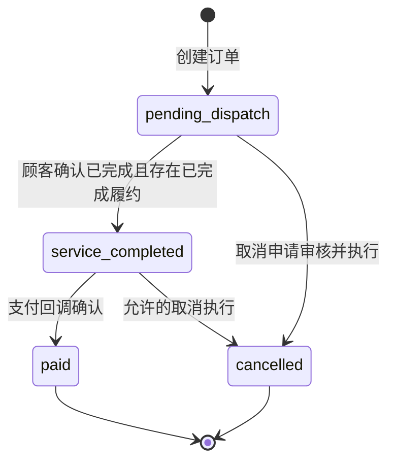
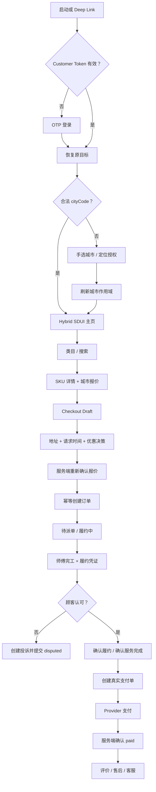
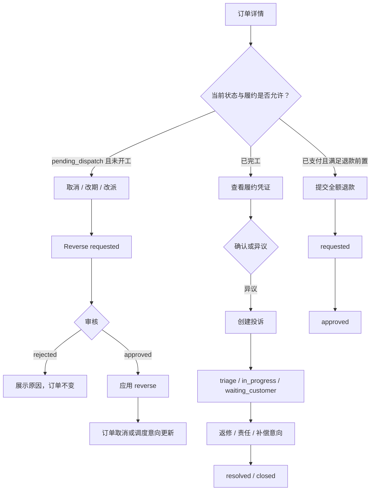
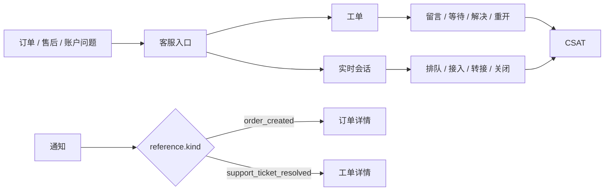

# 顾客端全业务场景建模与切片架构蓝图

> 状态：正式施工蓝图 v1
>
> 审计基线：`68495e4b188ffecb96948b80c93d4480b6e3771c`
>
> 适用范围：仅 `apps/customer`
>
> 不包含：Worker、Admin、OA、Dashboard

## 0. 蓝图结论

顾客端全业务被建模为 **42 个业务场景、20 个正式切片、3 个编排等级、9 个后续施工单元**。

本蓝图不是页面稿，也不把一个场景机械等同为一个路由或一个切片。切片边界按以下四个条件归并：

1. 用户是否在完成同一个连续任务；
2. 是否共享同一领域事实和 API 聚合；
3. 是否受同一状态机与权限边界约束；
4. 是否能够由同一个页面模板与组件族稳定承载。

所有页面都必须由注册组件组合。区别只在于组合计划由谁控制：

- **L3 高度动态**：远端 Manifest 可控制已注册组件的启停、顺序、受控属性与数据引用；
- **L2 有限动态**：固定安全模板拥有受保护核心区，只开放非关键展示插槽；
- **L1 严格固定**：路由选择固定模板，组件计划由客户端代码确定，Manifest 不参与业务流程和状态判断。

Manifest 永远不控制 Catalog、价格、优惠资格、订单状态、支付、退款、售后、身份或权限事实。

## 1. 本地事实审计

### 1.1 审计口径

本次审计直接读取显式指定的 P10 提交 `68495e4b…`，并核对当前工作区中的后端、共享类型、校验器和 API Client。

当前工作区位于其他开发分支，存在用户未提交的 Customer UI 删除/改造；这些改动不是本蓝图产物，本蓝图不覆盖、不恢复也不暂存它们。

### 1.2 八类事实审计结论

| 审计项 | 已确认事实 | 对蓝图的约束 |
| --- | --- | --- |
| Customer 路由 | P10 的 `App.tsx` 只挂载 `HomePage`；没有正式 Router。Home Action Registry 仅通过 `history.pushState` 写入 `/service`、`/orders`、`/support`、`/profile` 等目标路径，App 不会据此切换页面 | 后续必须先建立正式路由壳；不得把历史 Customer 页面恢复为路由实现 |
| Customer API | `customerApi` 聚合 Catalog、报价、下单、单笔订单、服务确认、支付单创建、退款申请、逆向、投诉、履约证据、评价、优惠券、通知、资料、地址和客服 API | 页面不得直接 `fetch`；全部经 `@xlb/api-client` 和 Feature Coordinator |
| 正式 SKU/Catalog | `OFFICIAL_SERVICE_CATALOG_SOURCE.md` 是唯一确认源；16 个一级大类、492 SKU，覆盖杭州/上海/北京；三城独立 price rule；禁止全国 fallback 和业务 `__global__`；Demo Catalog 已禁用 | 页面不内置类目、SKU、名称、价格或排序；只显示 Catalog/Quote 返回事实 |
| 订单状态机 | `draft -> pending_dispatch`；`pending_dispatch -> service_completed/cancelled`；`service_completed -> paid/cancelled`；`pending_payment -> paid/cancelled`；`paid/cancelled` 终态。当前创建订单直接进入 `pending_dispatch`，代码中没有进入 `pending_payment` 的路径 | UI 不能发明“待支付”订单状态；正式流程是服务完成后确认并支付 |
| 支付、退款、售后 | 支付单仅允许 `service_completed` 订单创建；Provider 类型和实现当前仅 `mock`。退款 MVP 仅支持已支付、履约完成、已记账订单的全额退款，状态仅 `requested/approved`。逆向、投诉、返修、责任、补偿均有明确状态机 | 真实支付页面在 Provider 接入前不得声称可用；退款不得提供部分退款输入；售后动作按后端状态开放 |
| 地址、优惠券、评价、通知 | 资料和地址 CRUD 已有正式 API；优惠券 grant 与 discount decision 已有 API，但 Customer grant 缺少面额/门槛展示投影；评价创建、可见性和申诉链已具备；通知仅投影 `order.created`、`support.ticket.resolved` 两类事件 | 地址可施工；券包详情为契约缺口；通知不能展示未被事件契约支持的虚构分类 |
| 登录、定位和权限 | Customer 使用手机号 OTP；Bearer Token 决定 `appType/role/userId`；城市由 `x-xlb-city-code` 提供并严格校验。P10 Home 只从 localStorage/env 取城市和区县文案，没有浏览器/原生定位授权链 | 所有受保护路由需 Customer Auth Guard + City Guard；真实定位与拒绝/受限状态需单独补齐 |
| SDUI 平台 | P10 已有 `customer.home` v1 Manifest、8 类组件、7 个数据键、14 个动作键、Registry、Composition Engine、Renderer、Data Coordinator、Delivery/LKG/Builtin/Kill Switch、主题/Logo 和 Telemetry | 主页继续复用；业务切片不得复制 Home 专用 Runtime，也不得把严格模板改造成任意 JSON 渲染 |

### 1.3 正式 Catalog 边界

16 个一级大类为：

1. 家庭保洁
2. 家电清洗
3. 家电维修
4. 上门安装
5. 管道疏通
6. 开锁换锁
7. 水电维修
8. 防水补漏/精准测漏
9. 家具家居维修保养
10. 房屋修缮/局部改造
11. 搬家搬运/拆旧清运
12. 甲醛检测治理
13. 数码办公维修
14. 洗衣洗鞋
15. 保姆月嫂/照护
16. 四害消杀

Catalog 层次固定为 `Category -> Item(L2>L3>L4) -> SKU`。SKU 详情必须呈现 API 返回的 `profile`、`standards`、`unit` 与城市级 Quote；不能根据类目名称推断服务模式、质保、品牌型号要求或是否需要测量。

### 1.4 订单、履约和售后状态机



`pending_payment` 属于共享类型，但当前没有业务服务把订单推进到该状态。页面只处理实际可达状态，不得为了设计完整性模拟该状态。

| 聚合 | 状态迁移 |
| --- | --- |
| 履约 | `accepted -> in_progress -> completed`；活动状态可进入 `cancelled` |
| 顾客履约确认 | `pending -> confirmed` 或 `pending -> disputed`；两者终态 |
| 逆向申请 | `requested -> approved/rejected`；`approved -> applied` |
| 退款 | `requested -> approved`；当前无 rejected 状态和 Customer 查询接口 |
| 投诉 | `submitted -> triaged/in_progress/rejected`；`triaged/in_progress/waiting_customer` 按后端允许关系流转；`resolved -> closed` 或重开到 `in_progress` |
| 返修单 | `requested -> assigned/in_progress/cancelled`；`assigned -> in_progress/cancelled`；`in_progress -> completed/cancelled` |
| 补偿意向 | `proposed -> approved/rejected`；Provider 执行状态固定为 `not_executed` |
| 评价可见性 | `pending_moderation/visible/hidden`，由审核域决定 |
| 评价申诉 | `open -> upheld/rejected/withdrawn` |
| 客服工单 | `open -> processing/escalated`；`processing -> waiting_requester/escalated/resolved`；`resolved -> processing/closed` |
| 实时会话 | `queueing -> active -> transferred/closed`，服务端当前实现并未完成全部 Customer 读接口 |

### 1.5 P10 Home Runtime 可直接复用项

| 能力 | 现状 |
| --- | --- |
| Page ID | 仅 `customer.home` |
| 组件 | `location_header`、`search_bar`、`service_grid`、`promotion_banner`、`recommend_list`、`worker_nearby`、`trust_guarantee`、`bottom_navigation` |
| 数据键 | `customer.current_location`、`customer.notification_summary`、`catalog.service_categories`、`catalog.recommended_services`、`provider.nearby`、`content.home_promotions`、`content.trust_guarantees` |
| 动作键 | Location、Notification、Search、Service、Promotion、Provider、Demand 和底部导航共 14 个白名单动作 |
| 可靠性 | Remote、304、Cache、LKG、Builtin、Kill Switch、Circuit Breaker、局部失败与观测 |
| 已接通真实数据 | Current location provider、Notification unread、Catalog categories、从正式 Catalog 派生的默认推荐 |
| 未接通数据 | Nearby provider、Home promotions、governed trust content |
| 主题/Logo | 基础色保持 `#CFEFEF`、`#FF6A00`、`#1F2D2D`；Logo 默认 `xlb100`；真实远端 Theme/Asset Envelope 交付未配置 |

### 1.6 审计事实源索引

| 事实 | 审计源 |
| --- | --- |
| P10 完成结论 | `68495e4b:docs/reports/CUSTOMER_UI_V2_P10_FINAL_ACCEPTANCE.md` |
| Hybrid SDUI 边界 | `68495e4b:docs/design/customer-v2/HYBRID_SDUI_ARCHITECTURE_BASELINE.md` |
| Manifest 契约 | `68495e4b:docs/contracts/CONTRACT_CUSTOMER_SDUI.md`、`68495e4b:packages/types/src/customerSdui.ts` |
| Registry / Coordinator / Action | `68495e4b:apps/customer/src/platform/sdui/**`、`68495e4b:apps/customer/src/features/home/**` |
| 当前 P10 Route 入口 | `68495e4b:apps/customer/src/app/App.tsx`、`apps/customer/src/routes/README.md` |
| API Client | `packages/api-client/src/customer.ts`、`auth.ts`、`marketing.ts`、`notification.ts`、`reviewReputation.ts`、`support.ts` |
| 正式 Catalog | `docs/catalog/OFFICIAL_SERVICE_CATALOG_SOURCE.md`、`docs/catalog/服务类目完整清单.tsv`、`db/seed/007_official_catalog.seed.sql`、`008_official_pricing.seed.sql` |
| 订单/履约/支付 | `backend/src/order/**`、`backend/src/fulfillment/evidence/**`、`backend/src/payment/**` |
| 退款/售后 | `backend/src/aftersale/**`、`packages/types/src/refund.ts`、`aftersale.ts` |
| 账户/地址 | `backend/src/customer/**`、`packages/types/src/customerOperations.ts` |
| 优惠/评价/通知/客服 | `backend/src/marketing/**`、`review/**`、`notification/**`、`support/**` 及对应共享类型 |
| 身份/城市/权限 | `backend/src/auth/**`、`context/**`、`city/**`、`gateway/authz.ts` |
| 视觉唯一真相 | `68495e4b:docs/design/customer-v2/references/customer-home-approved-2026-07-22.png`、`VISUAL_AUTHORITY.md` |

### 1.7 阻止伪造页面的正式能力缺口

| Gap ID | 缺口 | 受影响场景/切片 | 蓝图处理 |
| --- | --- | --- | --- |
| GAP-01 | 没有 Customer 订单列表 API | C18 / CSL-09 | 订单中心切片可设计、不可完成真实列表施工 |
| GAP-02 | 支付仅有 `mock` Provider；无顾客支付状态查询和真实 Provider 跳转/回调契约 | C16-C17 / CSL-08 | 只设计安全状态与 Provider 接口，禁止接入 mock 成功按钮 |
| GAP-03 | Customer 无退款列表/详情/状态查询 | C26 / CSL-12 | 可提交全额退款并展示当次响应，不能声称支持持续追踪 |
| GAP-04 | CouponGrant 不含面额、门槛、名称等 Customer 展示投影 | C13、C38-C39 / CSL-07、CSL-18 | 券包与选择器不得从 Admin 定义或本地常量拼装 |
| GAP-05 | 无权威推荐、附近师傅、主页活动、保障内容读取契约 | C04 / CSL-04 | 保持可选 Adapter 未注册或安全隐藏 |
| GAP-06 | 无真实定位权限、坐标解析、服务城市映射链 | C03 / CSL-03 | 支持手选城市；系统定位入口保持 capability unavailable |
| GAP-07 | 实时会话 Client 声明 list/detail/read，后端未实现；message list/mutation 响应也与 Client validator 不完整一致 | C34 / CSL-16 | 会话切片在契约对齐前不可按 Client 表面方法宣称完成 |
| GAP-08 | 通知只支持两个事件类型 | C36-C37 / CSL-17 | 只渲染真实事件类型；不建立虚构“系统/活动/售后”频道 |
| GAP-09 | Checkout 没有服务容量/可预约性 API | C12 / CSL-07 | 时间是顾客请求时间，不显示“该时段有空”等无依据文案 |
| GAP-10 | `pending_payment` 不可达 | C17 / CSL-08、CSL-10 | 不把它作为当前订单 UI 的可达状态 |
| GAP-11 | 履约媒体存储类型仍允许 local/mock，未形成生产对象存储事实 | C20 / CSL-10 | UI 只消费有权访问的媒体响应；生产验收需真实存储能力 |
| GAP-12 | 补偿 `providerExecutionStatus` 固定为 `not_executed` | C28 / CSL-13 | 只显示“补偿意向/审核结果”，不显示已到账 |

## 2. 顾客端全量业务场景清单

状态说明：

- `READY`：当前正式 API/契约足以进入切片施工；
- `PARTIAL`：核心可做，但必须降级或等待非关键契约；
- `BLOCKED`：不得用本地数据或假动作替代。

| ID | 用户任务 | 场景 | 起点 | 成功结果 | 正式切片 | 就绪度 |
| --- | --- | --- | --- | --- | --- | --- |
| C01 | 进入应用 | 冷启动、恢复会话、初始化主题与城市上下文 | App launch/deep link | 进入目标路由或明确门禁 | CSL-01 | READY |
| C02 | 登录 | 请求 OTP、倒计时、提交验证码、处理错误与限流 | Auth Guard | 获得 Customer Token 并返回原目标 | CSL-02 | READY |
| C03 | 确定服务城市 | 手选城市、读取默认城市、请求定位、处理拒绝/超范围 | 首次进入/Location Action | 生成合法 cityCode 并刷新 city-scoped 数据 | CSL-03 | PARTIAL / GAP-06 |
| C04 | 浏览首页 | 远端/LKG/Builtin 首页、类目、通知、可选运营区块 | `/` | 进入发现、通知、客服、订单或账户任务 | CSL-04 | READY core / GAP-05 |
| C05 | 按类目找服务 | 浏览 16 个一级类目及 Item/SKU | Home service grid | 得到真实 SKU 集合 | CSL-05 | READY |
| C06 | 搜索服务 | 按正式名称、Item 路径和 SKU 名称搜索 | Home search | 得到匹配结果或真实空状态 | CSL-05 | PARTIAL（客户端 Catalog 搜索） |
| C07 | 筛选发现结果 | 类目筛选、清除筛选、有限排序呈现 | `/service` | 缩小真实 Catalog 集合 | CSL-05 | PARTIAL |
| C08 | 查看 SKU | 查看单位、服务标准、保障、价格类型与报价 | SKU 卡片/深链 | 选择合法 SKU 进入下单 | CSL-06 | READY |
| C09 | 发起下单 | 带入 SKU、数量和报价快照前置信息 | SKU detail/demand action | 建立未提交 Checkout Draft | CSL-07 | READY |
| C10 | 选择服务地址 | 从地址簿选择同城地址 | Checkout | Draft 获得地址 | CSL-07 + CSL-20 | READY |
| C11 | 下单中新增/编辑地址 | 安全编辑联系人与详细地址 | Checkout address step | 保存真实地址并回填 Draft | CSL-07 + CSL-20 | READY |
| C12 | 选择预约时间 | 选择日期和 morning/afternoon/evening 请求时段 | Checkout schedule step | Draft 获得合法 scheduledAt/slot | CSL-07 | PARTIAL / GAP-09 |
| C13 | 选择优惠券 | 加载可用 grant，申请 discount decision，处理过期/冲突 | Checkout pricing step | 获得服务端 discount decision | CSL-07 + CSL-18 | PARTIAL / GAP-04 |
| C14 | 确认报价 | 展示 Quote breakdown、priceType、标准、优惠后金额 | Checkout review step | 顾客确认服务端事实 | CSL-07 | READY |
| C15 | 创建订单 | 幂等提交订单并防止重复点击 | Checkout submit | 获得 `pending_dispatch` 订单 | CSL-07 | READY |
| C16 | 创建支付单 | 服务完成后创建支付单 | Order detail CTA | 获得 Provider 支付上下文 | CSL-08 | BLOCKED production / GAP-02 |
| C17 | 支付与结果 | 离开/返回支付、轮询结果、失败重试、关闭 | Payment route | 服务端确认 `paid` 或显示真实失败 | CSL-08 | BLOCKED / GAP-02 |
| C18 | 查看订单中心 | 分页/分组查看本人订单 | Bottom navigation | 选择一笔真实订单 | CSL-09 | BLOCKED / GAP-01 |
| C19 | 查看订单详情 | 查看订单快照、地址、预约、状态和可用动作 | Deep link/list/notification | 获取单笔订单真相 | CSL-10 | READY（已知 orderId） |
| C20 | 查看履约凭证 | 查看到达、服务前后、完工证据和私有媒体 | Order detail | 了解履约事实 | CSL-10 | READY local / GAP-11 prod |
| C21 | 确认或异议 | 确认履约；或先创建投诉再绑定 dispute | Completed fulfillment | `confirmed` 或 `disputed` | CSL-10 + CSL-13 | READY |
| C22 | 申请取消 | 对允许状态提交 cancel reverse | Order detail | 逆向申请进入 `requested` | CSL-11 | READY |
| C23 | 申请改期 | 未开工 `pending_dispatch` 提交新时间 | Order detail | reschedule 请求进入 `requested` | CSL-11 | READY |
| C24 | 申请改派 | 未开工 `pending_dispatch` 提交 reassign | Order detail | reassign 请求进入 `requested` | CSL-11 | READY |
| C25 | 跟踪逆向 | 查看 requested/approved/rejected/applied | Order detail/change route | 获得审核与应用结果 | CSL-11 | READY |
| C26 | 申请退款 | 对满足条件的订单提交全额退款原因 | Paid order | 获得 `requested` 或幂等已有退款 | CSL-12 | PARTIAL / GAP-03 |
| C27 | 发起投诉 | 选择类别/优先级并描述问题 | Order/evidence/support | 获得 `submitted` 投诉 | CSL-13 | READY |
| C28 | 跟踪售后 | 查看投诉、返修、责任、补偿意向与时间线，补充备注 | Complaint list/detail | 获得真实处理进展 | CSL-13 | READY / GAP-12 |
| C29 | 提交评价 | 履约完成后提交 1-5 星与评论 | Order detail | 评价进入 `created/pending_moderation` | CSL-14 | READY |
| C30 | 查看/申诉评价 | 查看可见性、创建申诉、撤回 open 申诉 | Review detail | 申诉进入合法状态 | CSL-14 | READY |
| C31 | 选择客服渠道 | 在工单和实时会话之间选择并带入业务引用 | `/support` | 进入合适支持任务 | CSL-15/16 | READY shell |
| C32 | 创建/查看工单 | 按类型/优先级提交并查看本人列表 | Support hub/order | 获得工单或列表 | CSL-15 | READY |
| C33 | 工单跟进 | 查看 requester 可见事件、留言、解决后重开 | Ticket detail | 工单进入后端允许状态 | CSL-15 | READY |
| C34 | 实时会话 | 创建会话、REST/WS 收发、补偿、已读和关闭后历史 | Support hub/ticket | 获得连续会话 | CSL-16 | BLOCKED / GAP-07 |
| C35 | 客服满意度 | 对工单或会话提交一次 1-5 分评价 | Resolved/closed support | CSAT 保存成功 | CSL-15/16 | READY |
| C36 | 查看通知 | 未读数、inbox/archive 分页和引用跳转 | Header/bottom entry | 进入真实业务对象 | CSL-17 | READY / GAP-08 |
| C37 | 管理通知 | 标记已读、归档/恢复、处理 CAS 冲突 | Notification center | Recipient state 更新 | CSL-17 | READY |
| C38 | 查看券包 | 按 grant 状态查看本人优惠券 | Profile/Checkout | 得到 grant 生命周期 | CSL-18 | PARTIAL / GAP-04 |
| C39 | 判断券可用性 | 在 Checkout 中基于服务端 decision 接受/拒绝选择 | Coupon wallet/Checkout | 得到真实优惠金额或拒绝原因 | CSL-18 + CSL-07 | PARTIAL |
| C40 | 查看/编辑资料 | 读取姓名、脱敏手机号、头像与默认城市；更新允许字段 | `/profile` | Profile 保存成功 | CSL-19 | READY |
| C41 | 管理地址簿 | 列表、新增、编辑、删除、设默认、处理最后地址 | Profile/Checkout | Address CRUD 成功 | CSL-20 | READY |
| C42 | 退出/会话失效 | 主动退出、401 失效、清理用户级缓存并保留安全偏好 | Profile/任意受保护路由 | 返回登录并防止跨用户缓存污染 | CSL-01/02/19 | READY |

## 3. 用户旅程图

### 3.1 主服务旅程



支付节点 T-U-V 在真实 Provider 和状态查询契约完成前是正式阻塞点，不能用 `mock-webhook` 代替顾客旅程。

### 3.2 订单变更与售后旅程



### 3.3 客服与参与旅程



## 4. 场景—切片映射矩阵

| 正式切片 | 归并场景 | 归并依据 | 主要入口 | 主要出口 |
| --- | --- | --- | --- | --- |
| CSL-01 App Shell & Session | C01、C42 | 全局启动、路由、缓存和会话生命周期 | App/deep link | Auth、City、目标路由 |
| CSL-02 Customer Auth | C02、C42 | 同一 OTP 与 Token 任务 | Auth Guard/401 | Return URL |
| CSL-03 City & Location | C03 | City Scope 和定位权限独立于地址 CRUD | Header/first run | Home/原路由 |
| CSL-04 Home | C04 | 唯一完整 SDUI 页面和跨域入口聚合 | `/` | Service、Order、Support、Profile |
| CSL-05 Service Discovery | C05-C07 | 共享 Catalog 树、查询与结果集合 | Home/search | SKU detail |
| CSL-06 SKU Detail | C08 | 单 SKU、Quote、标准与下单入口 | Discovery/deep link | Checkout |
| CSL-07 Checkout | C09-C15、C10-C13 | 一个未提交订单 Draft 和同一最终提交 | SKU/demand | Order detail |
| CSL-08 Payment | C16-C17 | 真实 Provider 边界和 Payment 状态 | Service-completed order | Paid order |
| CSL-09 Order Center | C18 | 多订单读取、分页和筛选独立于单笔状态机 | Bottom nav | Order detail |
| CSL-10 Order & Fulfillment Detail | C19-C21 | 单订单聚合、履约证据和确认动作 | List/deep link/notification | Payment、Change、Aftersale、Review |
| CSL-11 Order Change | C22-C25 | 共用 OrderReverse 状态机与 orderId | Order detail | Order detail |
| CSL-12 Refund | C26 | 金额与退款资格为高敏固定流程 | Paid order | Order/Aftersale |
| CSL-13 Aftersale Complaint | C21、C27-C28 | 投诉、返修、责任、补偿和时间线同一 Case | Order/evidence/support | Order/Support |
| CSL-14 Review | C29-C30 | 评价、可见性、申诉共享 reviewId | Order detail | Order/Profile |
| CSL-15 Support Tickets | C31-C33、C35 | 工单生命周期、事件和 CSAT | Support/order | Ticket detail |
| CSL-16 Support Conversation | C31、C34-C35 | 会话、消息序列、WS 和 CSAT | Support/ticket | Conversation history |
| CSL-17 Notification Center | C36-C37 | Inbox recipient state 和引用跳转 | Header | Order/Ticket |
| CSL-18 Coupon Wallet | C13、C38-C39 | Grant 生命周期与 Checkout decision | Profile/Checkout | Checkout |
| CSL-19 Profile | C40、C42 | 顾客资料和账户动作 | Bottom nav | Address/Auth |
| CSL-20 Address Book | C10-C11、C41 | 地址 CRUD 与 Checkout Picker 共用实体 | Profile/Checkout | Profile/Checkout |

## 5. 正式切片清单和路由树

### 5.1 路由规则

- Customer 独立域内使用根路径，不恢复旧 `/customer/*` UI 路由体系。
- 路由只能选择客户端已发布的 Slice/Template，不能由 Manifest 动态创建。
- Route Params 只携带标识符；金额、状态、角色、优惠资格不得放入可信路由状态。
- 除登录、城市选择和安全 Home Fallback 外，所有业务路由都需要 Customer Auth Guard。
- 所有 city-scoped API 前必须具备合法城市；切换城市要清空旧城市 Feature Cache。

### 5.2 路由树

```text
/
├─ /auth/login                              CSL-02
├─ /location                                CSL-03
├─ /                                       CSL-04 Home
├─ /service                                 CSL-05
│  ├─ ?categoryId=:categoryId
│  ├─ ?q=:query
│  └─ /:skuId                              CSL-06
├─ /order/create?skuId=:skuId               CSL-07
├─ /payment/:paymentOrderId                 CSL-08
├─ /orders                                  CSL-09
│  └─ /:orderId                            CSL-10
│     ├─ /change                           CSL-11
│     ├─ /refund                           CSL-12
│     ├─ /aftersale                        CSL-13 create/list-by-order
│     └─ /review                           CSL-14
├─ /aftersale/:complaintId                  CSL-13 detail
├─ /reviews/:reviewId/appeal                CSL-14
├─ /support                                 CSL-15 support hub
│  ├─ /tickets                             CSL-15
│  │  └─ /:ticketId                        CSL-15
│  └─ /conversations                       CSL-16
│     └─ /:conversationId                   CSL-16
├─ /notifications                           CSL-17
├─ /coupons                                 CSL-18
└─ /profile                                 CSL-19
   └─ /addresses                            CSL-20
      ├─ /new
      └─ /:addressId/edit
```

P10 Action Registry 中 `location.open_picker` 当前指向 `/profile/addresses`。正式蓝图将“服务城市/定位”与“服务地址”拆开，因此该动作应指向 `/location`；地址簿仍由 Checkout/Profile 显式进入。此变更是新体系的正确边界，不保留错误语义兼容层。

## 6. Slice Contract

### 6.1 通用 Contract

每个 Slice 必须实现以下闭合接口：

```text
SliceContract
  id / routePatterns / orchestrationLevel / templateId
  routeInput -> validated identifiers and query
  guards -> session + role + city + ownership (server remains authoritative)
  coordinator -> @xlb/api-client calls + normalized ViewModel
  componentPlan -> registered components only
  actionPlan -> application-owned actions only
  stateModel -> loading/empty/error/domain/submission/conflict/success
  completion -> deterministic route or refresh outcome
  telemetry -> no raw PII, token, address, message or Manifest payload
```

严格模板可以拥有固定 `componentPlan`，但不允许在 Route Component 内堆叠大页 JSX。Route Component 只装配 Template、Coordinator、Action Controller 与 Route Context。

### 6.2 20 个正式 Contract

| ID | Template / 等级 | Contract |
| --- | --- | --- |
| CSL-01 | `CustomerAppShellTemplate` / L1 | 输入：URL、启动能力、持久化 token/city。守卫：恢复 Token 后仍以服务端 401 为准。输出：合法 Route Context。动作：`app.retry`、`session.expire`、`session.logout`。必须在 actor/city 变化时旋转 cacheScopeKey，清除用户级 SDUI/Data/Feature 缓存，不清除允许保留的无身份视觉偏好。 |
| CSL-02 | `CustomerAuthTemplate` / L1 | 输入：合法手机号与 OTP。API：request code、login。动作：请求验证码、提交、重发、返回。不得调用 debug-code，不把验证码或 token 写入日志/遥测。成功后只接受 `appType=customer/role=customer` 的会话并跳回经过校验的 same-origin return URL。 |
| CSL-03 | `CustomerLocationTemplate` / L1 | 输入：Profile defaultCityCode、本地已选 city、系统定位 capability。输出：杭州/上海/北京之一。动作：手选、请求定位、拒绝后继续、重新授权。系统坐标和行政区解析没有正式契约时只提供手选，不用默认杭州冒充定位结果。 |
| CSL-04 | `CustomerSduiPageTemplate` / L3 | 输入：`customer.home` Envelope、Theme/Asset Envelope、scope。复用 P10 Delivery/Registry/Engine/Data Coordinator/Action Registry。保护性组件 location/search/bottom nav 各一。Required slot 失败触发安全降级，Optional slot 局部隐藏。不能扩展到交易状态、价格或任意 URL。 |
| CSL-05 | `CustomerDiscoveryTemplate` / L2 | 输入：真实 CatalogSnapshot、categoryId、query。受保护核心：Search、Filter、Result Count、Result List。可动态：已注册推荐/说明插槽。动作：查询、切换类目、清除、打开 SKU。客户端搜索只能过滤已取回的当前城市 Catalog，不宣称全局热度或距离排序。 |
| CSL-06 | `CustomerSkuDetailTemplate` / L2 | 输入：skuId。API：Catalog 中定位 SKU + Price Quote。核心展示：名称、单位、priceType、breakdown、profile、standards、保障。可动态：非关键推荐/活动插槽。SKU disabled/not found 或 Quote city 不一致必须阻断下单。 |
| CSL-07 | `CustomerCheckoutStepperTemplate` / L1 | 输入：skuId；内部持有可恢复但未提交的 CheckoutDraft。步骤：服务/数量、地址、请求时间、优惠、确认。每次进入确认步骤重新读取 Quote；优惠必须由 discount decision 决定；创建订单使用幂等键。成功后丢弃 Draft 并导航订单详情，不在下单后立即创建支付单。 |
| CSL-08 | `CustomerPaymentTemplate` / L1 | 输入：orderId/paymentOrderId；前置：order.status=`service_completed`。动作：创建支付单、启动真实 Provider、恢复、查询/刷新结果、失败重试。金额只读 PaymentOrder/Order。真实 Provider 与状态读 API 缺失时显示 capability unavailable，禁止提供 mock webhook 顾客入口。 |
| CSL-09 | `CustomerOrderCenterTemplate` / L1 | 输入：分页 cursor/受控 filter。输出：本人订单摘要列表。动作：分页、刷新、打开详情。禁止从 localStorage orderIds、通知历史或本次会话拼接“订单列表”。GAP-01 关闭前只允许不可用状态和深链详情，不标记切片完成。 |
| CSL-10 | `CustomerOrderDetailTemplate` / L1 | 输入：orderId。聚合：Order、Fulfillment Evidence、Customer Confirmation、Reverse Requests、Complaint list、Review。动作由服务端事实派生：查看证据、确认/异议、确认服务完成、支付、变更、退款、投诉、评价。任一 CTA 点击前重新读取相关事实；403/404 不泄露订单是否属于他人。 |
| CSL-11 | `CustomerOrderChangeTemplate` / L1 | 输入：orderId、reverseType。仅 cancel/reschedule/reassign。改期/改派要求 `pending_dispatch` 且未开工；取消遵循后端实际允许状态。提交必须含幂等键；状态跟踪只读 Reverse API，不自行修改 Order ViewModel。 |
| CSL-12 | `CustomerRefundTemplate` / L1 | 输入：orderId。当前只允许全额退款，金额不可编辑；展示服务端 amount/currency。动作：提交原因、幂等重试。Customer 状态查询缺失时不构造“审核中时间线”，只保留当次响应和返回订单入口。 |
| CSL-13 | `CustomerAftersaleCaseTemplate` / L1 | 输入：orderId 或 complaintId。创建：类别、优先级、描述、幂等键。详情：投诉、返修、责任、补偿意向、timeline、可见备注。disputed 确认必须绑定本人同订单投诉。`providerExecutionStatus=not_executed` 不得显示为退款/补偿到账。 |
| CSL-14 | `CustomerReviewTemplate` / L1 | 输入：orderId/reviewId。创建 1-5 星、500 字内评论；读取 review + visibility + appeals。动作：创建申诉、撤回 open 申诉。不能把 `created` 等同于“公开可见”；可见性和申诉结果完全按服务端返回。 |
| CSL-15 | `CustomerSupportTicketTemplate` / L2 | 输入：可选 orderId/complaintId。固定核心：Channel Choice、Ticket List/Form/Detail/Timeline。可动态：受控 FAQ/帮助内容，不影响工单类型和优先级。动作：创建、分页、留言、重开、CSAT。只渲染 requester/all 可见事件。 |
| CSL-16 | `CustomerConversationTemplate` / L1 | 输入：conversationId/linkedTicketId。动作：创建、获取一次性 WS ticket、subscribe/catchup、REST 降级发送、已读、历史、CSAT。消息按 serverSeq 去重排序；JWT 不进 WS URL。GAP-07 对齐前不进入完成态。 |
| CSL-17 | `CustomerNotificationTemplate` / L1 | 输入：view=inbox/archive、cursor。动作：分页、mark read、archive/restore、按 reference 跳转。CAS 使用 expectedRowVersion + idempotencyKey；冲突后刷新。只支持 order_created 和 support_ticket_resolved 引用。 |
| CSL-18 | `CustomerCouponWalletTemplate` / L1 | 输入：grant status、可选 Checkout Context。动作：分页/筛选 grant、请求 discount decision、返回 Checkout。状态展示使用 granted/available/reserved/redeemed/released/expired/revoked。没有 Customer 展示投影时不得显示面额、门槛、活动名或“可省”金额。 |
| CSL-19 | `CustomerProfileTemplate` / L1 | 输入：CustomerProfile。动作：编辑 name/defaultCityCode、进入地址/券包/通知/客服、退出。手机号仅显示 phoneMasked；avatarUrl 当前只读且没有上传 API；更新默认城市后必须显式询问是否切换当前服务城市。 |
| CSL-20 | `CustomerAddressBookTemplate` / L1 | 输入：可选 picker mode、addressId。动作：列表、新增、编辑、删除、设默认、选择。写操作使用幂等键并由后端掩码返回手机号。Checkout 只能选择当前服务城市可用地址；城市不一致时要求切换城市或换地址，不静默改写。 |

## 7. 每个切片的状态矩阵

### 7.1 通用状态语义

| 状态 | 统一表现 |
| --- | --- |
| `loading` | 使用结构性 skeleton；不显示旧用户敏感数据 |
| `ready` | 核心数据完整、守卫通过 |
| `partial` | 仅非关键依赖失败；明确局部降级 |
| `empty` | 服务端返回合法空集合；提供与任务相关的下一步 |
| `stale/offline` | 只允许读取有作用域的安全缓存；写动作关闭 |
| `validation_error` | 字段级、可修复，不丢失合法输入 |
| `submitting` | 防重复提交；允许安全取消请求但不伪装回滚 |
| `conflict` | 409/CAS/状态变化；刷新事实后重新决定 |
| `unauthenticated` | 清理 actor-scoped cache，进入 Auth 并保留安全 return URL |
| `forbidden/not_found` | 不泄露他人资源；提供安全返回 |
| `unavailable` | 能力或 Provider 未接通，不显示假成功路径 |
| `success` | 只在服务端确认后出现；导航目标可恢复 |

### 7.2 Slice 状态矩阵

| Slice | 读取状态 | 空状态 | 提交状态 | 领域状态 | 冲突/降级 |
| --- | --- | --- | --- | --- | --- |
| CSL-01 | booting/restoring/ready | 无 | clearing-session | authenticated/guest/expired | storage unavailable 仍可内存启动；路由错误进入安全 404 |
| CSL-02 | idle/requesting-code/code-sent | 无 | verifying | authenticated/rate-limited/code-expired | 400 字段错、401 验证失败、429 倒计时、网络失败可重试 |
| CSL-03 | resolving-profile/checking-capability | 无合法城市 | selecting/requesting-permission | manual-selected/located/denied/restricted/out-of-service | GAP-06 时 located 不可达；手选永远可用 |
| CSL-04 | manifest-loading/data-loading | required content empty 不可接受；optional 可空 | action-running | remote/cache/LKG/builtin/kill-switch | invalid/timeout/offline/slot-error/partial-data 复用 P10 规则 |
| CSL-05 | catalog-loading/ready | no-match/catalog-empty | query-changing | category/search/all | Catalog stale 可只读；未知 category 清除筛选；不展示假推荐 |
| CSL-06 | catalog+quote loading | sku-not-found | starting-checkout | fixed/range/from/estimate_from/onsite_quote | city mismatch/disabled/quote error 阻断下单 |
| CSL-07 | draft-loading/dependency-loading | no-address/no-coupon | saving-address/issuing-decision/creating-order | editing/reviewing/created | Quote 版本变化、券过期、幂等 replay、409 后重取事实 |
| CSL-08 | order-loading/payment-loading | no-payment-order | creating/redirecting/verifying | pending/paid/failed/closed | Provider unavailable；未知结果绝不显示 paid |
| CSL-09 | list-loading/refreshing | no-orders | 无业务写提交 | all/active/completed/cancelled（UI 分组，不是新状态） | GAP-01 为 unavailable；禁止本地拼表 |
| CSL-10 | aggregate-loading/partial | evidence-empty/reverse-empty/complaint-empty/review-empty | confirming-service/deciding-confirmation | Order + Fulfillment + Confirmation 实际状态 | 多聚合 latest-wins；403/404 安全收敛；409 刷新 |
| CSL-11 | order+reverse loading | no-reverse-history | submitting-request | requested/approved/rejected/applied | 已开工/终态/重复幂等键冲突后刷新 |
| CSL-12 | eligibility-checking | no-existing-refund | requesting | requested/approved | 不满足 paid+completed+ledger 显示不可申请；无查询能力时为 limited-result |
| CSL-13 | list/detail loading | no-complaints/no-repair/no-compensation | creating-complaint/adding-note | Complaint/Repair/Compensation 实际状态 | waiting_customer 突出待响应；not_executed 明示未执行 |
| CSL-14 | review-loading | not-reviewed/no-appeal | creating-review/appealing/withdrawing | visibility + appeal status | 重复评价、旧 moderationVersion、申诉已终结后刷新 |
| CSL-15 | list/detail loading | no-tickets/no-events | creating/commenting/reopening/rating | open/processing/waiting_requester/escalated/resolved/closed | internal event 过滤；resolved 才可按后端规则重开 |
| CSL-16 | connecting/catchup/live/reconnecting | no-messages | sending/marking-read/rating | queueing/active/transferred/closed | GAP-07 unavailable；消息 optimistic 仅显示 sending，不当作服务端成功 |
| CSL-17 | inbox/archive loading | no-notifications | marking-read/archiving/restoring | unread/read/archived | rowVersion 冲突刷新；未知 eventType 拒绝而非通用跳转 |
| CSL-18 | grants-loading | no-grants/no-eligible-grant | issuing-decision | granted/available/reserved/redeemed/released/expired/revoked | 展示投影缺失时隐藏金额；decision expired/rejected 返回 Checkout |
| CSL-19 | profile-loading | 无 Profile 视为错误，不是空 | saving/logging-out | ready/dirty/saved | 401 退出；default city 与当前 city 不同需确认切换 |
| CSL-20 | addresses-loading | no-addresses | creating/updating/deleting/selecting | default/non-default/city-mismatch | 删除/默认竞争后刷新；Picker 中城市不一致不可选 |

## 8. API 和数据依赖矩阵

所有路径均需要 `Authorization: Bearer`；除 OTP 外的业务 API 还必须按现有 Route 要求携带合法 `x-xlb-city-code`。表中的“缺口”不是本阶段授权新增的 API。

| Slice | 现有 API / 数据 | 关键输出 | 缓存/一致性 | 缺口 |
| --- | --- | --- | --- | --- |
| CSL-01 | 本地安全会话存储 + API 401 | token/city/cache scope | actor+city 分区 | 无 session introspection API，采用 401 驱动失效 |
| CSL-02 | `POST /api/auth/customer/code`；`POST /api/auth/customer/login` | token/userId/role | 验证码不缓存 | 禁止 debug-code |
| CSL-03 | `GET/POST /api/customer/profile` + App capability | defaultCityCode | city 变更全量失效 | GAP-06 |
| CSL-04 | Customer SDUI Manifest API；`GET /api/catalog`；`GET /api/customer/notifications/unread-count` | Manifest、Catalog categories、unread | P10 scope cache/LKG | GAP-05 |
| CSL-05 | `GET /api/catalog` | Category/Item/SKU | city-scoped read cache | 无搜索/排序 API；只做本地过滤 |
| CSL-06 | `GET /api/catalog`；`GET /api/pricing/quote?skuId=` | SKU profile/standards/Quote | Quote 进入 Checkout 前重读 | 无单 SKU endpoint，当前从 Catalog 定位 |
| CSL-07 | Quote；Profile/Addresses；Coupon grants/decision；`POST /api/orders` | Order + authoritative snapshot | Draft 本地仅存输入；结果以服务端为准 | GAP-04、GAP-09 |
| CSL-08 | `POST /api/payments/orders`；开发专用 mock webhook 不进入 UI | PaymentOrder | 写动作不缓存 | GAP-02 |
| CSL-09 | 无 | Order summaries | 不允许本地替代 | GAP-01 |
| CSL-10 | `GET /api/orders/:orderId`；`GET /api/customer/orders/:orderId/fulfillment-evidence`；Reverse list；Complaint list；Review read | 单订单聚合 | route+orderId+city+actor 分区 | GAP-11 |
| CSL-11 | `POST/GET /api/orders/:orderId/reverse-requests` | ReverseRequest[] | mutation 后重读 | 无 |
| CSL-12 | `POST /api/aftersale/refunds` | RefundRequest | 当次响应仅会话可见 | GAP-03 |
| CSL-13 | `POST/GET /api/aftersale/complaints`；`GET /api/aftersale/complaints/:id`；`POST .../:id/notes` | ComplaintDetail/timeline | mutation 后 detail 重读 | GAP-12 |
| CSL-14 | `POST /api/orders/:orderId/reviews`；`GET /api/orders/:orderId/review`；Appeal create/withdraw | Review/Visibility/Appeals | versioned mutation | 无 |
| CSL-15 | `/api/support/tickets` 列表/创建/详情/事件/重开；ticket CSAT | Ticket/Detail/Event | cursor + mutation refresh | 无 |
| CSL-16 | Conversation create/messages/realtime-ticket/WS；conversation CSAT | Conversation/Messages | serverSeq/cursor | GAP-07 |
| CSL-17 | `/api/customer/notifications`、unread-count、read、archive | InboxItem/rowVersion | cursor + CAS | GAP-08 |
| CSL-18 | `GET /api/customer/marketing/coupon-grants`；`POST /api/customer/marketing/discount-decisions` | Grant/Decision | decision 有 expiresAt/version | GAP-04 |
| CSL-19 | `GET/POST /api/customer/profile` | CustomerProfile | mutation 后替换 | 无 avatar upload |
| CSL-20 | `GET/POST /api/customer/addresses`；update/delete action endpoints | CustomerAddress[] | mutation 后重读 | 无 |

## 9. Action 与状态机依赖

### 9.1 Action 分层

```text
Manifest Action Ref
  -> 仅 CSL-04 Home 的 CUSTOMER_SDUI_ACTION_KEYS
  -> HomeActionRegistry
  -> Route navigation / application event

Fixed Slice Action
  -> Slice Action Controller
  -> validator
  -> @xlb/api-client
  -> backend authorization + state machine
  -> refresh authoritative state
```

严格模板动作不是 Manifest Action，不需要为了页面按钮把交易动作加入 Home SDUI Contract。

### 9.2 关键 Action 矩阵

| Action | Slice | 前端启用条件（仅 UX） | 后端最终裁决 | 成功后 |
| --- | --- | --- | --- | --- |
| `auth.request_code` | CSL-02 | 手机号格式合法、倒计时结束 | OTP Service 限流和身份规则 | code-sent |
| `auth.login` | CSL-02 | OTP 输入完整 | Auth token 签发 | 恢复 return URL |
| `city.select` | CSL-03 | Known city | City Resolver | 旋转 city scope |
| `service.open_detail` | CSL-04/05 | Catalog SKU exists | SKU/Quote read | `/service/:skuId` |
| `checkout.create_order` | CSL-07 | Draft 本地完整 | Validator、Catalog、Price、Marketing、幂等事务 | `/orders/:orderId` |
| `payment.create` | CSL-08/10 | `service_completed` | PaymentOrderService | Provider handoff |
| `fulfillment.confirm` | CSL-10 | completed + completion evidence | Confirmation state machine | 刷新 aggregate |
| `fulfillment.dispute` | CSL-10/13 | 本人投诉已创建 | Confirmation + complaint ownership | complaint detail |
| `order.confirm_service` | CSL-10 | completed fulfillment | Order state machine | order=`service_completed` |
| `order.reverse.create` | CSL-11 | 状态看似允许 | Reverse + Order state machines | reverse=`requested` |
| `refund.request` | CSL-12 | order 显示 paid | paid+completed+ledger+full amount | refund=`requested` |
| `complaint.create` | CSL-13 | 表单合法 | ownership + Complaint service | complaint=`submitted` |
| `complaint.note` | CSL-13 | case 可读取 | ownership + case rules | detail refresh |
| `review.create` | CSL-14 | 未评价 | eligibility + uniqueness | pending moderation view |
| `review.appeal/withdraw` | CSL-14 | visibility/version 合法 | Appeal state/version | review refresh |
| `ticket.create/comment/reopen` | CSL-15 | requester form/state | Ticket state machine/visibility | ticket refresh |
| `conversation.send` | CSL-16 | active connection or REST fallback | participant + not closed + idempotency | serverSeq ack |
| `notification.read/archive` | CSL-17 | item rowVersion known | recipient ownership + CAS | update rowVersion |
| `coupon.issue_decision` | CSL-18/07 | grant 表面可选 | Marketing eligibility/price/version | Checkout amount refresh |
| `profile.save` | CSL-19 | editable fields valid | profile schema/ownership | profile refresh |
| `address.save/delete` | CSL-20 | form/id valid | address schema/ownership/default rules | list refresh |
| `session.logout` | CSL-19/01 | always | 客户端清理 | `/auth/login` |

### 9.3 不允许的 Action

- 任何客户端 `setOrderStatus`、`markPaid`、`approveRefund`、`approveComplaint`；
- 任何 Manifest 传入的 API URL、路由字符串、金额或订单状态；
- 任何 Customer UI 对 `/api/internal/*`、Worker、Admin API 的调用；
- 顾客页面调用 `/api/payments/mock-webhook`；
- 通过前端条件绕过后端 ownership、role、city、version 或 idempotency 校验。

## 10. 页面模板和组件拆解树

```text
CustomerAppShellTemplate
├─ CustomerPresentationProvider
│  ├─ BrandLogo(default="xlb100")
│  ├─ GlobalStatusAnnouncer
│  └─ GlobalErrorBoundary
├─ CustomerRouter
│  ├─ PublicRoute
│  │  └─ CustomerAuthTemplate
│  ├─ CityGateRoute
│  │  └─ CustomerLocationTemplate
│  └─ ProtectedCustomerRoute
│     ├─ CustomerSduiPageTemplate
│     │  └─ HomeRenderer -> HomeComponentRegistry
│     ├─ CustomerDiscoveryTemplate
│     │  ├─ SearchField
│     │  ├─ CategoryFilter
│     │  └─ ServiceResultList -> ServiceCard
│     ├─ CustomerSkuDetailTemplate
│     │  ├─ ServiceIdentity
│     │  ├─ PriceQuotePanel
│     │  ├─ FeeBreakdown
│     │  ├─ ServiceStandards
│     │  └─ StickyTaskAction
│     ├─ CustomerCheckoutStepperTemplate
│     │  ├─ StepProgress
│     │  ├─ ServiceQuantityStep
│     │  ├─ AddressPicker
│     │  ├─ SchedulePicker
│     │  ├─ CouponPicker
│     │  └─ OrderReviewSubmit
│     ├─ CustomerListTemplate
│     │  ├─ FilterTabs
│     │  ├─ CursorList
│     │  └─ ListStatePanel
│     ├─ CustomerOrderDetailTemplate
│     │  ├─ OrderStatusHeader
│     │  ├─ OrderSnapshot
│     │  ├─ FulfillmentTimeline
│     │  ├─ EvidenceGallery
│     │  ├─ RelatedCaseSummary
│     │  └─ StateAwareActionBar
│     ├─ CustomerTransactionTemplate
│     │  ├─ ImmutableAmountSummary
│     │  ├─ StatusTimeline
│     │  ├─ ConfirmationSheet
│     │  └─ RetryOrReturnAction
│     ├─ CustomerCaseTemplate
│     │  ├─ CaseHeader
│     │  ├─ CaseForm
│     │  ├─ CaseTimeline
│     │  ├─ RelatedEntityCards
│     │  └─ RequesterCommentComposer
│     ├─ CustomerConversationTemplate
│     │  ├─ ConnectionStatus
│     │  ├─ MessageList
│     │  ├─ MessageComposer
│     │  └─ CsatPrompt
│     └─ CustomerAccountTemplate
│        ├─ ProfileSummary
│        ├─ AccountActionList
│        ├─ AddressList/Form
│        └─ DestructiveActionSheet
└─ CustomerBottomNavigation (只在允许的一级路由出现)
```

页面 Route 组件不得重新实现以上组件；它只向 Template 传入规范化 ViewModel、状态和 Action。

## 11. 公共组件识别

### 11.1 跨域公共组件

| 公共组件 | 使用切片 | 不变量 |
| --- | --- | --- |
| `BrandLogo` | 全部 | 默认 `xlb100`，资产失败回退 |
| `CustomerPageHeader` | 除 Home 外全部 | 返回、标题、可选右侧受控动作 |
| `CustomerStatePanel` | 全部 | loading/empty/error/unavailable/forbidden 统一语义 |
| `StatusTag` | Order、Payment、Reverse、Refund、Aftersale、Review、Support、Coupon | 状态映射集中管理，不允许页面私配颜色 |
| `Timeline` | Order、Aftersale、Support、Payment | 只显示真实事件和时间 |
| `CursorList` | Order、Support、Notification | cursor、加载更多、去重、取消 |
| `PriceText` | SKU、Checkout、Order、Payment、Refund、Coupon | 金额格式统一；来源仍是 API |
| `ImmutableAmountSummary` | Checkout review、Payment、Refund | 金额只读，不在组件计算业务结果 |
| `IdempotentSubmitButton` | 所有写流程 | 防双击、保留 request key、支持 replay 结果 |
| `ConflictRefreshPanel` | 所有 version/CAS 流程 | 409 后刷新，不盲重放非幂等动作 |
| `PrivateMedia` | Evidence、Support | ownership、no-store、加载失败不泄露 URL |
| `ReferenceLink` | Notification、Support、Aftersale | allowlisted reference -> route |
| `SensitiveText` | Profile、Address、Support | 脱敏、复制限制和遥测排除 |
| `BottomSheet/ConfirmationSheet` | Checkout、Order change、Refund、Account | 44px 触控、焦点锁、Esc/返回行为 |
| `GlobalStatusAnnouncer` | 全部 | 异步结果和错误的无障碍播报 |

### 11.2 领域共享组件

| 组件族 | 组件 |
| --- | --- |
| Catalog | CategoryIcon、CategoryCard、ServiceCard、ServiceIdentity、ServiceStandardList |
| Pricing | PriceQuotePanel、FeeBreakdown、PriceTypeExplanation、CouponDecisionSummary |
| Order | OrderCard、OrderStatusHeader、OrderSnapshot、FulfillmentTimeline、StateAwareActionBar |
| Aftersale | CaseSummaryCard、CaseTimeline、ReverseStatusCard、RepairOrderCard、CompensationIntentCard |
| Support | TicketCard、TicketTimeline、MessageBubble、ConnectionStatus、CsatInput |
| Account | ProfileSummary、AddressCard、AddressForm、CityMismatchNotice |

## 12. 编排等级

| 等级 | 切片 | 远端可控制 | 绝对禁止 |
| --- | --- | --- | --- |
| L3 高度动态 | CSL-04 Home | v1 白名单组件启停/排序、受控 Props、DataRef、ActionRef、scope、rollout、主题/资产 | Catalog/价格/状态/权限/任意代码/API URL |
| L2 有限动态 | CSL-05 Discovery、CSL-06 SKU Detail、CSL-15 Support Hub | 固定核心外的推荐、活动、FAQ、保障说明等已注册插槽 | 搜索事实、SKU/Quote、工单类型/优先级、写动作和流程顺序 |
| L1 严格固定 | CSL-01/02/03/07-14/16-20 | 只允许全局主题 Token、Logo 和明确声明的非关键帮助内容；不改变组件计划 | 身份、地址、金额、优惠、订单、支付、退款、履约、售后、评价、通知、账户逻辑 |

“严格固定”仍然要求注册组件组合；它固定的是 Template 的组件计划和流程，不是允许一个大页 JSX 文件。

## 13. 后续施工顺序、串并行关系

最多三个并行写入单元。任何涉及共享契约破坏性修改、支付 Provider、金额规则、订单状态机或数据库 migration 的 Gap 修复，开始写入前按项目规则单独确认。

### 13.1 施工单元

| Unit | 切片 | 写入边界 | 前置 | 并行 |
| --- | --- | --- | --- | --- |
| B1 Shell & Entry | CSL-01/02/03 + CSL-04 接入 | `apps/customer/src/app/**`、`routes/**`、`features/auth/**`、`features/location/**` | P10 | 与 B2、B3 |
| B2 Service Discovery | CSL-05/06 | `features/service/**` + service components | P10、正式资产映射 | 与 B1、B3 |
| B3 Checkout | CSL-07 | `features/checkout/**` + checkout components | B2 contract 可稳定；Address/Coupon API | 与 B1、B2 |
| G1 Read-contract gaps | GAP-01、03、04、06、07 | `packages/types`、validators、api-client、backend；按 Gap 分小批次 | 蓝图确认；敏感项另确认 | 最多与不改同契约的 UI Unit 并行 |
| G2 Payment Provider | GAP-02 | Payment provider/API/security callbacks | 单独高风险与外部操作确认 | 不与 B4 同金额/支付契约并行 |
| B4 Orders & Fulfillment | CSL-09/10/11 | `features/orders/**`、`features/fulfillment/**` | GAP-01；B3 | 与 B5、B6 |
| B5 Aftersale & Review | CSL-12/13/14 | `features/aftersale/**`、`features/review/**` | B4 order detail seam；GAP-03 可降级 | 与 B4、B6 |
| B6 Support | CSL-15/16 | `features/support/**` | GAP-07 for conversation | 与 B4、B5 |
| B7 Engagement | CSL-17/18 | `features/notifications/**`、`features/coupons/**` | GAP-04 for full coupon UI | 与 B8 |
| B8 Account | CSL-19/20 | `features/account/**`、`features/address/**` | B1 session/city seam | 与 B7 |
| BI Integration | 全部 | 最终 route registry、App 装配、E2E、视觉 QA | B1-B8 + blocking Gaps | 最后串行 |

### 13.2 推荐波次

1. **Wave 0（串行）**：冻结本蓝图；为 20 个 Slice 建立共享 `SliceContract`/Template 接口，但不建业务页面。
2. **Wave 1（最多 3 个）**：B1、B2、B3；同时只做不会碰撞的 Gap 设计评审，不在 UI 中填假数据。
3. **Wave 1.5（按 Gap 独立）**：优先 GAP-01、GAP-04、GAP-07；GAP-02 作为独立高风险支付工程。
4. **Wave 2（最多 3 个）**：B4、B5、B6。
5. **Wave 3（最多 2 个）**：B7、B8。
6. **Wave 4（串行）**：BI 路由汇合、跨域动作、缓存隔离、关键 E2E、视觉和无障碍验收。

## 14. 验收标准

### 14.1 蓝图验收

- 42 个场景均有唯一 ID、业务结果、正式切片和就绪度；
- 20 个切片均有 Route、Template、Contract、State、API、Action 和编排等级；
- 所有现有状态机均被映射，没有新增金额、Catalog 或状态事实；
- 所有缺口显式标记，未使用 Demo、Mock、本地数组或历史页面填补；
- P10 Home Runtime 被复用而不是复制；
- Worker/Admin/OA/Dashboard 不在施工树中。

### 14.2 每个 Slice 的 Definition of Done

1. Route 可直接刷新和 deep link；非法参数进入安全状态。
2. 只通过 `@xlb/api-client`、共享 types/validators 获取和写入业务数据。
3. Route Component 不包含大页 JSX；Template 和注册组件边界清晰。
4. State Matrix 中该 Slice 的全部状态有单元/组件测试。
5. 写动作具备幂等键、提交锁、错误恢复和 409 刷新策略。
6. 401 清理 actor cache；403/404 不泄露资源；city 切换不串数据。
7. 不记录 token、OTP、完整手机号、详细地址、消息正文、投诉正文或支付敏感数据。
8. 390×844 主视口、窄屏、键盘、焦点、44px 触控和 reduced-motion 通过。
9. 颜色、布局、卡片、密度和导航继续以批准主页 PNG 为视觉真相；延续 Tiffany Blue `#CFEFEF` 与 Hermès Orange `#FF6A00` 体系；Logo 使用 `BrandLogo(xlb100)`。
10. 真实 API 缺失时为 `unavailable`，不得用成功假数据通过验收。

### 14.3 关键端到端验收旅程

| E2E | 验收链 |
| --- | --- |
| E2E-01 | 401 deep link -> OTP 登录 -> 恢复原订单/服务路由 |
| E2E-02 | 手选城市 -> Home Manifest -> Catalog 类目 -> SKU Quote |
| E2E-03 | SKU -> Address -> Schedule request -> 无券创建订单 -> `pending_dispatch` |
| E2E-04 | 可用券 -> discount decision -> 创建订单 -> Quote snapshot 金额一致 |
| E2E-05 | Order detail -> completed evidence -> confirmed -> confirm service -> Payment capability |
| E2E-06 | `pending_dispatch` -> cancel/reschedule/reassign -> reverse 状态跟踪 |
| E2E-07 | 履约异议 -> 创建投诉 -> disputed -> Complaint timeline |
| E2E-08 | paid order -> 全额 refund request；不出现部分退款输入 |
| E2E-09 | completed order -> review -> visibility -> appeal -> withdraw |
| E2E-10 | Support ticket create -> comment -> resolved notification -> reopen/CSAT |
| E2E-11 | Notification read/archive CAS -> reference 跳转 |
| E2E-12 | Profile update -> Address CRUD -> Checkout picker -> city mismatch |
| E2E-13 | Logout/401 -> 所有 actor-scoped 缓存失效，下一用户看不到旧数据 |
| E2E-14 | Home invalid Manifest/offline/kill switch -> LKG/Builtin，交易路由不受 Manifest 控制 |

E2E-05 的真实支付完成、E2E-08 的退款持续追踪、实时会话全链路和订单列表分页，必须在相应 Gap 关闭后才允许变绿。

## 15. 本阶段停止线

本蓝图完成后，下一步是把 B1-B8/G1-G2 分解成独立施工单元。当前阶段不：

- 批量实现页面；
- 修改 API、Catalog、金额或状态机；
- 新增 migration；
- 接入真实支付 Provider；
- 恢复旧 Customer 页面；
- 为缺失能力制作 Demo/Mock；
- 修改 Worker、Admin、OA 或 Dashboard。

任何页面设计稿都必须从本蓝图的场景、Slice Contract、State Matrix 和 API 依赖出发，而不是先画页面再反推业务。
