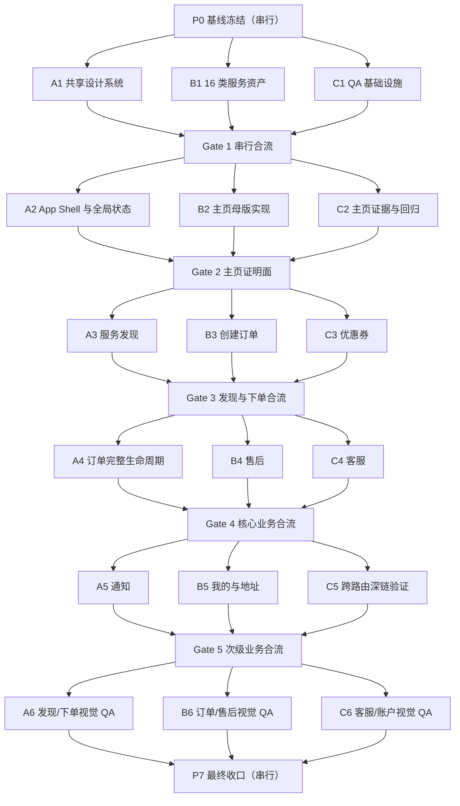

# 顾客端全业务切片设计系统统一与视觉重构 — 工程施工拓扑

> 状态：**P2 GATE 2 PASSED / READY FOR P3**
> 施工对象：仅 `apps/customer` 及其直接消费的顾客端 `packages/ui` 能力
> 明确排除：`apps/worker`、`apps/admin`、`apps/oa`、`apps/dashboard`
> 视觉母体：[`CUSTOMER_HOME_VISUAL_TRUTH.md`](./CUSTOMER_HOME_VISUAL_TRUTH.md)
> 设计系统：[`XLB_CUSTOMER_APP_DESIGN_SYSTEM.md`](./XLB_CUSTOMER_APP_DESIGN_SYSTEM.md)
> 切片台账：[`CUSTOMER_FULL_BUSINESS_SLICE_VISUAL_REFACTOR_SCOPE.md`](./CUSTOMER_FULL_BUSINESS_SLICE_VISUAL_REFACTOR_SCOPE.md)
> P0 基线：[`CUSTOMER_UI_REFACTOR_P0_BASELINE.md`](./CUSTOMER_UI_REFACTOR_P0_BASELINE.md)

## 1. 工程目标

本拓扑把“顾客端全业务切片的设计系统统一与视觉重构”拆成可执行的串并行施工阶段，并为每个阶段定义唯一文件所有者、工作树边界、合流顺序和验收门禁。

继承的是主页的设计语言与交互规则，包括暖奶油底、墨绿信任色、陶橙关键动作、苹果服务卡片层级、功能层 Liquid Glass、3D 服务图像、五项底部导航、安全区及可访问性规则；不是把主页布局复制到其他业务页面。

“施工部署”在本文中指本地分支、工作树、集成和验证编排，不包含 push、生产部署、真实 Provider 或公开发布。

## 2. 总体拓扑

硬规则：任一时刻最多 3 个并行写入单元。现存但未参与本批次的工作树不自动算写入单元；一旦在其中施工，就占用一个并发名额。

## 3. 工作树与分支命名

### 3.1 唯一集成线

| 角色 | 分支 | 工作目录 | 用途 |
| --- | --- | --- | --- |
| 集成线 | `codex/customer-ui-refactor` | `G:/xlb100` 或另建干净集成工作树 | 只接收已通过阶段验收的提交；承担共享文件合流与最终验证 |

不得把当前 `codex/tke-infra`、既有 `codex/customer-ui-prod` 或其他历史工作树直接当作本批次集成线。先把已确认的主页真相、设计系统、范围清单与本拓扑固化到一个干净基线提交，再从该提交创建集成分支。

### 3.2 三个轮转槽位

| 槽位 | 工作树目录 | 分支格式 | 默认职责 |
| --- | --- | --- | --- |
| A | `G:/xlb100-worktrees/customer-ui-refactor/slot-a` | `codex/customer-ui-refactor-p{阶段}-a-{主题}` | 共享基础、Shell、订单主生命周期 |
| B | `G:/xlb100-worktrees/customer-ui-refactor/slot-b` | `codex/customer-ui-refactor-p{阶段}-b-{主题}` | 资产、主页、创建订单、售后、账户 |
| C | `G:/xlb100-worktrees/customer-ui-refactor/slot-c` | `codex/customer-ui-refactor-p{阶段}-c-{主题}` | QA、优惠券、客服、跨路由验证 |

槽位只表示并发容量，不表示永久代码所有权。每个阶段结束后，槽位必须 clean、提交、合流并解除旧分支占用，才能进入下一阶段。

## 4. 阶段施工矩阵

| 阶段 | 执行方式 | Slot A | Slot B | Slot C | 串行合流门禁 |
| --- | --- | --- | --- | --- | --- |
| P0 基线冻结 | 串行 | — | — | — | 固化唯一主页真相、设计系统、44 切片台账、本拓扑；确认基线无 Worker/Admin 污染 |
| P1 设计系统基础 | 三路并行 | `CUST-DS-003`、共享状态与 A11y recipe | `CUST-ASSET-001`，16 类独立 3D 资产和映射 | 顾客端测试/截图/证据目录与视觉检查基架 | A → B → C；token、导出入口由 A 唯一收口 |
| P2 Shell 与主页证明 | 三路并行 | `CUST-SHELL-*`、`CUST-STATE-*`、`CUST-A11Y-001` | `CUST-HOME-001..005` | 主页运行态测试、390×844 截图和对比报告 | A → B → C；主页 P0/P1/P2 为 0 后才开放后续页面 |
| P3 服务发现与创建订单 | 三路并行 | `CUST-CATALOG-001..002` | `CUST-ORDER-001..005` | `CUST-COUPON-001..002` | A → B → C；优惠券与报价只通过冻结的 adapter/view-model 接口接入 |
| P4 核心业务生命周期 | 三路并行 | `CUST-ORDERS-*`、确认、支付、评价、申诉、退款 | `CUST-AFTER-001..003` | `CUST-SUPPORT-001..003` | A → B → C；同一订单状态动作不得跨工作树修改 |
| P5 次级业务与账户 | 三路并行 | `CUST-NOTIFY-001..002` | `CUST-PROFILE-001`、`CUST-ADDRESS-001` | 跨路由深链、城市与恢复路径验证 | A → B → C；`App.tsx`/Shell 路由变更由集成线串行完成 |
| P6 全量视觉 QA | 三路并行 | 主页/服务/下单/优惠券证据 | 订单/支付/售后证据 | 客服/通知/我的/地址证据 | 三路只写各自证据目录；源代码修复退回对应所有者 |
| P7 最终收口 | 串行 | — | — | — | 9 载体、44 切片、3 个宽度、关键状态、A11y、typecheck/lint/test/build 全部通过 |

阶段之间严格串行：`P0 → P1 → P2 → P3 → P4 → P5 → P6 → P7`。阶段内部仅在文件所有权和契约互不重叠时并行。

## 5. 文件所有权与冲突域

### 5.1 必须单一所有者、串行修改的共享文件

下列路径是高碰撞区。一个阶段内只能由 Slot A 或集成线修改；其他槽位通过已冻结接口消费，不直接“顺手修复”。

- `packages/ui/src/tokens/**`
- `packages/ui/src/components/index.tsx`
- `packages/ui/src/components/primitives/**`
- `packages/ui/src/components/patterns/**`
- `packages/ui/src/layouts/**`
- `packages/ui/src/templates/**`
- `packages/ui/src/index.ts`
- `apps/customer/src/app/App.tsx`
- `apps/customer/src/app/mobile-shell.css`
- `apps/customer/src/pages/customerPageShell.tsx`
- 根依赖清单与 `pnpm-lock.yaml`

如果页面施工发现共享组件缺口，页面工作树只记录最小需求和消费接口；共享所有者先实现并合流，页面分支更新到新基线后再消费。

### 5.2 页面载体的唯一所有者

| 所有者域 | 唯一路径 | 说明 |
| --- | --- | --- |
| Home | `CustomerHomePage.tsx` 及其专属样式/测试 | 五个主页切片在同一分支内串行 |
| Services | `CustomerServicesPage.tsx` 及专属测试 | 搜索、分类、SKU 深链不跨分支拆同一文件 |
| Order Create | `CustomerOrderCreatePage.tsx`、`customer-order-create.css` | 五步下单及优惠券接入在同一工作树串行 |
| Orders | `CustomerOrdersPage.tsx`、`customer-orders.css` | 列表、确认、支付、评价、申诉、退款不可拆到不同工作树 |
| Aftersale | `CustomerAftersalePage.tsx` 及专属样式/测试 | 售后状态、证据、争议同域施工 |
| Support | `CustomerSupportPage.tsx`、`features/support/**` 及专属样式/测试 | 工单与实时会话保持同一所有者 |
| Notifications | `CustomerNotificationsPage.tsx` 及专属样式/测试 | 收件箱、归档、恢复与深链同域施工 |
| Coupons | `CustomerCouponsPage.tsx`、`customer-coupons.css` | 券页归 C；下单页消费接口归 Order Create |
| Profile | `CustomerProfilePage.tsx` 及专属样式/测试 | 账户与地址在同一分支内串行 |

### 5.3 Adapter 归属

- `catalogAdapters.ts`：Services/Home 共同需要时，P2 先由集成线冻结只读输出形状，P3 由 Services 所有者维护。
- `orderAdapter.ts`、`orderAddressOptions.ts`、`pricingAdapter.ts`：Order Create/Orders 的共享变更先在集成线上冻结接口；不得由两条页面分支同时编辑。
- `marketingAdapter.ts`：Coupons 所有者维护；Order Create 只消费公开 view model。
- `workflowAdapter.ts`、`workflowBindings.ts`：视为共享契约，始终串行。

任何会改变 `packages/types`、`packages/validators` 或 `@xlb/api-client` 公共契约的需求，先退出当前并行波次单独评估；本次视觉重构默认不修改这些契约。

## 6. 每阶段工作树协议

### 6.1 开工前

1. 集成线必须 clean，且三槽位都从同一个已验证提交创建。
2. 在阶段卡中写明 Slice ID、文件白名单、禁止修改路径、依赖提交和验收命令。
3. 先冻结跨槽位接口；未冻结时，不同时开写相关页面。
4. 确认角色为 Customer；发现 Worker/Admin/OA/Dashboard 文件立即停止该部分。

### 6.2 施工中

1. 每个槽位只修改自己的文件白名单。
2. 不在工作树之间复制未提交文件；共享能力通过提交和合流传播。
3. 不用本地假成功、假价格、假师傅、假推荐或新服务类目填补缺失事实。
4. 页面必须覆盖 ready/default 和最高风险的 loading/error/success/permission/conflict 等适用状态。
5. P1–P5 每个槽位先跑相关测试；P6 的 QA 槽位只写独立证据，避免三路同时修源文件。

### 6.3 合流顺序

1. 暂停三个槽位写入并确认 clean。
2. 集成线先接共享基础，再接页面实现，最后接测试与证据，即默认 `A → B → C`。
3. 每接一条分支立即跑该分支的相关测试；冲突由该文件的唯一所有者解决。
4. 完成阶段级顾客端 typecheck/test/build 和视觉门禁。
5. 只有 Gate 通过，才能从新的集成提交创建下一阶段三条分支。

不把三个未同步分支一次性混合解决，也不通过 cherry-pick 复制同一文件的多个竞争版本。

## 7. 阶段门禁

| Gate | 必须通过的事实 |
| --- | --- |
| Gate 0 | 唯一主页 PNG 与哈希可复核；范围只含 Customer；基线提交 clean |
| Gate 1 | **PASS（2026-07-21）** — Customer token/recipe/共享组件可消费；16 类资产映射完整；无 Emoji/截图裁切占位 |
| Gate 2 | **PASS（2026-07-21）** — 主页在 390×844 达成同屏视觉证明；320×844、430×932 与 partial 状态无溢出；Shell、状态、焦点、安全区、强对比、减少动效与无 blur 回退可用；P0/P1/P2/P3 = 0/0/0/0 |
| Gate 3 | 服务发现、优惠券、创建订单深链闭环；报价与优惠结果来自权威接口 |
| Gate 4 | 订单、支付、确认、评价、退款、售后、客服状态与动作保持后端权威语义 |
| Gate 5 | 通知、我的、地址及跨路由恢复可用；底部五导航仍是唯一一级导航 |
| Gate 6 | 9 页面载体均有 default/ready 与最高风险状态证据；P0/P1/P2 缺陷为 0 |
| Gate 7 | 44 切片全部满足 Definition of Done；相关 test/typecheck/lint/build 通过 |

视觉缺陷等级：P0 阻断任务或角色/业务事实错误；P1 关键流程不可用；P2 明显偏离主页设计系统或响应式/A11y 失败；P3 为不阻断的细节优化。最终收口只允许登记 P3。

## 8. 本地运行资源

- P1–P5 的纯前端代码、文档、单测、静态截图不需要独立 MySQL、Redis、Compose 或端口登记。
- 只有实际运行依赖后端的 E2E 时，才为对应槽位配置独立端口/实例；不得三个工作树共享可变测试数据。
- 每个工作树使用独立 `node_modules` 链接策略或仓库既有包管理方式，不手工复制锁文件。
- 本拓扑不授权 push、deploy、生产数据、真实支付/短信/对象存储 Provider 或公开发布。

## 9. 当前启动状态

Gate 1 已于 2026-07-21 在唯一集成线 `codex/customer-ui-refactor` 完成 A → B → C 串行合流：

- A1 `e6f0b51b`：顾客端共享 token、recipe、组件样式和 Overlay 焦点能力；合流提交 `4ad01318`。
- B1 `6a13f3ec`：16 类官方服务陶瓷 3D 透明资产、manifest、稳定映射和资产契约；合流提交 `e19a8006`。
- C1 `0eaa2363`：9 路由 × 3 视口、36 个计划证据项的 QA 基础设施；合流提交 `60023b50`。
- 三条支线均以 P0 `9fde5878` 为共同祖先，文件交集为 0，合流无冲突。
- Gate 1 聚合验证通过：Phase 25 design/Gate 1A/Gate 1B、UI/Customer typecheck、Customer 依赖拓扑生产构建、QA 基础设施检查和 199 文件 / 1104 项 unit-contract 回归。
- P2 只可从 Gate 1 集成线最新提交创建；主页运行态实现、390×844 截图与视觉对比仍属于 P2，P1 不虚报实际截图证据。

Gate 2 已于 2026-07-21 在同一集成线完成第二轮 A → B → C 串行合流与关门校正：

- A2 `3565e741`：唯一 App Shell、五项主导航、认证/离线/城市/深链恢复和安全区；合流提交 `3390d166`。
- B2 `cad95a0b`：锁定主页母版、16 类真实目录映射、诚实推荐/附近师傅空态和信任保障；合流提交 `788f1f66`。
- C2 `6dad3465`：真实浏览器证据、状态检查器和同屏比较；合流提交 `17e0c8eb`。
- 集成线收敛了主页密度、底部导航 canonical token、320 窄屏类目缩放和 real-API-derived partial 夹具；没有把主页布局复制到其他页面。
- 最终接受轮次为 Round 09；Round 01 保留预集成失败基线，Round 02–08 保留为人工视觉校正轨迹，不作为 Gate 2 PASS 证据。
- P3 只能从 Gate 2 关门提交创建；不得从任一 A2/B2/C2 支线或更早中间证据轮次创建。

## 10. 完成定义

工程拓扑本身完成，不等于视觉重构完成。只有以下事实同时成立，本项目才可标记完成：

- 9 个顾客端页面载体和 44 个业务切片全部验收；
- 所有切片继承主页设计语言，但保持各自业务信息架构；
- Worker、Admin、OA、Dashboard 未进入改动范围；
- 关键业务动作、权限、金额、状态机和正式服务类目仍由权威契约决定；
- 320、390×844、430 三个宽度及关键状态截图通过；
- P0/P1/P2 缺陷为 0，相关工程检查通过；
- 最终结果已串行合流到唯一集成线，且工作树 clean。
