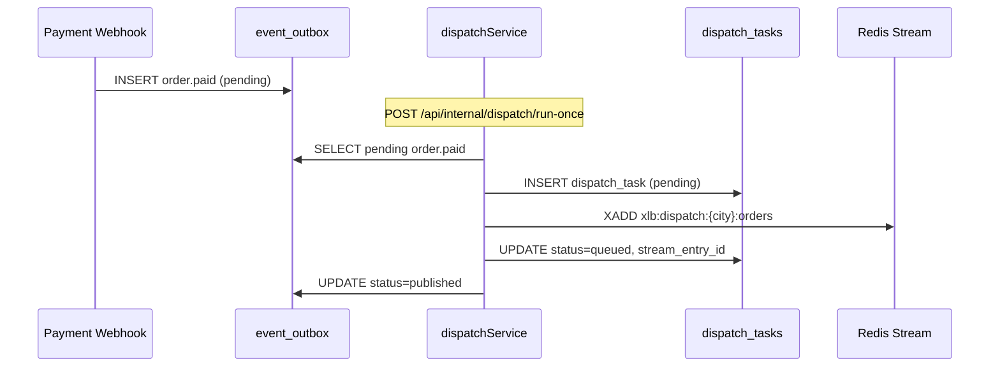

# FLOW: Outbox → Dispatch Stream

```mermaid
sequenceDiagram
  participant Pay as Payment Webhook
  participant Outbox as event_outbox
  participant Dispatch as dispatchService
  participant DB as dispatch_tasks
  participant Redis as Redis Stream

  Pay->>Outbox: INSERT order.paid (pending)
  Note over Dispatch: POST /api/internal/dispatch/run-once
  Dispatch->>Outbox: SELECT pending order.paid
  Dispatch->>DB: INSERT dispatch_task (pending)
  Dispatch->>Redis: XADD xlb:dispatch:{city}:orders
  Dispatch->>DB: UPDATE status=queued, stream_entry_id
  Dispatch->>Outbox: UPDATE status=published
```

## Idempotent re-run

Second run-once finds no pending `order.paid` → `processed: 0`, no duplicate task.
