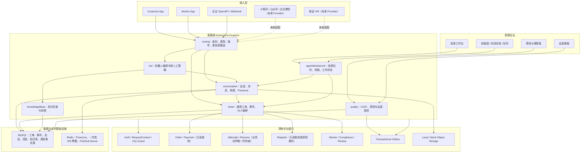
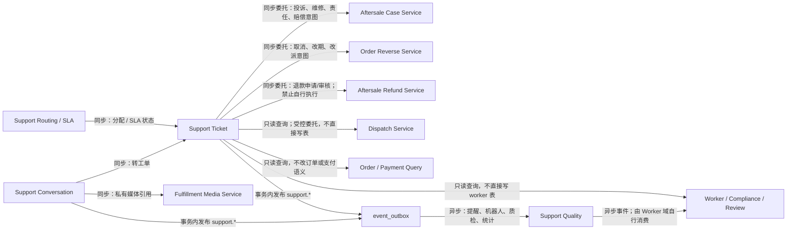
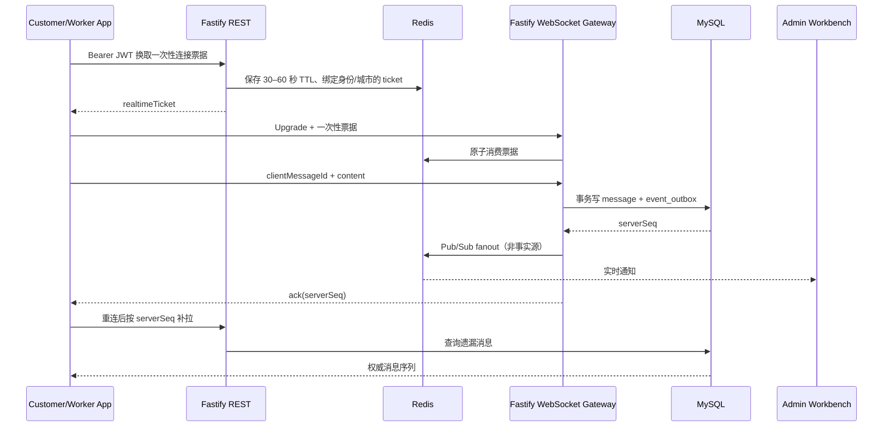

# XLB 客服系统架构图（Phase 24 设计基线）

> 本文件只描述目标架构，不代表对应运行时能力已经实现。Phase 24 当前阶段不包含业务代码、迁移、WebSocket 或外部 Provider 接入。

## 分层架构

```mermaid
flowchart TB
  subgraph Access["接入层"]
    C["Customer App"]
    W["Worker App"]
    B["企业 OpenAPI / Webhook"]
    WX["小程序 / 公众号 / 企业微信（未来 Provider）"]
    IVR["电话 IVR（未来 Provider）"]
  end

  subgraph Support["客服域 backend/src/support"]
    R["routing：身份、类型、城市、紧急度路由"]
    Bot["bot：机器人编排与转人工策略"]
    Conv["conversation：会话、消息、转接、Presence"]
    Ticket["ticket：通用工单、事件、SLA 编排"]
    KB["knowledgeBase：知识文章与检索"]
    Quality["quality：CSAT、质检与运营指标"]
    Workbench["agentWorkbench：坐席队列、领取、工作状态"]
  end

  subgraph Platform["现有中台能力"]
    Auth["Auth / RequestContext / City Guard"]
    Order["Order / Payment（只读查询）"]
    Aftersale["Aftersale / Reverse（业务动作唯一所有者）"]
    Dispatch["Dispatch（只读查询或受控委托）"]
    Worker["Worker / Compliance / Review"]
    Events["Transactional Outbox"]
    Media["Local / Mock Object Storage"]
  end

  subgraph Data["数据与实时基础设施"]
    MySQL["MySQL：工单、事件、会话、消息、知识库、质检事实源"]
    Redis["Redis：Presence、一次性 WS 票据、Pub/Sub fanout"]
  end

  subgraph Admin["管理后台"]
    Desk["坐席工作台"]
    Schedule["技能组 / 在线状态 / 队列"]
    QA["质检与满意度"]
    Dashboard["运营看板"]
  end

  C --> R
  W --> R
  B --> R
  WX -. "未来适配" .-> R
  IVR -. "未来适配" .-> R
  R --> Bot
  R --> Conv
  R --> Ticket
  Bot --> KB
  Bot --> Conv
  Conv --> Ticket
  Workbench --> Conv
  Workbench --> Ticket
  Ticket --> Aftersale
  Ticket --> Order
  Ticket --> Dispatch
  Ticket --> Worker
  Quality --> Events
  Conv --> Media
  Support --> Auth
  Support --> Events
  Conv --> MySQL
  Ticket --> MySQL
  KB --> MySQL
  Quality --> MySQL
  Conv --> Redis
  Desk --> Workbench
  Schedule --> Workbench
  QA --> Quality
  Dashboard --> Quality
```

## 领域调用关系

```mermaid
flowchart LR
  Ticket["Support Ticket"]
  Conversation["Support Conversation"]
  Routing["Support Routing / SLA"]
  Quality["Support Quality"]
  Outbox["event_outbox"]
  Aftersale["Aftersale Case Service"]
  Reverse["Order Reverse Service"]
  Refund["Aftersale Refund Service"]
  Dispatch["Dispatch Service"]
  Order["Order / Payment Query"]
  Worker["Worker / Compliance / Review"]
  Media["Fulfillment Media Service"]

  Conversation -->|"同步：转工单"| Ticket
  Routing -->|"同步：分配 / SLA 状态"| Ticket
  Ticket -->|"同步委托：投诉、维修、责任、赔偿意图"| Aftersale
  Ticket -->|"同步委托：取消、改期、改派意图"| Reverse
  Ticket -->|"同步委托：退款申请/审核；禁止自行执行"| Refund
  Ticket -->|"只读查询；受控委托，不直接写表"| Dispatch
  Ticket -->|"只读查询，不改订单或支付语义"| Order
  Ticket -->|"只读查询，不直接写 worker 表"| Worker
  Conversation -->|"同步：私有媒体引用"| Media
  Ticket -->|"事务内发布 support.*"| Outbox
  Conversation -->|"事务内发布 support.*"| Outbox
  Outbox -->|"异步：提醒、机器人、质检、统计"| Quality
  Quality -->|"异步事件；由 Worker 域自行消费"| Worker
```

## 实时消息原则

```mermaid
sequenceDiagram
  participant App as Customer/Worker App
  participant REST as Fastify REST
  participant Redis as Redis
  participant WS as Fastify WebSocket Gateway
  participant DB as MySQL
  participant Agent as Admin Workbench

  App->>REST: Bearer JWT 换取一次性连接票据
  REST->>Redis: 保存 30–60 秒 TTL、绑定身份/城市的 ticket
  REST-->>App: realtimeTicket
  App->>WS: Upgrade + 一次性票据
  WS->>Redis: 原子消费票据
  App->>WS: clientMessageId + content
  WS->>DB: 事务写 message + event_outbox
  DB-->>WS: serverSeq
  WS->>Redis: Pub/Sub fanout（非事实源）
  Redis-->>Agent: 实时通知
  WS-->>App: ack(serverSeq)
  App->>REST: 重连后按 serverSeq 补拉
  REST->>DB: 查询遗漏消息
  DB-->>App: 权威消息序列
```
