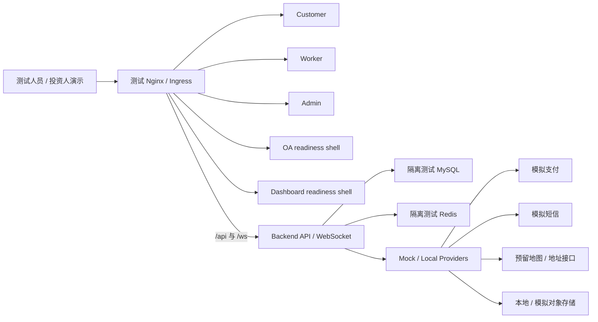

# 云端隔离测试 RC 封板说明（2026-07-20）

## 决策

- 工程状态：`ENGINEERING_AUDIT_READY`
- 允许动作：部署到隔离的云端测试环境，执行 API、WebSocket 与五端 Smoke
- 禁止动作：生产发布、公共域名切换、真实 Provider、生产数据、应用商店发布
- 生产状态：`PRODUCTION_NO_GO`
- 候选分支：`codex/investor-demo-rc`
- 部署提交：本文件所在提交；精确哈希由总指挥在部署任务交接消息中提供
- 已知云端回滚基线：`064dc8b`

本 RC 合并了第一波 Unit A/B/C 与五端产品候选，并完成门禁、历史边界、浏览器验收、Service Worker 子路径部署和测试稳定性扫尾。真实支付、短信、高德地图/地理服务、对象存储仍保持 mock/local/reserved，任何配置不得把模拟结果宣称为真实 Provider 成功。

## 最终验证证据

- 全量单元/契约回归：165 个文件、917 项测试通过。
- DB/安全回归：203 个文件、645 项测试通过，1 项按既有条件跳过。
- 架构预检：Phase 0–29 全部通过。
- 最终非浏览器 Stage 5：`pnpm gate:stage5 -- --skip-full-regression --skip-browser`，退出码 0；包含链接完整性、契约、依赖审计、lint、typecheck、build、Provider 边界、数据可靠性、安全/性能/故障注入、架构预检及真实数据库跨端 API 生命周期。
- 最终浏览器 Stage 4B：`pnpm test:e2e:stage4b -- --browser-only`，12/12 通过；覆盖顾客 OTP、三端持久化 Smoke、三端鉴权验收、客服闭环、消息闭环、评价/口碑及营销优惠券下单闭环。
- Stage 5 矩阵：16 项证据有效，7 项生产阻断如实保留。

## 云端测试拓扑

## 部署窗口强制边界

1. 只允许使用交接消息中的精确 RC 提交，不允许从旧工作树或浮动分支部署。
2. 使用隔离的测试数据库和 Redis；变更前备份，不对现有线上数据执行破坏性迁移。
3. 支付、短信、Geo/高德、对象存储和企业 Webhook 必须保持 mock/local 或显式禁用；真实密钥不得写入仓库。
4. 不执行 DNS、证书、ICP、公开入口、真实 Provider、生产数据、push/tag 或应用商店发布。
5. 保留 `064dc8b` 回滚能力，并记录部署前后镜像/提交、数据库迁移版本和回滚演练结果。
6. 部署完成必须验证 `/health`、API、WebSocket，以及 Customer、Worker、Admin、OA、Dashboard 五个表面；失败即回滚并汇报，不得带病宣布成功。

## 生产前仍需关闭的真实阻断

- 生产 Secret Manager、凭据轮换、最小权限与责任人。
- DNS、TLS、Ingress、托管 MySQL/Redis 与备份恢复拓扑。
- 生产监控、告警路由、值班与发布窗口演练。
- 公司主体、商业 Provider 账号和合同。
- ICP 与公开发布材料。
- 真实支付、短信、对象存储、Geo/高德凭据及沙箱/生产验收。
- 投资决策通过后的生产运营与发布责任人。

因此，本次可以上线“隔离云测/投资人演示环境”，不能上线“对公众运营的商业生产环境”。
