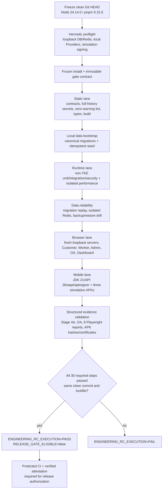

# XLB Non-TKE Engineering RC Closure

This is the single repository engineering release-candidate gate for the
current XLB scope.

## Scope

Included:

- repository architecture, contracts, lint, types and production builds;
- unit, integration, security, performance and isolated database regression;
- migration integrity, migration runtime and the local data-reliability drill;
- Customer, Worker, Admin, OA and Dashboard browser acceptance;
- three-role Android simulation release APK construction and signing checks;
- dependency plus current-tree and full-Git-history secret checks;
- repository-side production readiness.

Excluded:

- TKE delivery/deployment/cutover source, commands and TKE-specific tests;
- real Payment Provider execution;
- real SMS Provider execution;
- real Amap Provider execution;
- production activation.

Test-only mocks remain permitted when they create deterministic business
preconditions. They do not grant permission to call a real Provider.
The immutable database migration chain is still replayed in full; a historical
migration name containing `tke` is schema history, not execution of TKE.

## Execution topology



Steps are deliberately serialized in the canonical runner. This avoids
multiple Turbo, database, browser-port and Android build processes mutating
shared local resources at the same time.

The canonical disposal order is fixed:

| # | Lane | Disposal item |
|---:|---|---|
| 1 | environment | `environment-preflight` |
| 2 | environment | `install` |
| 3 | environment | `closure-contract` |
| 4 | static | `workspace-links` |
| 5 | static | `contracts` |
| 6 | static | `supply-chain` |
| 7 | static | `tracked-and-history-secrets` |
| 8 | static | `lint` |
| 9 | static | `typecheck` |
| 10 | static | `build` |
| 11 | static | `architecture` |
| 12 | static | `migration-integrity` |
| 13 | static | `migration-runtime` |
| 14 | static | `production-repository` |
| 15 | static | `dependency-audit` |
| 16 | data | `local-database-migrate` |
| 17 | data | `local-database-seed` |
| 18 | runtime | `full-regression-non-tke` |
| 19 | runtime | `performance-regression` |
| 20 | runtime | `security-performance-faults` |
| 21 | data | `data-reliability-drill` |
| 22 | data | `oa-migration` |
| 23 | browser | `browser-cross-app` |
| 24 | browser | `browser-oa-dashboard` |
| 25 | browser | `browser-dashboard` |
| 26 | mobile | `mobile-tests` |
| 27 | mobile | `mobile-types` |
| 28 | mobile | `mobile-boundaries` |
| 29 | mobile | `mobile-toolchain` |
| 30 | mobile | `mobile-release` |

Every item is disposed only when its exit code is zero and its required
evidence is valid. The runner stops at the first failure; after correction, a
new run starts from item 1 so the final manifest proves one unchanged commit,
not a patchwork of results from different source states.

## Canonical command

Run from a clean commit:

```powershell
pnpm gate:engineering-rc
```

The runner creates three short-lived simulation keystores outside the
workspace, gives each app a `.engineering-rc.invalid` API origin and removes
the keystores at the end. No formal signing key is loaded. MySQL and Redis are
forced to loopback, the database name is forced to `xlb_local`, every external
Provider switch is forced closed, and Provider credential variables are
removed from child environments.

The command accepts no skip flags. It fails when the tracked worktree is dirty,
the Git commit or lockfile changes, any canonical ID/stage/command is altered,
a log or structured artifact hash differs, a step times out or fails, a
browser reuses an old server, TKE enters the resolved regression set, or a
real Provider can be selected.

Current-run evidence is written below:

```text
.artifacts/engineering-rc/<commit>/<run-id>/manifest.json
```

The same command runs in the main CI workflow. CI installs JDK 21, Android API
36 and Chromium, generates the same simulation signing identities and uploads
the ignored evidence directory. On a successful push, GitHub Actions also
creates a signed provenance attestation for the manifest. Old Stage 5 reports
and readiness matrices are not accepted as proof for this gate.

## Decision semantics

- `ENGINEERING_RC_EXECUTION=PASS` means the included repository engineering
  checks passed on one identified commit; it deliberately does not print a
  local release `GO`.
- A local manifest is always `DIAGNOSTIC_ONLY`; its internal hashes prevent
  accidental drift but do not make it an independent release authorization.
- Release authorization requires both a successful protected canonical CI job
  named exactly `Engineering RC (non-TKE)` for the exact commit and a verified
  GitHub attestation for its manifest.
  Verify a downloaded manifest only with
  `pnpm verify:engineering-rc-release <manifest.json>`. The verifier binds the
  repository, workflow, run attempt, source SHA/ref, protected required check
  and attestation policy. A bare `gh attestation verify ... -R ...` command
  proves only that some matching signature exists and is not release
  authorization.
  The repository pins the approved Windows x64 GitHub CLI binary; on another
  platform, pass an independently verified absolute binary with
  `--gh-path <path> --gh-sha256 <sha256>`.
- `PRODUCTION_ACTIVATION=NOT_EVALUATED` means domain, infrastructure, legal,
  operational and real-Provider prerequisites remain a separate decision.
- Any tracked change after a PASS result invalidates that evidence and requires
  a new gate run for the new commit.
- The local validator accepts a completed diagnostic run for only 15 minutes;
  durable CI provenance comes from the GitHub run identity and attestation, not
  from reusing an old local directory.

## Release-authorization boundary

The repository source defines two separate CI jobs:

1. `Engineering RC (non-TKE)` checks out and executes repository code with
   read-only repository permission.
2. `Engineering RC provenance` runs only after a successful push gate,
   downloads the run-bound evidence artifact without checking out repository
   code, and receives the narrowly scoped OIDC/attestation permissions.

The evidence artifact name binds the GitHub repository ID, run ID, run attempt
and source SHA. The manifest binds the same run metadata. A release verifier
must query GitHub live, reject API or authentication failure, require a
successful current push to `main`, require the exact protected status check
`Engineering RC (non-TKE)`, and verify the manifest attestation through a
hash-pinned GitHub CLI with an isolated configuration. Classic branch
protection is an external one-time setting; until that live check succeeds,
source-code completion does not become release authorization.

## Trust boundary

This gate assumes the host operating system, host-installed toolchain, local
Docker daemon and GitHub itself are trusted. It rejects known redirect
variables and user package-manager configuration, and binds the pnpm/Corepack
binaries, Docker context, container instances, images and ports for the
duration of a run. It does not claim to defend against a local
administrator/root user who can replace the operating system, Docker daemon or
the gate source while it executes.
