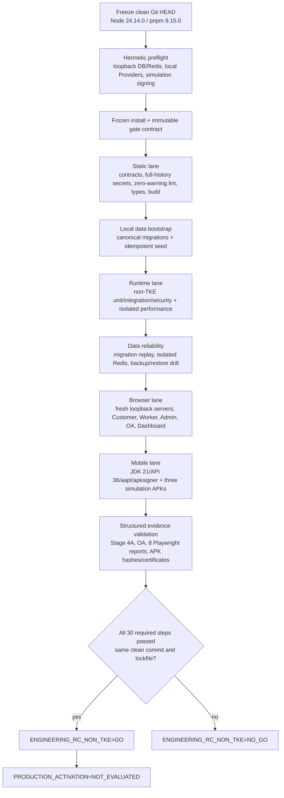

# XLB Non-TKE Engineering RC Closure

This is the single repository engineering release-candidate gate for the
current XLB scope.

## Scope

Included:

- repository architecture, contracts, lint, types and production builds;
- unit, integration, security, performance and isolated database regression;
- migration integrity, migration runtime and the local data-reliability drill;
- Customer, Worker, Admin, OA and Dashboard browser acceptance;
- three-role Android simulation release APK construction and signing checks;
- dependency plus current-tree and full-Git-history secret checks;
- repository-side production readiness.

Excluded:

- TKE delivery/deployment/cutover source, commands and TKE-specific tests;
- real Payment Provider execution;
- real SMS Provider execution;
- real Amap Provider execution;
- production activation.

Test-only mocks remain permitted when they create deterministic business
preconditions. They do not grant permission to call a real Provider.
The immutable database migration chain is still replayed in full; a historical
migration name containing `tke` is schema history, not execution of TKE.

## Execution topology



Steps are deliberately serialized in the canonical runner. This avoids
multiple Turbo, database, browser-port and Android build processes mutating
shared local resources at the same time.

## Canonical command

Run from a clean commit:

```powershell
pnpm gate:engineering-rc
```

The runner creates three short-lived simulation keystores outside the
workspace, gives each app a `.engineering-rc.invalid` API origin and removes
the keystores at the end. No formal signing key is loaded. MySQL and Redis are
forced to loopback, the database name is forced to `xlb_local`, every external
Provider switch is forced closed, and Provider credential variables are
removed from child environments.

The command accepts no skip flags. It fails when the tracked worktree is dirty,
the Git commit or lockfile changes, any canonical ID/stage/command is altered,
a log or structured artifact hash differs, a step times out or fails, a
browser reuses an old server, TKE enters the resolved regression set, or a
real Provider can be selected.

Current-run evidence is written below:

```text
.artifacts/engineering-rc/<commit>/<run-id>/manifest.json
```

The same command runs in the main CI workflow. CI installs JDK 21, Android API
36 and Chromium, generates the same simulation signing identities and uploads
the ignored evidence directory. Old Stage 5 reports and readiness matrices are
not accepted as proof for this gate.

## Decision semantics

- `ENGINEERING_RC_NON_TKE=GO` means the included repository engineering scope
  passed on one identified commit.
- `PRODUCTION_ACTIVATION=NOT_EVALUATED` means domain, infrastructure, legal,
  operational and real-Provider prerequisites remain a separate decision.
- Any tracked change after a GO result invalidates that evidence and requires a
  new gate run for the new commit.
