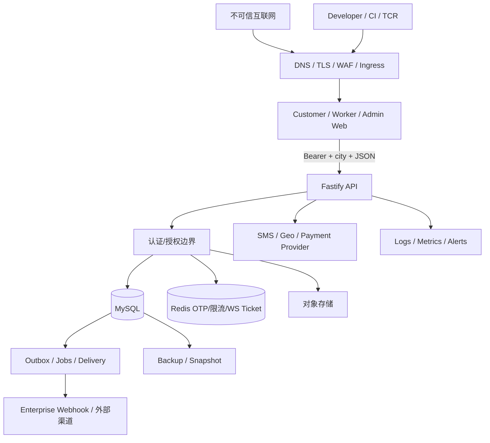

# XLB 威胁模型与隐私安全上线门禁

状态：**UNIT C LOCK CANDIDATE — 工程威胁基线，不是生产安全批准**

方法：资产/信任边界 + STRIDE + 隐私伤害分析

基线日期：2026-07-19

<!-- UNIT_C_THREAT_REQUIRED: assets trust_boundaries stride privacy launch_blockers auth_idor admin_city_scope mock_payment localstorage_xss retention_deletion provider_secrets -->

## 1. 目标与边界

本模型覆盖 Customer、Worker、Admin、Enterprise、Fastify API、MySQL、Redis、对象存储、WebSocket、Outbox/Jobs、TKE/Ingress 和计划中的 SMS/Geo/Payment Provider。它回答：攻击者可能如何冒充、篡改、否认、窃取、阻断或提权，以及如何导致超范围收集、错误披露、不可删除或对个人产生不公平影响。

不在本 Lock 中：实施修复、渗透测试、生产配置、真实 Provider、支付红队、账号注销或删除 Job。

## 2. 资产和安全目标

| 资产 | 关键安全目标 |
|---|---|
| 手机号、地址、精确位置、履约图片、客服消息 | 仅为明确目的处理；最小披露；可追踪访问；到期删除/匿名化 |
| JWT、OTP、API key、Webhook secret、云凭据 | 不泄露、不可重放、可轮换、可撤销、最小权限 |
| 订单、支付、退款、账本、结算 | 身份/城市正确；金额和状态不可伪造；幂等；可对账 |
| Worker 资质、账户、评价与申诉 | 防越权；防不公平自动决定；允许人工复核和审计 |
| 日志、Outbox、备份、对象版本 | 不成为旁路 PII 仓库；期限和删除传播一致 |
| 发布镜像、migration、配置 | 来源可验证；不可降级；变更可回滚；Secret 不进入镜像/Git |

## 3. 攻击者模型

- 未认证互联网攻击者、撞库/短信轰炸者、恶意脚本和机器人；
- 恶意或被接管的 Customer/Worker/Enterprise 账户；
- 越权、误操作或被钓鱼的 Admin/Operator；
- 恶意上传者、Webhook 接收方、被攻陷的第三方 SDK/Provider；
- 供应链攻击者、泄露 CI 凭据或镜像的攻击者；
- 可读取日志、备份、对象存储或云控制面的内部人员；
- XSS、CSRF、SSRF、SQL/模板/内容注入等应用层攻击者。

## 4. 信任边界

边界 B1（浏览器→Edge）、B2（Edge→API）、B3（API→数据层）、B4（内部→外部 Provider）、B5（业务数据→日志/事件/备份）、B6（CI→运行环境）均需独立认证、最小权限、加密、审计和失败关闭。

## 5. 当前正向控制

- JWT 固定 HS256 allowlist，校验 `kid/issuer/audience/exp/jti/tokenUse` 和 app-role 绑定。
- OTP 标识摘要、验证码 HMAC、Redis TTL、重试/冷却/锁定；生产不注册 debug-code。
- RequestContext 从已验证 Token 推导主体；业务域广泛使用城市和角色双重约束。
- 数据库层存在外键、唯一键、金额/状态 CHECK、事务、幂等和 Outbox。
- Worker 手机号、银行卡采用哈希/掩码；完整卡号不落库。
- Worker 位置默认关闭共享，精确位置有业务到期时间。
- Fastify 日志配置对 Authorization、Cookie、验证码、密码、Token、API key 和 Secret 脱敏。
- WebSocket 使用 60 秒一次性 Redis ticket，并限制 payload/禁压缩。
- API Client 对明显凭据字段做错误文本脱敏。
- 对象 key 有路径穿越检查；媒体类型有限；目标云存储设计为私有。
- Outbox 有事件目录、PII ceiling、终态/下游完成/法律保留检查和分级期限基础。

## 6. 威胁登记册

优先级：`P0` 阻止公开运营，`P1` 阻止真实 Staging/受邀试运营，`P2` 应在规模化前完成，`P3` 持续治理。

| ID | STRIDE/隐私 | 攻击路径与影响 | 现有控制 | 残余风险/缺口 | 优先级 | 责任施工包 |
|---|---|---|---|---|---|---|
| TM-01 | S/I/E | XSS 读取 Customer/Admin `localStorage` Token，冒充用户、读取地址/订单/客服或执行管理操作 | Token 有过期和服务端校验；API 错误脱敏 | CSP 当前关闭；Token 同源脚本可读；Admin 影响高 | **P0** | W1/W2 |
| TM-02 | S/E | 生产登录依赖 debug-code 或弱 Admin OTP/用户名，攻击者取得高权账号 | 生产禁 debug route；OTP 限流/哈希 | Customer/Worker 前端仍有自动 debug 登录路径；Admin 缺 MFA/SSO 和强联系身份 | **P0** | W1 |
| TM-03 | S/E | Token 被窃取后在有效期内持续使用 | jti、exp、issuer/audience | 无服务端 session/revocation/logout invalidation；无设备/风险会话视图 | P1 | W1 |
| TM-04 | T/E | 客户端伪造 `customerId/workerId/city` 越权查询他人数据 | RequestContext、app-role/city 边界、诸多安全测试 | 新增订单列表/权利导出/注销最易引入 IDOR；需统一禁止 body/query 选主体 | **P0** | W1/W3/W5B |
| TM-04A | S/I/E | Worker/Admin 使用已知订单 ID 调用通用订单读取；当前所有权校验只在 Customer 分支执行，可能返回完整联系人和地址 | JWT/RequestContext 有效；Customer 分支检查 owner | 通用订单路由没有对非 Customer 身份统一拒绝；属于可利用的跨应用 IDOR/混淆代理 | **P0** | W1/W3 |
| TM-04B | S/I/E | Admin/Operator 篡改城市请求头访问其他城市；部分域仅检查角色和请求城市，未统一查询 `admin_city_scopes` | `adminQueryGuard` 提供 DB scope 校验能力，部分服务已使用 | 该校验尚未成为所有 Admin 路由强制前置条件 | **P0** | W1/各后台域 |
| TM-05 | I/P | 候选 Worker 或运营人员过早看到完整电话/地址，造成骚扰、人身安全风险 | 大量 API 城市/角色隔离 | 缺按订单阶段的字段级披露、虚拟号、访问回收和读取审计 | **P0** | W3/W5B |
| TM-06 | I/P | Worker 精确位置被越权查询、长期留存或从备份恢复 | 默认关闭、`private_exact`、`expires_at`、本人/运营 scope | 无物理清理 Job、单独同意证据、导出/后台访问审计 | **P0** | W5B/W6 |
| TM-07 | I | Customer 手机明文或地址/客服/评价数据被数据库/备份/日志读取 | 外部 API 掩码、DB 权限目标、日志字段脱敏 | 手机明文；无字段加密/列级访问/生产 RBAC/查询审计证据 | P1 | W5B/W6 |
| TM-08 | I/T | 履约/客服图片含人脸、家庭环境、EXIF/GPS；对象公开或签名 URL 过长 | 类型限制、对象 key 检查、私有 COS 目标 | 当前 local/mock；无 EXIF 清理、恶意扫描、签名 URL/下载审计、生命周期 | **P0** | W4/W5B/W6 |
| TM-09 | T/E/D | 恶意文件、图片解析炸弹或超量上传耗尽 API/COS；内容触发后端漏洞 | Fastify 1 MiB body limit；类型 allowlist | 文件扫描/像素限制/配额/异步隔离证据不足 | P1 | W4/W6 |
| TM-10 | I/T | 客服消息、评价、备注中的 HTML/URL 在 Admin/Worker 页面触发存储型 XSS | React 默认文本转义；输入长度限制 | 需要对所有富文本/链接/导出路径做明确编码测试；CSP 缺失放大后果 | **P0** | W2/W5B |
| TM-11 | S/T/D | WebSocket ticket 重放、跨城使用、连接洪泛或消息乱序 | 60 秒 Redis ticket、GETDEL 思路、city/user binding、payload 限制、幂等序号 | Ingress Upgrade/连接限流/生产 Redis 原子消费和压测证据待完成 | P1 | W2/W6 |
| TM-12 | T/R | 支付回调伪造、重放、金额/订单不匹配，导致假支付或重复退款 | 金额状态机、Outbox、幂等、Provider envelope mock | 真实验签、证书轮换、回调重放窗口、对账/差错队列未实现 | **P0（启用支付时）** | W7 |
| TM-12A | S/T/E | 任意有效同城身份调用 `/api/payments/mock-webhook`，将付款单推进 paid；未发现生产环境关闭该路由的强制边界 | Mock Provider 如实标记未外部执行；金额取权威订单 | mock 回调本身可改变业务状态，必须生产 404/未注册，并与真实 Provider 回调完全隔离 | **P0（进入真实 Staging 前）** | W1/W7 |
| TM-13 | T/R | Admin 可将提现“标记已支付”但无真实渠道证据，造成账实不符 | 治理/审核/账本基础、mark-paid audit | 无真实打款 Provider、银行回单和自动对账 | **P0（公开资金运营）** | W7 |
| TM-14 | I/T | Enterprise Webhook URL 指向内网/云元数据；DNS rebinding；payload 泄露；签名密钥失陷 | URL/secret 模型、签名/重试基础、blocked provider | SSRF/DNS 重解析/出站 allowlist/KMS/真实投递尚未验收 | P0（启用 B2B Webhook 时） | W4/W6 |
| TM-15 | I | SMS/Geo/COS/Payment/监控 Provider 超范围保存、二次使用或跨境 | Provider fail-closed/mocks、私有 COS IaC 目标 | 无真实合同/清单/区域/SDK 抓包/跨境核验 | **P0** | W4/W5B/W6/W7 |
| TM-16 | R/P | 无统一 consent 证据，无法证明用户同意的版本、目的、接收方和撤回 | 文档/事件审计基础 | 无 consent ledger/单独同意 UI/撤回传播 | **P0** | W5B |
| TM-17 | I/P | 注销只隐藏前端，主表、投影、Outbox、对象、日志、备份和第三方仍可用 | 地址可单条删除；Outbox purge 决策基础 | 无账户注销编排、删除依赖图、法定保留隔离或完成证明 | **P0** | W5B/W6 |
| TM-18 | I/D | 无期限或法律保留永不解除，数据无限累积；错误删除又破坏争议/财务证据 | 部分 90d/2y/7y 和营销 10y 设计；legal hold | 多数主表/备份无确定期限和执行器；期限口径不统一 | **P0** | W5B/W6/W7 |
| TM-19 | I | 日志/错误/trace/metrics 带手机号、地址、payload 或凭据，监控平台成为旁路数据湖 | Fastify/ApiClient 有字段/正则脱敏，指标避免部分高基数 | body/query/业务 error/第三方 envelope 全链路 allowlist 未证明；日志期限未知 | P1 | W5B/W6 |
| TM-20 | I/T | Outbox/投影复制 PII，源删除后下游继续存在；replay 重建已删除信息 | event catalog、PII ceiling、下游完成、retention/hold 判断 | 缺字段级 payload 目录、tombstone/redaction 和实际 purge/replay 删除语义 | **P0** | W5B/W6 |
| TM-21 | T/R/E | 越权 Admin 导出或批量查看地址、银行/客服/评价；内部滥用难追责 | role/city scope、Admin mutation audit | 读取审计、导出水印、MFA、双人审批、定期权限复核不足 | **P0** | W1/W5B/W6 |
| TM-22 | T/E | JWT HMAC key、Webhook secret、DB/COS/SMS 凭据进入环境、日志、镜像或 Git | Secret 配置与生产检查模板、日志脱敏 | 真实 Secret Manager、轮换、最小 IAM 和泄露演练无证据 | **P0** | W6 |
| TM-23 | T/I | Nginx/Ingress 错误路由、无 TLS/CSP/安全头、API 跨域开放造成 Token/数据泄露 | Fastify Helmet/HSTS 基础 | CSP 关闭；前端域 API/WS 路由未闭环；CORS/可信代理需生产验证 | **P0** | W2/W6 |
| TM-24 | D | Redis/MySQL/SMS/COS 故障导致登录、派单、客服或履约不可用；重试造成雪崩 | health、outbox lease/retry、限流、备份脚本基础 | 托管 HA、断路、配额、告警、RTO/RPO 和恢复演练缺证据 | P1 | W6 |
| TM-25 | T/E | 依赖、CI、TCR 或构建产物被投毒，发布恶意前端窃取 Token | lockfile、依赖审计、CI supply tests、私有 TCR IaC | 镜像签名/摘要准入、SBOM、最小 CI 权限和生产 admission 未闭环 | P1 | W6 |
| TM-26 | R/P | 派单、营销、评价/信誉自动化对用户或 Worker 产生不透明/不公平结果 | 版本化决策/审核/申诉基础；当前多为 conservative foundation | 缺影响评估、规则说明、关闭/拒绝路径、人工复核 SLA 和偏差监测 | P1 | W5B/相关产品域 |
| TM-27 | I/P | 未成年人注册或在地址/客服/图片中出现，未经监护人同意被处理 | 当前无面向未成年人的明确承诺 | 无年龄策略、专门规则、监护人权利和删除流程 | **P0（如允许未成年人）** | W5B/法务 |
| TM-28 | R/I | 规则/隐私政策更新未留版本或默认同意，无法证明用户看到什么 | Git 文档历史 | 无用户可下载历史版本、通知/重新同意和 consent hash | **P0** | W5B |
| TM-29 | I/T | 数据从备份恢复后“复活”已注销账户或已删除 PII | 备份/恢复脚本基础 | 无删除清单回放、备份销毁期限、恢复后 re-delete 验证 | P1 | W6 |
| TM-30 | T/I | 共享开发/测试环境使用真实生产数据或 debug OTP 泄露账号 | 测试 helper/mock 和生产 debug 禁用 | 缺数据脱敏/合成数据强制 Gate 和环境访问证据 | P1 | W6 |
| TM-31 | I/P | 用户在客服正文输入验证码、身份证、银行卡或健康/家庭信息，原文写入工单、会话、Outbox 或 Bot 路径 | 敏感关键词可触发转人工；输入长度限制 | “转人工”不是 DLP 或脱敏；缺输入提醒、secret 阻断、显示/导出脱敏和受控涂黑 | **P0** | W5B/客服域 |
| TM-32 | I/D | `/metrics`、`/api/system/db-health` 应用层无认证，Ingress 绕过或误配时泄露内部状态并可被探测滥用 | 生产 Nginx 计划限制 `/metrics` 私网 | db-health 未见同等边界；应用端仍开放，TKE 暴露模型未验收 | P1 | W2/W6 |
| TM-33 | T/D | Redis Stream 畸形消息无法解析，达到重试上限后不能形成类型化 DLQ/ACK，可能长期滞留 PEL 并反复回收 | 正常消息 Zod 校验、MySQL 权威记录核对、重试基础 | 需要 raw-DLQ/隔离/ACK 语义和 poison-message 故障测试 | P1 | W0/W6 |
| TM-34 | I/S | WebSocket ticket 位于 URL query，被 Ingress/代理访问日志记录；缺 Origin allowlist 或连接上限会放大劫持/DoS | 256-bit、60 秒、Redis 单次消费、参与者校验、64 KiB frame | URL 脱敏、Origin、每用户/IP 连接数、心跳和严格 frame schema 待验收 | P1 | W2/W6 |
| TM-35 | S/I | Enterprise Webhook 加密 key 与 JWT secret 派生耦合；JWT 轮换可能使历史密文不可解，JWT 泄露扩大到 Webhook secret | AES-GCM、随机 IV、签名比较 | 需要独立 KMS/data key、key-id 和双密钥重包裹演练 | P1（启用 Webhook 前） | W4/W6 |

### 6.1 三项必须优先修复的可利用边界

1. **跨应用订单访问/创建**：`backend/src/order/orderRoutes.ts` 使用通用认证；`backend/src/order/orderService.ts` 的读取所有权判断只在 Customer 分支执行，创建也只确认存在 `userId`。修复验收必须覆盖 Worker/Admin 读取、创建、确认和支付关联接口统一拒绝。
2. **Admin 城市授权**：`backend/src/dal/adminQueryGuard.ts` 已有查询真实城市权限的能力，但 `backend/src/gateway/authz.ts`、Dispatch、Ledger、Settlement 等通用入口没有证据证明全部调用。修复应把 DB 权限变成统一强制前置条件，而不是依赖调用者记得检查。
3. **Mock 支付回调**：`backend/src/payment/paymentWebhook.ts` 的 `/api/payments/mock-webhook` 可推进支付状态，但没有生产不注册的强制边界。修复必须让 production/staging-real 默认 404，真实回调另设 Provider 签名、时间窗、商户、金额和唯一交易号校验。

## 7. 上线阻断清单

### 7.1 真实 Staging 前

- TM-01/02/04：正式身份、会话和授权回归；
- TM-05/06/08/10：地址/位置/媒体/内容的最小披露和 XSS/CSP；
- TM-15/22/23：真实 Provider 数据流、Secret Manager、TLS/API/WS；
- TM-16/17/18/20/28：同意、权利、注销、期限、下游删除和版本证据的最小可运行闭环；
- TM-24/25/29/30：HA、告警、恢复、供应链和环境隔离证据。

### 7.2 公开支付前

- TM-12/13：支付、退款、打款、对账和故障演练；
- 全部财务/税务期限与法律保留经过专业确认；
- 小额真实资金测试须另获外部操作授权。

## 8. 必须建立的验证用例

| 测试组 | 最小验证 |
|---|---|
| Auth/session | 生产无 debug；OTP 轰炸/枚举；Token 过期/撤销/跨 app；Admin MFA；退出后不可复用 |
| IDOR/tenant | Customer A 无法读 B 的订单/地址/客服/通知；Worker 候选看不到完整地址；跨城市全部拒绝 |
| Browser/XSS | 存储型/反射型/DOM XSS payload；CSP report-only→enforce；Token 不可被普通内容路径窃取 |
| Location | 未同意不采集；关闭立即停用；过期不可查询；精确位置不出现在日志/Outbox/Worker 公共 API |
| Media | MIME 欺骗、polyglot、超大像素、EXIF、路径穿越、恶意文件、签名 URL 过期和跨主体下载 |
| WebSocket | ticket 一次性/过期/跨城/跨用户；并发连接、乱序、重放、Redis fail-closed |
| Privacy rights | 查阅/导出只含本人；更正；撤回；注销；法律保留隔离；对象/投影/Outbox/第三方/备份传播 |
| Logs | 自动扫描手机号、Token、地址、银行卡、OTP 和 payload；最小 RBAC；读取/导出审计；到期销毁 |
| Provider | SSRF/DNS rebinding、签名、回调重放、secret rotation、超时/重试/熔断、区域和跨境证据 |
| Payment | 金额篡改、伪回调、重复回调、退款竞态、对账差错、账本不变量和回滚 |
| Supply/infra | SBOM、镜像摘要/签名、Secret 扫描、NetworkPolicy、备份恢复、RTO/RPO、故障注入 |

## 9. 风险接受规则

- P0 不能用“用户量小”“试运行”或文档承诺接受；只有关闭相关功能、完成控制或由有权负责人基于真实证据作限时风险决定。
- 对隐私权利、真实资金、身份越权、完整地址/位置/媒体披露和生产 Secret 的 P0，不允许长期例外。
- 每个风险决定必须记录 owner、范围、环境、到期日、补偿控制、监控和退出条件。
- `mock/local/blocked` 必须保持真实标识，不得在 UI、日志或报告中宣称外部成功。

## 10. W5A Lock 结论

当前仓库具有良好的认证校验、城市隔离、幂等、事件可靠性和审计基础，但还没有生产级会话、隐私权利、删除传播、真实私有存储、Provider/Secret、CSP/Ingress 和资金闭环证据。因此：

- `THREAT_MODEL_BASELINE = LOCKABLE`；
- `REAL_STAGING = BLOCKED`，直到相应 P0/P1 有可运行证据；
- `PUBLIC_COMMERCIAL_RELEASE = NO-GO`；
- 本文 Lock 不改变 Phase 14 的 `PRODUCTION BLOCKED` 状态。
