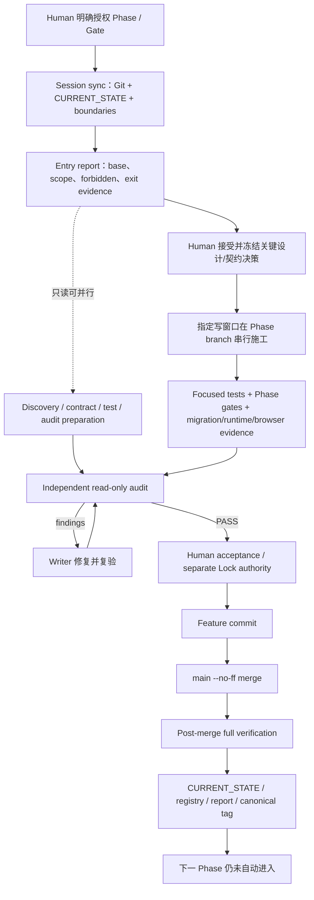

# XLB 当前工程施工模型

> 状态：Governance Refactoring Phase 0 事实报告，等待人工审核
> 观察时间：2026-07-14
> 本文描述“现在实际上怎样施工”，不提出流程优化，不执行 Phase Lock

## 1. 当前现场快照

| 项 | 观察事实 |
|---|---|
| 唯一获批根目录 | `G:\xlb100` |
| 当前 branch | `codex/phase29-marketing-coupon` |
| `main` / HEAD 基线 | `d7bf3e0`，Phase 28 Lock governance commit |
| 最近 canonical tag | `xlb-phase28-review-reputation` |
| 当前 Phase | Phase 29 `IN_PROGRESS`，已完成独立只读接受，但尚待 Human 明确接受；未 commit/merge/tag/Lock |
| 工作树 | dirty，包含 Phase 29 runtime、migration、contracts、tests、reports 与治理元数据改动 |
| Production | Phase 14 仍为 `64/100`、staging/production `NO-GO` |

标记：**[正式规则]** 指强制文件/契约/Gate/Skill 中明文要求；**[历史习惯]** 指多个 Phase 重复执行但未形成统一政策；**[未明确治理]** 指无统一规则、存在冲突或只能从个案推断。

## 2. 端到端执行图

## 3. Phase 如何启动

1. **[正式规则]** Agent 必须先执行 session sync；其余 Skill 按任务触发路由。Session sync 固定 `refs/heads/main` control commit，并分别核验 canonical authority 与当前 worktree 的 branch、HEAD、dirty state。
2. **[稳定实践]** Human 明确进入某 Phase 或子 Gate；“设计已接受”“审计已 PASS”本身不会自动打开 runtime。
3. **[稳定实践]** 从最近 locked main/tag 建立 `codex/phase...` branch，并在 Entry Report 记录 base SHA、最新 migration、下一 migration、允许/禁止文件和生产边界。
4. **[稳定实践]** 先做 current-vs-target discovery，列出 P1/P2 风险和 deferred decisions；由 Human 接受保守决策包后 freeze architecture/contract。
5. **[未统一治理]** 不同 Phase 使用不同生命周期词汇：Phase 25 是 Gate 0–8，Phase 27 是 A–E/B1/B2，Phase 28 是 E0–E7，早期 Phase 使用 readiness scan/implementation/inspection/lock。没有一个统一状态机。

## 4. Agent 如何分配任务

### 4.1 已观察到的模式

- **[历史习惯] 功能型只读扫描**：早期 readiness scan 把任务分给 Baseline、Contract、Forbidden Scope、Admin/UI、City Scope、Test/Gate、Synthesis 等 Agent A–H。
- **[历史习惯] 多路领域审计**：Phase 25 使用三路只读审计，分别检查 runtime theme、五系统 workflow/routes、Campaign/security/QA。
- **[稳定实践] Writer + Independent Reviewer**：近期 Phase 27–29 由施工窗口写代码和证据，独立只读 reviewer 检查完整 candidate；writer 修复，reviewer 重新审查。
- **[正式规则] 单一共享写者**：Phase Prompt Pack 明确多个 Codex/Claude 窗口共享一个 worktree，只能并行 READ_ONLY；一个 designated integration window 一次写一个任务。

### 4.2 没有明确治理的部分

- 没有中央任务登记、Agent identity、owner lease、文件 ownership 或 reviewer independence 定义。
- 没有统一 handoff 格式；有的报告用 P0–P3，有的用 GO/CONDITIONAL/PASS。
- 没有规定 Audit Agent 是否必须由不同模型、不同会话或不同 Human 发起。
- Synthesis Agent、Construction Agent、Audit Agent 的冲突裁决和最终签字边界主要靠 Human 指令与 Phase 报告表达。

## 5. Worktree 如何使用

### 5.1 正式政策

- `AGENTS.md` 指定 `G:\xlb100` 为唯一有效本地仓库根；所有项目命令必须以该目录为 cwd。
- [Phase Prompt Pack](../docs/reports/XLB100_PHASE_PROMPT_PACK.md) 明确：多个窗口共享一个 Git worktree，不得并行写；真实并行施工需要未来明确授权 isolated worktrees、merge ownership、migration-number reservation 和 serial Lock order。
- [Phase 26 Ownership](../docs/architecture/26_XLB_PLATFORM_DOMAIN_OWNERSHIP.md) 明确：read-only discovery 可提前并行，migration allocation、runtime work、merge、Lock 不得在共享 worktree 中并行。

### 5.2 实际使用

- 实际施工通常是在唯一根目录切换 feature branch；近期 Phase 报告称它为 feature/construction branch 或 main worktree，并在 Lock 时 checkout `main`。
- 用户自有 untracked audit artifacts 会被列出并保护；历史上也使用过命名 stash 隔离脏文件，但这属于个案实践。
- 2026-07-14 的 `git worktree list` 显示另有 `G:/xlb100-p0-architecture-foundation`。该路径不在获批根目录政策内，因此不能视作正式并行施工模型；其 owner、用途、生命周期与清理责任未被当前治理说明。
- 当前根 worktree 已包含大量 Phase 29 未提交写入；本 Governance Phase 0 只在全新 `governance/` 目录写报告，未触碰这些既有改动。

结论：项目“使用 branch”，但没有正式采用“isolated worktree 并行开发”。额外 worktree 的存在反而证明政策与 Git 元数据未完全对齐。

## 6. Code Change 如何进入主线

1. **[稳定实践]** 在 Phase branch 完成 contract-first implementation、focused gates 和证据报告。
2. **[稳定实践]** 独立只读审查可能先拒绝；finding 全部修复并复审 PASS 后，候选才进入 Human acceptance。
3. **[正式规则]** Lock 必须由 Human 明确请求；不得因测试全绿而自 Lock。
4. **[稳定实践]** 形成 feature commit，必要时另有 audit trace/docs commit。
5. **[正式规则]** clean main 上 `git merge --no-ff <phase-branch>`；不得夹带无关 branch。
6. **[稳定实践]** main 上重复 full regression、build、typecheck、preflight、Phase gates、migration/browser evidence。
7. **[稳定实践]** 更新 Lock report、`CURRENT_STATE`、phase registry 等治理元数据并创建 canonical tag。

GitHub workflows 在 `pull_request` 和 main push 上运行，但近期 Lock 报告记录的是“本地 `--no-ff` merge + 本地 post-merge verification”。没有发现强制 PR、required review、branch protection 或 remote merge queue 的仓库内治理证据。早期计划要求立即 push main/tag，近期 Phase 27–29 又明确 push 未授权；因此 push 不是一个一致的自动步骤。

## 7. Test 如何执行

### 7.1 实际分层

| 层 | 当前实际用途 |
|---|---|
| Unit | 纯函数、schema、state machine、policy、components |
| Contract | types/validators/API Client/event/enum 和响应形状对齐 |
| Integration | 真实 MySQL、HTTP/service、transaction、outbox、idempotency/concurrency |
| Security | city/tenant/role/owner denial、forbidden import/write、provider truth、scope leak |
| E2E/Browser | 真实 API/DB/auth，关键 C/W/A workflow，responsive 与 console/network/5xx |
| Performance/Coverage | Phase 22/23D 等专项工作流中的阈值测试 |
| Migration | fresh/upgrade/partial/double replay、marker、constraint、zero seed/activation |

### 7.2 常见执行顺序

1. 工作包 focused unit/contract/security/integration。
2. Phase entry/boundary/aggregate gate。
3. Migration gate 与本地 migrate/seed。
4. 真实 API/DB/browser acceptance。
5. Workspace full regression；记录 test files/cases、todo/skip 来源。
6. Workspace typecheck/build。
7. 完整 architecture preflight 与 phase-governance check。
8. 适用时 dependency audit、coverage、performance、diff hygiene。
9. Lock 后在 main 重复关键链路。

### 7.3 明确例外

- **[未明确治理]** `.github/workflows/contract-check.yml` 调用的 `check-contracts.ps1` 仍只是 Phase 0 placeholder；真实 contract assurance 实际由 Vitest contract suites 和 Phase gates承担。
- **[未明确治理]** `lint` 命令存在但未进入主 CI；近期 Phase 28 将继承 lint red 记录为已知历史问题。
- **[未明确治理]** 主 CI 运行 build/typecheck/full Vitest/preflight，但 E2E、coverage、performance、dependency audit 依赖专项 workflow/Phase，尚非统一 baseline。

## 8. Audit 如何执行

- **[稳定实践]** Audit 是独立、只读的；必须检查完整 tracked/untracked candidate，而不是相信实现报告。
- **[稳定实践]** finding 用 P0–P3 计数；初审可以拒绝。施工方修复后必须重新跑相关 gates 并交回独立复审。
- **[稳定实践]** finding 不得被“接受风险”静默跳过；近期 Phase 28/29 都记录了初审发现、修复和第二次 PASS。
- **[稳定实践]** Audit PASS 只证明适合提交 Human acceptance，不授予 merge/Lock/next Phase。
- **[未明确治理]** Audit 的最低覆盖、独立性标准、证据保存格式、签名/身份、复审 SLA 和 P2/P3 是否必须清零没有全局章程。近期 Phase 28/29 事实上要求 P0/P1/P2/P3 全零，但早期 Phase 有“third-party inspection PASS”或 conditional verdict。

## 9. Lock 如何发生

Lock 的现行 ceremony 由 [`xlb-phase-lock`](../.cursor/skills/xlb-phase-lock/SKILL.md) 与近期 Lock 报告共同体现：

1. Human 明确请求 Lock。
2. Session sync，确认 feature commits、clean worktree、未包含 dist/cache/无关文件。
3. build/typecheck/full tests/preflight + 全部 Phase gates。
4. infrastructure、migration/seed、live API、DB invariants、boundary scan（按 Phase 适用）。
5. 冻结 pre-merge acceptance evidence，不提前宣告 Lock。
6. 在 canonical root 切换并断言当前 branch 为 `main`，再 `--no-ff` merge。
7. main post-merge repeat verification。
8. 更新并提交 `CURRENT_STATE`/registry/Lock report，再创建指向最终治理 commit 的 canonical Phase tag。
9. 明确 next Phase 未进入；production/push/deploy 仍按单独授权处理。

P-18 已统一未来顺序：Human merge/Lock authority → main merge → main 复验 → Lock metadata commit → canonical tag。早期顺序只属于历史，不得继续用于新 Lock；push/deploy 始终需要独立明确授权。

## 10. 模型摘要：正式规则、历史习惯、未明确治理

| 主题 | 正式规则 | 历史形成习惯 | 未明确治理 |
|---|---|---|---|
| Phase 启动 | Human 授权、session sync、边界先行 | Entry Report + frozen decision package | 统一生命周期状态机 |
| Agent 分工 | 共享 worktree 单 writer、其他只读 | A–H 专项 scanner、独立 reviewer | identity、ownership、handoff、冲突裁决 |
| Worktree | 唯一有效根目录；并行写未授权 | feature branch 在同一根切换 | 额外 worktree owner/lifecycle；isolated worktree policy |
| 主线集成 | clean、`--no-ff`、post-merge verify、Human Lock | feature/audit/governance 多提交 | PR/branch protection/push policy；tag/metadata 顺序 |
| 测试 | build/typecheck/test/preflight、Phase gates | full regression计数、browser/live DB、audit critical | lint、统一 E2E/coverage/perf baseline、contract-check placeholder |
| Audit | 只读、不自动授权 Lock | P0–P3、修复后复审 | Audit Charter 与 independence 标准 |
| Lock | Human-only、main+tag、不得进入下一 Phase | local merge、完整 evidence report | remote/push、治理提交与 tag 的原子顺序 |

## 11. 当前施工位置

Phase 29 当前位于“独立只读 acceptance PASS → 等待 Human acceptance → 如另行授权才进入 Lock”的停线点。它尚未形成 feature commit、main merge、tag 或 Lock，因此任何后续 Phase、push、deployment、production migration、subscriber activation、历史 replay/backfill 都没有被当前状态授权。
