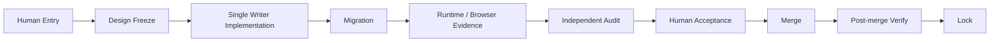

# XLB 治理差距分析

> 状态：Governance Refactoring Phase 0 分析，等待人工审核
> 限制：只识别问题、并行边界与未来决策题，不修复、不创建新规则、不引入 ADR Engine

## 1. 分析结论

本次识别 **16 个治理问题**：高影响 6 个、中影响 8 个、低影响 2 个。核心矛盾不是缺少工程纪律，而是纪律分散且写并发被唯一共享 worktree 完全串行化：项目已经建立强 Phase boundary、数据隔离、migration、测试和独立审查，但没有统一生命周期、Agent/Worktree ownership、migration reservation、Audit Charter 和 metadata closure 协议。

## 2. 问题清单

| ID | 级别 | 问题 | 事实证据 | 当前影响 |
|---|---|---|---|---|
| G-01 | 高 | Phase 生命周期没有统一状态机 | Phase 25 用 Gate 0–8，Phase 27 用 A–E/B1/B2，Phase 28 用 E0–E7；registry 状态无法表达所有停线点 | 同一词如 accepted/complete/locked 在不同 Phase 含义不同，交接依赖人工阅读长报告 |
| G-02 | 高 | 唯一共享写 worktree 形成垂直瀑布瓶颈 | `AGENTS.md` + Phase Prompt Pack 明确多窗口不得并行写，runtime/migration/merge/Lock 串行 | Writer 等 Human，Audit 等 writer，后续 Phase 等 Lock；独立领域也被同一写锁阻塞 |
| G-03 | 高 | 并行施工所需的 ownership/merge/migration reservation 不存在 | Prompt Pack 明文说需要未来 amendment；当前没有 file owner、merge owner、migration lease | 无法安全并行 contract、runtime、migration；冲突只能靠“禁止并行”规避 |
| G-04 | 高 | 正式 worktree 政策与 Git 元数据不一致 | 政策只允许 `G:\xlb100`；`git worktree list` 另有 `G:/xlb100-p0-architecture-foundation` | 附加 worktree 的 authority、staleness、branch ownership 和清理责任未知 |
| G-05 | 高 | Source-of-truth 文档存在明显漂移 | 根 README 仍称 Phase 3；`tests/README` 仍称 Phase 0 skeleton；Phase Numbering Policy baseline 停在 Phase 25，而 current state 已到 Phase 29 | 新 Agent 可能读到互相矛盾的“当前事实”，增加误施工和错误 gate 解释风险 |
| G-06 | 高 | Lock closure 的提交/tag/metadata/push 顺序不一致 | Lock Skill：tag 后更新 CURRENT_STATE；近期 tag 指向最终 governance commit；早期计划要求立即 push，近期 Phase 禁止 push | Lock 可重复性、remote truth 和 failure recovery 缺少单一 ceremony |
| G-07 | 中 | Audit Agent 权限与独立性没有集中章程 | 近期实践是 read-only + P0–P3 + re-review；早期是 third-party inspection/conditional pass | 审计覆盖、身份、冲突回避、P2/P3 closure、证据签名只能按个案解释 |
| G-08 | 中 | Human Owner 不是正式角色模型 | 文档反复引用 Human/Product/Privacy/Finance/Legal/Ops owner，但无身份、代理或冲突处理规则 | “谁的批准足够”以及多 owner 分歧如何处理不明确 |
| G-09 | 中 | Phase registry 无法表达子阶段与 acceptance-but-not-locked | Phase 27A 报告明确 registry 不能准确编码 runtime substage；Phase 29 已 accepted by audit 但仍 IN_PROGRESS | 状态被迫写进 notes/长报告，机器 gate 难以准确判断 authority |
| G-10 | 中 | Contract Check 名义上独立、实际上是 placeholder | `contract-check.yml` 只运行两行 placeholder script | CI 绿色可能被误读为 contract governance 已由独立 gate 证明 |
| G-11 | 中 | Lint 不属于统一 merge/Lock baseline | root 有 `lint`，主 CI 不运行；Phase 28 记录 inherited lint red | “全绿”不包括 lint，技术债与新回归边界依赖人工解释 |
| G-12 | 中 | Quality evidence 没有统一 schema | 不同 Phase 对 test count、todo、flaky rerun、browser、live ID、coverage/perf 的记录格式不同 | 自动比较与审计复用困难，长报告成为唯一证据索引 |
| G-13 | 中 | Production/runtime/local merge/push authority 分散 | Phase 文档逐次写 NO-GO；ADR 和 Provider 文档另写 deferred authority；没有总表 | local runtime、production data write、activation、push、deploy 容易被混为一类授权 |
| G-14 | 中 | 并行只读产物缺少稳定 handoff/freeze/rebase 规则 | Discovery 可以提前并行，但不得假设 predecessor contract；未规定 predecessor 变化后如何作废/重验 | 早期并行分析可能在依赖变化后悄然过期，仍被后续施工引用 |
| G-15 | 低 | README/索引不能支持治理导航 | docs/reports/README 只有一句话，contracts index 不完整，tests README 陈旧 | Agent 被迫依赖全库搜索或会话知识，增加读取成本与遗漏 |
| G-16 | 低 | ADR 覆盖是单点而非系统性决策记录 | 仓库可确认的正式 ADR 主要是 ADR-26-01；大量 frozen decision 存在 Phase reports 中 | 决策状态、supersede/ reopen、owner 和影响范围难以横向查询 |

## 3. 垂直瀑布式瓶颈

当前写流程近似：

主要等待点：

1. **Human 串行停线**：Entry、关键 deferred decisions、子 Gate、acceptance、Lock 都可能需要单独 Human 指令；前一授权不传递到下一阶段。
2. **Single Writer 停线**：所有 runtime/contracts/migration/governance metadata 共用根 worktree，读写冲突靠禁止并行解决。
3. **Migration 停线**：没有 migration-number reservation 和跨 worktree schema owner，后续 Phase 不能安全提前写 migration。
4. **Audit 后置**：独立 audit 往往在完整 candidate 形成后开始；初审发现 P1/P2 会把整条链退回 writer，再完整复验。
5. **重复全量验证**：feature、审计修复、pre-merge、post-merge 都可能重复 full regression、migration、browser 和 preflight；这是现有证据要求，不是本报告要优化的对象，但它构成真实周期成本。
6. **Lock 阻塞后续 runtime**：后续 Phase 可做只读 discovery，但 runtime、migration、merge、Lock 必须等 predecessor acceptance/Lock。

## 4. 当前规则允许的可并行区域

以下只是在现有政策下已经可并行的只读或互不改状态工作，不代表授权扩大：

| 区域 | 可并行内容 | 现有限制 |
|---|---|---|
| Discovery | current-vs-target、领域事实、dependency map、风险扫描 | 必须只读；predecessor contract 变化后结果可能过期 |
| Audit 准备 | 审计清单、威胁模型、evidence index、历史 finding 对照 | 不得提前给 candidate PASS，不得写实现 |
| Test 设计 | scenario matrix、cross-city/role denial、idempotency/concurrency cases、E2E journey 设计 | 不得修改共享 tests/fixtures；必须以 frozen contract 为条件 |
| Contract 检查 | types/validators/API Client/文档差异的只读检查 | 不得多个 Agent 同时改 shared contract；独立 CI contract-check 尚是 placeholder |
| Migration 评审 | DDL/FK/index/replay plan 的只读审查 | 不能分配/写 migration 号，不能执行共享 DB 写入 |
| UI/Backend 对照 | route/action/API/not-wired/fake-state audit | 只读；不能各自在 app/backend 直接施工 |
| Evidence 整理 | 测试结果、命令、计数、报告交叉核对 | 最终报告仍由 designated writer 集成 |
| Future Phase Phase 0 | 后续领域只读 discovery 与 entry design | 不得假设未接受 predecessor，不得创建 runtime/migration |

历史实践证明这些并行方式可用：Phase 10/11 的 A–H readiness scanners、Phase 25 三路只读审计、Phase 27–29 的 independent read-only reviewers。

## 5. 当前不可并行区域

| 区域 | 不可并行原因 |
|---|---|
| Migration 号分配与 SQL 写入 | 全局序列、append-only immutability、无 reservation/lease、同一 schema ledger |
| 共享 Contract 修改 | `packages/types`/`validators`/API Client 是跨端单一契约源；并发写会改变所有消费者 |
| Runtime 共享模块修改 | backend/events/order/payment/pricing 等存在 canonical writer 和跨域不变量；同一根 worktree 无隔离 |
| Phase boundary/preflight gate 修改 | gate 既约束当前 Phase 又保护历史 Phase；并发放宽可能互相掩盖 |
| `CURRENT_STATE`/registry/Lock report | 它们共同表达 authority 与 phase truth；并发写会产生不一致事实 |
| Main merge 与 tag | 必须保序、基于 clean main、post-merge verify；一个 canonical tag 只能对应一个 closure truth |
| Local shared DB migration/runtime verification | 使用同一 MySQL/Redis/seed 状态时，并发测试可互相污染；DB suites 已采用 serial project |
| Production activation/replay/purge/Provider | 当前根本未获授权；不是并发策略问题，而是 authority 边界 |

## 6. 未来 ADR/治理决策需要回答的问题

以下是未来需要解决的“决策题”，不是本阶段提出的答案，也不是创建 ADR 的授权：

1. **Phase Lifecycle**：统一 Entry、Design Frozen、Construction、Verification、Audit、Human Accepted、Merge Ready、Locked、Production Ready 的状态和合法转换；子 Gate 如何映射。
2. **Agent Authority / RACI**：Human Owner、Construction Agent、Audit Agent、Integration Owner、Migration Owner、Release Owner 的权限、代理、冲突回避和签字证据。
3. **Parallel Worktree Policy**：是否允许 isolated worktree；允许时的命名、base、owner lease、过期、共享依赖、清理与禁止路径。
4. **Merge Ownership**：谁可以集成 shared contracts/runtime，怎样处理交叉 branch、rebase、cherry-pick、conflict 和 partial acceptance。
5. **Migration Reservation**：migration 号如何保留、释放、过期；DDL owner、共享 DB 验证和失败恢复如何保序。
6. **Audit Charter**：独立性最低条件、覆盖面、P0–P3 closure、复审、证据签名、报告保存和 Audit 不得写 candidate 的边界。
7. **Gate Baseline**：哪些是所有 Phase 的统一硬门禁，哪些按风险启用；contract-check、lint、E2E、coverage、performance、dependency audit 的地位。
8. **Evidence Model**：命令、commit、环境、test count、todo、rerun、migration、browser/live IDs、DB invariants 如何形成统一可验证清单。
9. **Governance Metadata Atomicity**：`CURRENT_STATE`、registry、Lock report、tag、main commit、remote push 的唯一顺序与失败恢复。
10. **Authority Layers**：local construction、local merge、push、staging migration、production migration、subscriber activation、Provider、replay/backfill、purge 是否分别授权，如何证明未越权。
11. **Decision Record Coverage**：哪些 frozen Phase decisions 必须提升为可追踪 ADR/decision record，如何 supersede/reopen；避免所有决策散落在 acceptance report。
12. **Parallel Discovery Validity**：提前完成的只读 discovery/test design 在 predecessor contract 改变后，何时必须 rebase/revalidate/作废。

## 7. 风险关系摘要

问题之间存在三条主链：

- G-01/G-09 的状态表达不足，使 G-06/G-13 的 authority 与 Lock closure 更依赖人工解释。
- G-02/G-03/G-04 阻止安全并行，形成瀑布等待；G-14 又使唯一获准的只读并行容易过期。
- G-05/G-10/G-11/G-12/G-15 让“绿色证据”和“当前事实”难以由新 Agent 快速、机器化地复核。

## 8. 下一阶段建议（仅建议人工评审顺序）

下一阶段不应直接植入 ADR Engine。建议先由 Human 审核本次事实是否准确，尤其确认四项争议事实：

1. 唯一根目录政策与附加 `xlb100-p0-architecture-foundation` worktree 的真实意图；
2. Audit PASS、Human acceptance、merge 与 Lock 的精确 authority 分界；
3. canonical tag、governance metadata、remote push 的期望顺序；
4. Contract Check placeholder、lint red 和专项 E2E/performance 是否应被视为当前允许例外。

在这些事实被人工确认之前，不宜把本草案升级为规范，也不宜据此并行 runtime/migration、改变 CI、修改 Phase 状态或执行 Lock。
