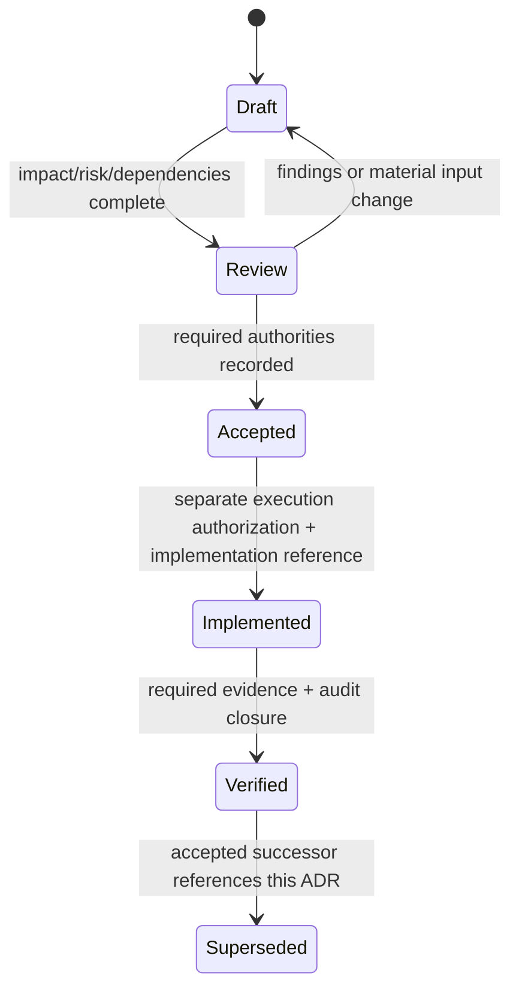

# XLB ADR Decision Engine Design

> 状态：Human Owner 已接受 ADR Engine 与 P-01～P-18，并授权植入项目执行系统、纳入正式版本控制；当前为 `BOOTSTRAP / NOT_ENABLED` candidate
> 输入：[正式项目工程治理宪法](./01_PROJECT_CONSTITUTION_DRAFT.md)、[当前工程施工模型](./02_CURRENT_ENGINEERING_EXECUTION_MODEL.md)、[治理差距分析](./03_GOVERNANCE_GAP_ANALYSIS.md)
> 范围：设计并植入本地人工 ADR/并行治理控制；不修改业务 runtime、Phase 状态、hosted CI、Lock，不执行 merge
> 追溯规则：本文件每个设计条目以 `Gap` 标注回指 G-01～G-16；未决项以 `UNRESOLVED DEPENDENCY` 标注
> 并行施工决定：[06_PARALLEL_CONSTRUCTION_GOVERNANCE_DESIGN.md](./06_PARALLEL_CONSTRUCTION_GOVERNANCE_DESIGN.md)；执行控制 candidate 已安装，实际 WRITE parallel 在独立审计与 Human 启用确认前保持未启用

## 0. 设计目标与边界

ADR Decision Engine 把任何未来 Phase Change 的意图转换为一个可审查的决策包，而不是直接执行变更。其固定决策链为（Gap: G-01, G-16）：

```text
Intent
  ↓
Impact Analysis
  ↓
Risk Classification
  ↓
Required Authority
  ↓
Required Evidence
  ↓
Execution Permission
```

| 设计原则 | 规则 | Gap |
|---|---|---|
| Trace-first | 每个 ADR 必须引用触发它的已知治理 Gap、当前事实来源和目标 Phase；没有 Gap/事实追溯时只能保持 `Draft`。 | G-05, G-12, G-16 |
| Highest-impact wins | ADR Level 取 scope、impact、risk、authority trigger 中的最高级，不允许通过拆小文件或改名降级。 | G-01, G-09, G-13 |
| Decision is not permission | `Accepted` 只表示设计决策被接受，不自动授权 runtime、migration、merge、Lock、push、Provider 或 production。 | G-01, G-06, G-08, G-13 |
| Fail closed | impact、authority、evidence 或 dependency 不能确定时，Engine 输出 blocked/unresolved，不猜测 owner 或权限。 | G-05, G-08, G-12, G-13 |
| Preserve current boundaries | 已 Lock migration/tag、Phase boundary、canonical writer、city scope 和 no-fake-state 仍由原规则约束；ADR 不能绕过它们。 | G-03, G-06, G-13 |
| Managed parallelism only | Human 已决定 managed Work Unit 并行模型；只有执行控制完成 candidate commit、独立审计与 Human 启用确认，且 Train Charter/worktree/lease/contract/reservation/environment/evidence 全部有效时，Engine 才能输出 Work Unit parallel eligibility。否则输出 `GOVERNANCE_EXECUTION_BOOTSTRAP_NOT_ENABLED` 或 blocked。 | G-02, G-03, G-04, G-14 |

## 1. Engine 输入与输出契约

### 1.1 Intent 输入

| 字段 | 含义 | 缺失时处理 | Gap |
|---|---|---|---|
| `intentId` | 稳定的变更意图 ID | 保持 `Draft` | G-12, G-16 |
| `title` / `problemStatement` | 要解决的已知问题，不是预设实现 | 保持 `Draft` | G-05, G-16 |
| `sourceFacts` | Git/tag/`CURRENT_STATE`/contract/report 的精确引用 | 标记 `FACT_SOURCE_MISSING` | G-05, G-15 |
| `gapRefs` | 一个或多个 G-01～G-16 | 标记 `TRACEABILITY_MISSING` | G-16 |
| `targetPhaseOrWorkUnit` | 目标 Phase/Gate/工作包 | 标记 `PHASE_SCOPE_UNKNOWN` | G-01, G-09 |
| `inScope` / `outOfScope` | 明确施工与禁止范围 | 不生成 write permission | G-01, G-13 |
| `requestedActions` | read、design write、runtime write、migration、merge、Lock、push、production 等动作 | 未声明动作一律不推定 | G-06, G-13 |
| `dependencySnapshot` | predecessor tag/commit、contract revision、migration ledger、worktree snapshot | 标记 `STALE_INPUT_RISK` | G-05, G-14 |
| `trainCharterRef` / `workUnitManifestRef` | Human 批准的 Train Charter 与唯一 Work Unit manifest | 执行控制未启用或 Charter 未批准时 fail closed；不得从文件存在推定 authority | G-01, G-02, G-04, G-09 |
| `ownershipLeases` / `migrationReservation` | path+semantic owner、Contract/Migration/Integration Owner、migration number/filename/table reservation | 缺失或冲突时 `OWNERSHIP_OR_RESERVATION_MISSING` | G-03, G-04 |
| `isolatedEnvironment` | Work Unit MySQL/Redis/Compose 隔离证明，或明确 no-state-write | 未证明时 DB/state-write 进入 serial lane | G-02, G-03, G-12 |

### 1.2 Decision 输出

| 字段 | Engine 输出 | Gap |
|---|---|---|
| `adrLevel` | L0～L4，附所有 escalation trigger | G-01, G-09, G-16 |
| `impactVector` | Database/API/Workflow/Payment/Security/UI/Migration/Provider/Production 九维结果 | G-12, G-13 |
| `riskClass` | R0～R4 与命中的 risk flags | G-01, G-12, G-13 |
| `requiredAuthorities` | Agent/Human/Architecture/Financial/Security review 集合；全部 Human-side review class 由唯一 Human Owner 承担，不设代理或多人会签 | G-07, G-08, G-13 |
| `requiredEvidence` | 按 ADR Level 与 impact trigger 计算的证据清单 | G-10, G-11, G-12 |
| `parallelismClass` | READ_ONLY parallel、policy-approved-not-enabled、managed Work Unit eligible、SERIAL WRITE、STALE 或 BLOCKED | G-02, G-03, G-04, G-14 |
| `executionPermission` | Engine 可表达的权限状态，不等于实际 Phase/Lock 授权 | G-01, G-06, G-08, G-13 |
| `unresolvedDependencies` | 所有阻断依赖的 ID、Gap、影响和所需 Human decision | G-03, G-04, G-06, G-07, G-08, G-13 |
| `evidenceStatus` | missing/partial/complete/invalidated，含 source revision | G-10, G-11, G-12, G-14 |

## 2. ADR Level 分级

有效 Level 是“基础范围等级”和所有最低等级触发器的最大值。治理元数据、money、安全、Provider、production 等变化不得因为 diff 很小而归入 L0/L1。（Gap: G-01, G-09, G-13）

| Level | 定义 | 允许描述的典型范围 | 最低升级触发器 | Gap |
|---|---|---|---|---|
| L0 — Documentation | 只修正文案、索引、证据引用或不承载 authority 的说明文档；不改变 Phase/registry/Lock/contract/CI/runtime 含义。 | README/索引/报告中的事实同步、链接和措辞修正 | 触及 `CURRENT_STATE`、registry、Lock report、authority、contract 或执行含义时至少升至 L2/L3；不得仅按文件扩展名判断。 | G-05, G-06, G-15 |
| L1 — Local Feature | 单一已授权模块或 UI surface 内的可逆局部变化；无 DB/API contract/workflow authority/money/security/provider/production 影响。 | 既有 contract 下的纯呈现、局部组件、内部非共享实现 | 一旦改变 backend action、共享 package、city/role、持久化或用户成功状态，升 L2/L3。 | G-01, G-10, G-11, G-12 |
| L2 — Domain Change | 单一业务域内的 contract/API/workflow/persistence 变化，保持 canonical writer 与既有跨域边界。 | 一个 domain 的 additive API、状态转换、domain-owned migration、API Client 对齐 | 共享 contract 影响多个 domain、跨域写、money/security/PII/Provider/production 时升 L3/L4。 | G-01, G-03, G-09, G-14 |
| L3 — Cross Domain / Money / Security | 任何跨 domain 行为、金额/支付/退款/ledger/settlement、auth/city/tenant/role/PII、安全边界或高影响 migration。 | 跨域 event/contract、financial evidence、authorization、sensitive audit、protected-domain boundary | 平台控制面、全局基础设施、production activation、治理/Lock/worktree/migration policy 时升 L4。 | G-03, G-07, G-08, G-12, G-13 |
| L4 — Platform Architecture | 改变平台级 control plane、跨 Phase 基础设施、治理状态机、worktree/merge/migration policy、Provider 体系或 production authority。 | event delivery platform、Phase lifecycle、ADR governance、worktree policy、production activation model | L4 不自动表示可执行；必须单独解决所有 authority/dependency。 | G-01, G-02, G-03, G-04, G-06, G-08, G-09, G-13, G-16 |

### 2.1 强制 Level 覆盖规则

| 触发事实 | 最低 Level | Gap |
|---|---:|---|
| 只改不承载 authority 的事实文档/索引 | L0 | G-05, G-15 |
| 单一 surface 且完全服从既有 API/workflow | L1 | G-01, G-12 |
| 新增/修改单域 API contract、状态机或业务表 | L2 | G-01, G-03, G-09 |
| 修改 shared contract、cross-domain event/canonical writer 边界 | L3 | G-03, G-13, G-14 |
| Payment/money/refund/ledger/settlement/pricing/discount 金额语义 | L3 | G-08, G-12, G-13 |
| AuthN/AuthZ、city/tenant/role、PII、privacy、安全审计 | L3 | G-07, G-08, G-13 |
| 新外部 Provider 或 production data/activation | L4 | G-08, G-13 |
| Phase lifecycle、registry schema、Lock、worktree、merge、migration-number policy | L4 | G-01, G-03, G-04, G-06, G-09 |
| 修改已 Lock migration/tag 或越过当前 Phase boundary | `BLOCKED`，不能以 L4 合法化 | G-03, G-06, G-13 |

## 3. Change Impact Matrix

### 3.1 Impact 值

| 值 | 含义 | Gap |
|---|---|---|
| `NONE` | 有证据证明不受影响；不能用“未检查”代替 | G-05, G-12 |
| `LOCAL` | 单文件/单 surface 内部影响，不改变契约或权限 | G-01, G-12 |
| `DOMAIN` | 一个 canonical domain 的 contract/workflow/data 影响 | G-01, G-09 |
| `CROSS_DOMAIN` | 两个以上 domain、shared contract、event 或 protected boundary 影响 | G-03, G-13, G-14 |
| `PRODUCTION` | 触及 live data、Provider activation、deployment、replay/backfill/purge 或 release authority | G-08, G-13 |
| `UNKNOWN` | 证据不足；Engine 必须阻止 write permission | G-05, G-12, G-13 |

### 3.2 九维影响矩阵

| Dimension | 必须回答的问题 | Level 提示/阻断规则 | Gap |
|---|---|---|---|
| Database | 是否新增/改表、约束、索引、query scope、snapshot、audit data 或 protected-domain write？ | 单域 data 至少 L2；跨域/financial/sensitive 至少 L3；改 locked schema 直接 BLOCKED。 | G-03, G-12, G-13 |
| API Contract | 是否改变 request/response、enum、error、action、version、API Client 或兼容性？ | 单域 additive 至少 L2；shared/breaking/cross-domain 至少 L3。当前 placeholder Contract Check 不得作为唯一证据。 | G-10, G-12, G-14 |
| Workflow | 是否改变状态机、canonical writer、available action、idempotency、audit 或 side effect？ | 单域至少 L2；跨域/不可逆/protected writer 至少 L3。 | G-01, G-09, G-13 |
| Payment（资金流） | 是否改变价格/折扣/金额快照、支付/退款、账本/结算/出款或资金证据？ | 任一非 `NONE` 至少 L3，并触发 Financial Review；外部执行/production 为 L4。 | G-08, G-12, G-13 |
| Security | 是否改变 auth、city/tenant/role/owner、PII、secrets、audit visibility、provider trust？ | 任一 contract/authority 影响至少 L3，并触发 Security Review。 | G-07, G-08, G-13 |
| UI | 是否只是投影既有 backend truth，还是新增/启用 action、fake state、金额或权限假设？ | 纯呈现可 L1；新 action/contract 至少 L2；money/security/cross-domain 按触发器升 L3。 | G-01, G-10, G-12 |
| Migration | 是否分配新号、写 SQL、seed、backfill、重放、修改历史 migration？ | 新单域 migration 至少 L2；跨域/financial 至少 L3；reservation ledger candidate 已安装但未启用，未获具体 reservation/Charter 时 BLOCKED；历史修改 BLOCKED。 | G-03, G-04, G-12 |
| Provider | 是否新增/改变 local/mock/external envelope、credential、retry、delivery truth 或 activation？ | Provider contract 至少 L3；新外部 Provider/activation 至少 L4。 | G-08, G-13 |
| Production | 是否包含 push/deploy、staging/production migration、live start、subscriber activation、replay/backfill/purge？ | 任一非 `NONE` 为 L4 且需要独立 authority；ADR acceptance 不等于 production permission。 | G-06, G-08, G-13 |

## 4. Risk Classification

Risk 与 ADR Level 分开计算；最终 Level 不低于 risk class 对应的最低 Level。（Gap: G-01, G-12, G-13）

| Risk | 定义 | 典型 flags | 最低 Level | Gap |
|---|---|---|---:|---|
| R0 — Editorial | 可逆事实文档/索引，无 authority 或执行含义 | `docs-only`, `link-only` | L0 | G-05, G-15 |
| R1 — Local Reversible | 单 surface/模块内可逆，不改 contract/data/workflow/security | `local`, `reversible`, `no-shared-state` | L1 | G-01, G-11, G-12 |
| R2 — Domain Correctness | 单域 contract、state、data、migration、idempotency | `domain-state`, `persistence`, `migration` | L2 | G-01, G-03, G-09, G-12 |
| R3 — Critical Boundary | cross-domain、money、security/privacy、shared contract、不可逆 audit/evidence | `cross-domain`, `money`, `auth`, `PII`, `protected-domain` | L3 | G-03, G-07, G-08, G-13, G-14 |
| R4 — Platform / Production | platform control plane、production、Provider activation、Phase/Lock/worktree/migration governance | `platform`, `production`, `provider`, `lock`, `governance-policy` | L4 | G-01, G-02, G-03, G-04, G-06, G-08, G-09, G-13, G-16 |

### 4.1 Risk fail-closed 规则

| 条件 | Engine 结果 | Gap |
|---|---|---|
| 任一 impact 为 `UNKNOWN` | `IMPACT_UNRESOLVED`，不生成 write permission | G-05, G-12, G-13 |
| money/security/production 被声明为 `NONE` 但无证据引用 | 对应维度退回 `UNKNOWN` | G-08, G-12, G-13 |
| dependency snapshot 已过期或 predecessor contract 改变 | evidence 标记 `INVALIDATED`，回到 Impact Analysis | G-05, G-14 |
| 请求动作越 Phase、改 locked migration/tag、绕过 canonical writer | `BLOCKED_BY_EXISTING_BOUNDARY` | G-03, G-06, G-13 |
| 试图用多个低级 ADR 拆分一个 cross-domain/money/platform change | 按组合影响升级到最高 Level | G-01, G-09, G-13 |

## 5. Authority Mapping

### 5.1 Authority ownership 与并行施工决定

> **RESOLVED DEPENDENCY UD-04 / UD-AUTHORITY — G-08**
> Human Owner 已于 2026-07-14 正式决定：本项目只有一位 Human Owner，由该唯一自然人承担全部 Human Review、Architecture Review、Financial Review、Security Review 与 Lock Authority；不设代理，不设多人会签。该决定解决 authority owner 身份与批准方式，不等于对任何具体 ADR、Phase、Implementation、Production 或 Lock 的批准。

> **HUMAN DECISION PACKAGE P-01～P-18 — G-01～G-04, G-06～G-09, G-12～G-14**
> Human Owner 随后通过逐题选择并最终确认：采用 managed Work Unit parallelism、唯一 Contract/Migration/Integration Owner、migration reservation、隔离 DB/Redis、contract invalidation、两级 audit、局部停线、最多三支 WRITE 队伍和 serial Phase Lock。UD-01/02/03/05/09 因而在**治理设计层**获得明确答案；完整记录见 06。

> **Design resolution is not enablement — G-02, G-04, G-08, G-13**
> Human Owner 已进一步授权把 01/04/06、`AGENTS.md`、Skills、manifest/ledger、隔离环境和本地人工 Gate 植入正式版本控制。当前 candidate 仍为 `BOOTSTRAP / NOT_ENABLED`，因此任何实际 WRITE parallel 仍不可执行。General Contractor、Contract Owner、Migration Owner 与 Integration Owner 不取得 Human approval、main、Lock、push 或 production authority。

### 5.2 Level → Authority

| Level | Agent execution authority | Human Owner 事先批准 | 完成/验证要求 | Review class 的承担方式 | Gap |
|---|---|---|---|---|---|
| L0 | Agent 自决，仅限纯文档/说明且不承载 authority | 不需要；无需事先或事后告知 | 保留适用的文档事实与 diff hygiene | 不触发 Human-side review | G-05, G-08, G-15 |
| L1 | Agent 可直接执行；必须仍满足“单一 surface、局部可逆、无 contract/data/money/security 影响”的 Level 定义 | 不需要事先批准 | 完成后在报告中列出变更摘要并事后告知 | 不单独触发 Architecture/Financial/Security 会签；一旦命中这些影响即不再是 L1 | G-01, G-08, G-11, G-12, G-13 |
| L2 | Agent 不得自行进入 Implementation | 必须事先获得唯一 Human Owner 明确批准；测试通过不得替代批准 | 按第 7 节提交 L2 evidence | 所需 Human/Architecture 审查均由同一 Human Owner 在该批准中承担，不设额外会签 | G-01, G-03, G-08, G-09, G-12 |
| L3 | Agent 不得自行进入 Implementation；若在 Train 内，必须同时满足 Level authority 与 Work Unit eligibility | 必须事先获得唯一 Human Owner 明确批准；可由批准的 Train Charter 覆盖章程内固定 L3 scope，新增/扩大风险必须重新裁决 | `Implemented → Verified` 必须附完整测试记录与两级审计结果；批准与 evidence 缺一不可 | Architecture/Financial/Security review 按实际 impact 由同一 Human Owner 承担，不设额外会签 | G-03, G-07, G-08, G-12, G-13 |
| L4 | Agent 不得自行进入 Implementation、Production、Provider activation、Lock 或 migration-policy execution | 必须事先获得唯一 Human Owner 显式书面确认，例如明确写出“同意上线”或“同意执行”；沉默、默认或推断均无效；Train Charter 不吸收 production/Lock/push authority | 按第 7 节提交 L4 evidence；Lock 按 P-18 固定 closure 且仍需单独 Human 授权 | 所有 Human/Architecture/Financial/Security/Lock Authority 职责由同一 Human Owner 承担，不设代理或多人会签 | G-01, G-02, G-03, G-04, G-06, G-08, G-13, G-16 |

### 5.3 Trigger 覆盖

| Trigger | 唯一 Human Owner 必须覆盖的 review/批准语义 | Gap |
|---|---|---|
| Money/Payment/Refund/Ledger/Settlement/Pricing/Discount | 在 Human 批准中同时履行 Financial Review；不产生第二签字人 | G-08, G-13 |
| Auth/City/Tenant/Role/PII/Secret/Provider trust | 在 Human 批准中同时履行 Security Review；不产生第二签字人 | G-07, G-08, G-13 |
| Shared contract/Cross-domain/Platform | 在 Human 批准中同时履行 Architecture Review；不产生第二签字人 | G-03, G-08, G-14 |
| Production/Provider activation/Replay/Purge | 由唯一 Human Owner 以 L4 要求的显式书面方式批准，并覆盖相关 Architecture/Financial/Security 维度 | G-08, G-13 |
| Lock/merge/tag/governance metadata | 唯一 Human Owner 持有 main/Lock Authority；P-18 已决定固定顺序为 integration verification/audit → Human merge/Lock authorization → `--no-ff` main merge → main verify → governance metadata commit → canonical tag；push/deploy 单独授权 | G-06, G-08, G-13 |
| Audit PASS | 只满足 evidence，不增加 execution authority | G-07, G-08, G-13 |

## 6. Parallelism Decision

### 6.1 READ_ONLY parallel

| 类别 | 当前设计结论 | 有效性条件 | Gap |
|---|---|---|---|
| Discovery / current-vs-target | `READ_ONLY_PARALLEL_ELIGIBLE` | 每份产物记录 base commit/tag 与读取范围 | G-02, G-14 |
| Impact/risk classification | `READ_ONLY_PARALLEL_ELIGIBLE` | 不修改 ADR canonical record；由 designated synthesizer 合并 | G-02, G-12, G-14 |
| Contract diff / threat model / test design | `READ_ONLY_PARALLEL_ELIGIBLE` | 以 frozen contract revision 为输入；revision 变化即 invalidated | G-10, G-12, G-14 |
| Audit preparation / evidence indexing | `READ_ONLY_PARALLEL_ELIGIBLE` | 不得预先给 candidate PASS，不写实现 | G-07, G-12, G-14 |
| Future Phase discovery | `READ_ONLY_PARALLEL_ELIGIBLE` | 不假设未接受 predecessor，不创建 runtime/migration | G-02, G-14 |

### 6.2 WRITE parallel

Human Owner 已通过 P-01～P-18 选择 managed Work Unit parallelism；UD-01/G-03 与 UD-02/G-04 不再缺少政策答案，执行载体也已形成 candidate。但 candidate 尚未完成独立审计与 Human 启用确认，因此 Engine 必须继续区分“控制已安装”和“实际可执行”（Gap: G-02, G-03, G-04, G-14）：

`GOVERNANCE_EXECUTION_BOOTSTRAP_NOT_ENABLED`

只有全部满足以下条件，未来完成植入后的 Engine 才可输出 `WORK_UNIT_PARALLEL_ELIGIBLE`：

1. 唯一 Human Owner 已批准包含该 Work Unit 的 Train Charter；
2. Work Unit manifest 绑定 managed worktree、唯一 branch/owner/base；
3. path lease 与 semantic lease 无冲突；
4. shared contract 已冻结到具体 revision；
5. migration reservation 有效或显式 `NONE`；
6. MySQL/Redis/Compose 隔离已证明，或该 Work Unit 不写状态；
7. 不修改 serial lane/canonical owner 范围；
8. evidence、package audit、stop conditions 已定义；
9. 同一 Train 同时 WRITE Work Unit 不超过三支。

| WRITE parallel 候选 | 完成植入后的条件输出 | 仍须串行的交点 | Gap |
|---|---|---|---|
| 不同 app/surface 独立页面 | `WORK_UNIT_PARALLEL_ELIGIBLE` | shared API Client/index、app root、global config 由 Integration Owner | G-02, G-03, G-04 |
| frozen contract 下 backend 与 frontend consumer | `WORK_UNIT_PARALLEL_ELIGIBLE` | contract revision 最终提交与 material change 串行 | G-03, G-04, G-14 |
| 不同 domain 新模块 | `WORK_UNIT_PARALLEL_ELIGIBLE` | canonical shared runtime、cross-domain event finalization、main integration 串行 | G-02, G-03, G-04 |
| 独立测试文件与 runtime Work Unit | `WORK_UNIT_PARALLEL_ELIGIBLE` | shared fixture/config/full regression 串行；contract 变化使 evidence `STALE` | G-03, G-04, G-12, G-14 |
| 已预约 migration 的 domain DDL | Work Unit 可写自己已预约 SQL，输出仍要求 isolated DB | number/ledger、shared schema replay、integration DB verification 串行 | G-02, G-03, G-04, G-12 |
| predecessor Lock 前的 future Work Unit | `PREPARED_CANDIDATE_ELIGIBLE`，仅限无直接依赖或 frozen dependency | 不得 main/Lock；dependency change 后 `STALE` | G-01, G-02, G-09, G-14 |

未登记 worktree、自由共享写、owner/lease 不明、并发写 shared DB、超过三支 WRITE 队伍或章程外动作一律 `BLOCKED`，不得回退到“路径看起来不同所以并行”。

### 6.3 SERIAL WRITE

| 类别 | 当前分类 | 说明 | Gap |
|---|---|---|---|
| Migration allocation / reservation / schema ledger | `SERIAL_WRITE` | Migration Owner 单 writer 分配且放弃编号不复用；domain SQL 可在已预约 Work Unit 写，但 ledger/integration replay 串行 | G-02, G-03 |
| Shared types/validators/API Client/event contracts | `SERIAL_WRITE` | Contract Owner 先冻结唯一 revision，消费者才可并行 | G-02, G-03, G-14 |
| Canonical runtime/shared modules | `SERIAL_WRITE` | 防止 parallel writer 改变同一业务真相 | G-02, G-03, G-13 |
| Phase boundary/preflight gate | `SERIAL_WRITE` | 同时保护历史与当前 Phase，不能并发放宽 | G-02, G-03, G-10 |
| `CURRENT_STATE`/registry/Lock report | `SERIAL_WRITE` | authority truth 由单一集成/Lock flow 更新；Work Unit 状态不得冒充 Phase 状态 | G-05, G-06, G-09 |
| Main merge/governance commit/tag | `SERIAL_WRITE` | 按 P-18 固定顺序逐 Phase 保序；push 另行授权 | G-06, G-13 |
| Integration DB/full regression | `SERIAL_WRITE` | Work Unit DB 可隔离并行；最终 fresh DB replay 与 cross-domain regression 串行 | G-02, G-03, G-12 |
| Production/Provider/replay/purge | `BLOCKED_UNLESS_SEPARATELY_AUTHORIZED` | serial 也不等于已获 authority | G-08, G-13 |

`SERIAL_WRITE` 只是并发分类，不是 execution permission；仍需 Phase scope、Required Authority 与 Required Evidence 全部满足。（Gap: G-02, G-08, G-13）

## 7. Evidence Requirement Matrix

### 7.1 Level 证据矩阵

| Level | Test | Independent Audit | Migration | Security | E2E / Runtime | Approval | Gap |
|---|---|---|---|---|---|---|---|
| L0 | link/path、diff hygiene、事实来源核对 | 条件性：authority-bearing docs 需要只读复核 | 不适用；若涉及 migration 语义则升级 | 不适用 | 不适用 | Agent 自决；无需事先或事后告知 | G-05, G-08, G-12, G-15 |
| L1 | focused unit/component、typecheck/build（按影响） | 条件性，只读 review | 不允许；出现 migration 升 L2 | 条件性 boundary check | 用户可见行为变化时需 browser evidence | Agent 可直接执行；报告列出变更摘要并事后告知 | G-01, G-07, G-08, G-11, G-12 |
| L2 | unit + contract + integration + regression delta | 必需；按 P-08/P-16 执行独立只读 package audit，P0/P1/P2 必须关闭 | 若有 migration：fresh/upgrade/partial/double replay、marker、constraint | city/role/owner/forbidden boundary 按影响必需 | 用户 workflow/API 变化时必需真实 API/browser | 唯一 Human Owner 必须事先明确批准；同一人承担适用 review class，测试不得替代批准 | G-03, G-07, G-08, G-10, G-12 |
| L3 | focused + full regression + contract/integration/concurrency | 必需，finding closure + re-review | 有 migration 时必须完整 replay/contradiction/zero-write evidence | 必需；money/security/privacy/protected-domain 覆盖 | workflow 变化必需端到端；服务商真实性与零外部调用证据 | 唯一 Human Owner 必须事先明确批准；`Implemented → Verified` 必须同时具备完整 evidence | G-03, G-07, G-08, G-10, G-12, G-13 |
| L4 | cross-phase regression、compatibility、rollback/recovery 验证计划 | 必需；平台级独立审查 | schema plan、reservation、upgrade/replay/rollback/retention 证据；依赖未解不得执行 | 必需；identity/PII/provider/production threat evidence | platform operational/live-chain/rollback evidence；production 仍需单独授权 | 唯一 Human Owner 必须事先显式书面确认“同意上线”或“同意执行”等；沉默、默认或推断无效 | G-01, G-03, G-06, G-07, G-08, G-10, G-12, G-13, G-16 |

### 7.2 Evidence record 最低字段

本节定义 ADR/Phase 级 evidence 的概念字段；它不直接等同于 `governance/execution/evidence/*.json` 的 strict package record schema。执行系统 strict record 使用 `schemaVersion/recordType/recordId/candidateCommit/candidateDigest/environmentDigest/...`，并通过 type-specific `additionalProperties=false`、canonical digest 与 blob identity 绑定；ADR evidence 若要进入 package/queue，必须由显式 adapter/record type 映射，不能把两套字段混装进同一 JSON。

| 字段 | 目的 | Gap |
|---|---|---|
| `evidenceId`, `adrId`, `adrRevision` | 证据与决策版本一一绑定 | G-12, G-16 |
| `sourceCommit`, `predecessorTag`, `contractRevision` | 防止旧证据复用到新输入 | G-05, G-14 |
| `environment` / `databaseState` | 区分 local、CI、shared DB、staging/production | G-12, G-13 |
| `commandOrProcedure` | 允许复现，不只记录“PASS” | G-10, G-11, G-12 |
| `result`, `fileCount`, `caseCount`, `duration` | 统一 test accounting | G-12 |
| `todoSkipFlakeRerun` | 记录历史 todo、失败与干净重跑，不静默豁免 | G-11, G-12 |
| `impactDimensionsCovered` | 证明九维影响中哪些已被验证 | G-10, G-12, G-13 |
| `reviewerClass`, `findingCounts`, `closureRefs` | 连接独立只读审查与修复；记录 package/train audit、P0～P3 与新 commit 复审 | G-07, G-08, G-12 |
| `validUntil` / `invalidatedBy` | predecessor/contract 变化后使证据失效 | G-14 |

### 7.3 当前证据系统限制

| 限制 | Engine 处理 | Gap |
|---|---|---|
| Contract Check workflow 是 placeholder | 不得把该 workflow 绿色单独算作 contract evidence | G-10 |
| Lint 不在统一 baseline 且已有历史 red | 必须分别记录“执行/未执行/历史失败/新增失败”，不得笼统写全绿 | G-11, G-12 |
| E2E/coverage/performance/dependency audit 非所有 Phase baseline | 由 impact/Level 显式要求，不能假设主 CI 已覆盖 | G-12 |
| Evidence 格式历史不统一 | ADR 使用本节字段形成独立 evidence index；不改 CI | G-12 |

## 8. Execution Permission

### 8.1 Permission 状态

| 状态 | 含义 | 可否执行写入 | Gap |
|---|---|---:|---|
| `READ_ONLY_ALLOWED` | 仅允许事实读取、impact/audit/test design；记录 snapshot | 否 | G-02, G-14 |
| `DRAFT_WRITE_ONLY` | 只允许写 ADR/设计草案的已授权文件；不含 runtime/Phase/CI/Lock | 仅限明确授权的设计文件 | G-01, G-08, G-13, G-16 |
| `GOVERNANCE_DESIGN_WRITE_ONLY` | Human 已接受治理设计方向并显式授权修改列明的治理文档；设计 acceptance 不等于执行 enablement | 仅限授权清单中的治理文档；不含 runtime/migration/CI/Phase/Git/worktree/merge/Lock | G-01, G-08, G-13, G-16 |
| `GOVERNANCE_EXECUTION_BOOTSTRAP_WRITE` | Human 已显式授权把治理控制植入项目并版本化，但执行 registry 仍为 Bootstrap | 仅 canonical root 内的治理文档、registry、strict records、Skills 与本地 Gate candidate；不产生 worktree 创建或任何 Docker/DB/Redis runtime resource 权限，也不含业务 runtime/migration/hosted CI/Phase/main/Lock | G-01, G-02, G-04, G-08, G-13, G-16 |
| `ELIGIBLE_FOR_SERIAL_WRITE_AUTHORIZATION` | L2–L4 的 Level/impact/risk/evidence plan 完整，等待唯一 Human Owner 对具体 Phase/scope 事先批准 | 否；不是 permission grant | G-02, G-08, G-13 |
| `SERIAL_WRITE_AUTHORIZED` | Level-specific Required Authority 已满足时才可记录：L0/L1 依第 5 节 Agent authority，L2–L4 依唯一 Human Owner 的有效事先批准 | 是，且仅限 Level 定义与批准范围；本治理设计记录不产生具体 runtime/Phase/Lock 授权 | G-02, G-08, G-13 |
| `GOVERNANCE_EXECUTION_BOOTSTRAP_NOT_ENABLED` | Human 已授权且本地执行控制 candidate 已安装，但尚缺 clean immutable candidate、独立审计 PASS 与 Human 启用确认 | 否；这是当前 WRITE parallel 强制状态 | G-02, G-03, G-04, G-07, G-08 |
| `WORK_UNIT_PARALLEL_ELIGIBLE` | 执行植入完成后，Train Charter 与第 6.2 节全部条件满足的 Work Unit | 是，仅限 manifest/lease/Level authority 范围；不含 main/Lock/production | G-01, G-02, G-03, G-04, G-08, G-14 |
| `PREPARED_CANDIDATE_ELIGIBLE` | predecessor Lock 前、无直接依赖或 dependency frozen 的隔离候选 | 仅可在 Work Unit branch 施工；不得 main/Lock | G-01, G-02, G-09, G-14 |
| `WORK_UNIT_STALE` | base/contract/dependency/candidate revision 变化使旧 evidence 失效 | 否，重新同步、验证和审计前不得排队 | G-05, G-12, G-14 |
| `PRODUCTION_AUTHORITY_REQUIRED` | 涉及 production/provider/replay/purge/push/deploy | 否，等待独立 Human authority | G-06, G-08, G-13 |
| `BLOCKED_BY_EXISTING_BOUNDARY` | 越 Phase、改 locked evidence、缺 authority/evidence、impact unknown | 否 | G-01, G-03, G-05, G-06, G-08, G-12, G-13 |

### 8.2 Permission 计算

| 顺序 | 计算规则 | 失败输出 | Gap |
|---:|---|---|---|
| 1 | 校验 Intent、source facts、Gap trace、Phase scope 与 Human 授权类型；未接受草案为 `DRAFT_WRITE_ONLY`，已接受且仅授权列明治理文件为 `GOVERNANCE_DESIGN_WRITE_ONLY` | 缺 scope/authority 时 `BLOCKED_BY_EXISTING_BOUNDARY` | G-01, G-05, G-08, G-09, G-16 |
| 2 | 完成九维 Impact Matrix；任一 `UNKNOWN` 不继续 | `IMPACT_UNRESOLVED` | G-05, G-12, G-13 |
| 3 | 计算 Risk 与 ADR Level，取最高触发器 | `CLASSIFICATION_INCOMPLETE` | G-01, G-09, G-12 |
| 4 | 按 UD-04 与 Train Charter 决定映射 Required Authority：L0 Agent 自决；L1 Agent 直行并事后报告；L2–L4 校验唯一 Human Owner 的事先批准；Train Charter 只覆盖写明的 local construction scope | 缺少所需批准时 `AUTHORITY_MISSING`；章程外/新增风险重新 Human 裁决 | G-07, G-08, G-13 |
| 5 | 计算 Required Evidence 并绑定 revision | `EVIDENCE_INCOMPLETE` / `EVIDENCE_INVALIDATED` | G-10, G-11, G-12, G-14 |
| 6 | 计算 parallelism；Bootstrap 未经独立审计与 Human 启用确认时停止；启用后逐项校验 Charter/manifest/lease/contract/reservation/environment/team limit | `GOVERNANCE_EXECUTION_BOOTSTRAP_NOT_ENABLED` / `WORK_UNIT_STALE` / `BLOCKED` | G-02, G-03, G-04, G-07, G-08, G-14 |
| 7 | 检查 requested action 是否为 runtime/migration/production/merge/Lock | 对应 authority required / blocked | G-03, G-06, G-08, G-13 |
| 8 | 输出 level-specific + Work Unit permission：L0/L1 记录 Agent authority；L2–L4 引用 Human 批准；parallel candidate 同时引用 Train Charter 与 manifest；main/Lock/push/production 永不从 Charter 推导 | 对应 serial/Work Unit/separate-authority 状态 | G-01, G-08, G-13 |

## 9. ADR Lifecycle

ADR lifecycle 与 Phase lifecycle、implementation status、Lock status 分离；不得把 ADR 状态自动写入 `CURRENT_STATE` 或 registry。（Gap: G-01, G-06, G-09）



| State | 定义 | 进入条件 | 明确不表示 | Gap |
|---|---|---|---|---|
| Draft | Intent、事实、Gap trace、impact/risk/option 仍可编辑 | `sourceFacts` 与 `gapRefs` 至少存在 | 不表示 review 或 write authority | G-05, G-12, G-16 |
| Review | Decision package 完整，交 Required Authority/Audit 检查 | impact 无 `UNKNOWN`；Level、risk、dependencies、evidence plan 完整 | 不表示 accepted、runtime entry 或 Phase entry | G-01, G-07, G-08, G-12 |
| Accepted | 所需 decision classes 已接受设计 | 按第 5 节记录唯一 Human Owner 的有效批准；L4 必须是显式书面确认 | 不表示 Implemented、Verified、merge、Lock、production | G-01, G-06, G-08, G-13 |
| Implemented | 有独立 execution authorization 的 candidate 已按 ADR 实现 | 引用 branch/commit/diff 和具体授权；ADR revision 未变 | 不表示 tests/audit PASS 或 Lock | G-01, G-07, G-08, G-12, G-13 |
| Verified | 对应 Level/impact 的 evidence 完整且 findings closure | evidence index complete；需要时 independent audit PASS | 不表示 Phase Lock 或 production ready | G-06, G-07, G-10, G-11, G-12, G-13 |
| Superseded | 后继 ADR 已被 Accepted 并显式替代本决策 | successor ID/revision、替代范围、兼容/迁移影响明确 | 不删除或重写历史 ADR/evidence | G-05, G-14, G-16 |

### 9.1 Lifecycle 转换规则

| 转换规则 | 处理 | Gap |
|---|---|---|
| Review 中发现事实/contract/predecessor 变化 | 回到 Draft，旧 evidence 标记 invalidated | G-05, G-14 |
| Accepted 后发生 material change | 创建新 Draft revision/后继 ADR，不原地伪装为同一 accepted decision | G-14, G-16 |
| Accepted → Implemented | 必须引用单独 execution authorization；ADR acceptance 不够 | G-01, G-08, G-13 |
| Implemented → Verified | 按 Level/impact 收齐 evidence，Audit finding 闭环 | G-07, G-10, G-11, G-12 |
| Verified → Lock | **不属于 ADR lifecycle**；交给独立 Lock authority/ceremony | G-06, G-08 |
| ADR state → Phase/Work Unit registry state | 不自动映射；由 06 定义的 Train/Work Unit 状态单独记录，package 状态不得冒充 Phase Lock | G-01, G-09 |

### 9.2 Work Unit lifecycle（并行施工专用）

Work Unit lifecycle 与 ADR、Phase、Lock 三者分离；详细定义见 06。（Gap: G-01, G-09, G-14）

```text
PLANNED
  → WAITING_DEPENDENCY | CONTRACT_FROZEN
  → CONSTRUCTION_AUTHORIZED
  → IN_CONSTRUCTION
  → PACKAGE_VERIFIED
  → PACKAGE_AUDITED
  → QUEUED
  → INTEGRATED
  → CLOSED
```

- base/contract/dependency/evidence revision 变化：进入 `STALE`，重新同步、验证、审计后才能回队列；
- P0/P1/P2、lease/reservation 冲突、越 scope 或 authority 缺失：进入 `BLOCKED`；
- `PACKAGE_AUDITED`/`INTEGRATED` 不表示 ADR `Verified`、Phase `LOCKED` 或 production ready；
- 当前执行植入未完成，因此本 lifecycle 只是治理设计，不能自行创建 Work Unit runtime permission。

## 10. Dependency Register

| ID | Status | 依赖/决定 | 影响的 Engine 部分 | 当前强制输出或生效范围 | Gap |
|---|---|---|---|---|---|
| UD-01 | `ENFORCEMENT CANDIDATE — NOT_ENABLED` | P-03/P-04/P-05：唯一 Contract/Migration/Integration Owner；path+semantic/environment/port lease；migration reservation 不复用；DB/Redis 隔离；serial merge queue | WRITE parallel、migration、cross-branch integration | 控制载体已安装；Bootstrap 审计/Human 启用前仍 fail closed | G-03 |
| UD-02 | `ENFORCEMENT CANDIDATE — NOT_ENABLED` | P-02/P-13/P-15：`G:\xlb100` 为 control/integration root，managed pool 为 `G:\xlb100-worktrees\...`；manifest/lifecycle/clean-only cleanup；最多三支 WRITE 队伍 | Worktree selection、parallel write、branch ownership | `AGENTS.md` 与 Skill candidate 已安装；历史附加 worktree不自动纳入或清理 | G-04 |
| UD-03 | `RESOLVED — DESIGN ONLY` | P-11/P-18：逐 Phase serial main/Lock；integration verify/audit → Human merge/Lock authorization → main merge/verify → governance commit → canonical tag；push 单独授权 | Verified 后的 merge/Lock handoff、remote truth | 固定设计已记录；本轮不执行 Lock，不改既有历史 | G-06 |
| UD-04 | `RESOLVED` | 唯一 Human Owner 承担全部 Human/Architecture/Financial/Security Review 与 Lock Authority；不设代理或多人会签 | Authority Mapping、Accepted、execution/production approval identity | 仅解决 owner 身份与 L0–L4 批准方式；不授权具体 change；其他 UD 的状态变化只能来自各自独立 Human 决定 | G-08 |
| UD-05 | `ENFORCEMENT CANDIDATE — NOT_ENABLED` | P-08/P-16：独立只读 package audit + integration/Phase audit；新 commit 复审；P0/P1/P2 必须关闭，P3 留痕可继续 | Independent audit、finding closure、reviewer evidence | 审计规则与 candidate handoff 已植入；Audit 仍只提供 evidence，不获得 Human/merge/Lock authority | G-07 |
| UD-06 | `PARTIALLY RESOLVED — ENFORCEMENT CANDIDATE` | P-06/P-09/P-11 与 06：定义 Train/Work Unit lifecycle、dependency DAG 和 serial Phase Lock | ADR state 与 Phase/Gate/Work Unit state 关联 | execution registry/Skill candidate 已安装并与 Phase registry 分离；Bootstrap 尚未启用 | G-01, G-09 |
| UD-07 | `UNRESOLVED` | Contract/lint/evidence baseline 不统一 | Evidence completeness 与“全绿”含义 | 显式列出执行/未执行/placeholder/历史 red | G-10, G-11, G-12 |
| UD-08 | `PARTIALLY RESOLVED — DESIGN ONLY` | P-09/P-11/P-18：Train Charter 仅覆盖固定 local construction；Integration Owner 只管 integration branch；main/Lock、push、production/Provider 分层授权 | Execution Permission 与 production escalation | local/integration/main 权限已分层；production/provider/replay/purge 仍逐案 L4 Human authority | G-13 |
| UD-09 | `ENFORCEMENT CANDIDATE — NOT_ENABLED` | P-07/P-12：绑定 base/contract/candidate revision；变化即 `STALE`；重新同步、验证、审计；已审计历史不改写 | Evidence validity、Review 回退 | base/tag/candidate/cleanliness 检查已进入本地 Gate candidate；启用前仍 fail closed | G-14 |

状态解释：`ENFORCEMENT CANDIDATE — NOT_ENABLED` 表示控制载体已经安装为候选，但尚未经过 immutable commit、独立审计和 Human 启用确认；`RESOLVED — DESIGN ONLY` 表示已有政策答案但未安装对应执行控制；`PARTIALLY RESOLVED` 表示仍有 production/registry 等剩余维度；`UNRESOLVED` 继续逐维阻断相关 permission。任何状态都不自动产生 runtime、main、Lock 或 production authority。（Gap: G-01, G-03, G-04, G-06, G-07, G-08, G-13, G-14）

## 11. ADR 最小文档结构

| Section | 必须内容 | Gap |
|---|---|---|
| Metadata | ADR ID、revision、status、date、target Phase、source commit/tag | G-05, G-09, G-12, G-16 |
| Intent | problem、source facts、Gap refs、in/out scope、requested actions | G-01, G-05, G-13, G-16 |
| Impact Analysis | 九维 impact vector、affected canonical owners/contracts | G-03, G-12, G-13, G-14 |
| Risk Classification | R0–R4、flags、最低 ADR Level、escalation reason | G-01, G-09, G-12 |
| Authority | required review classes、actual approval references、unresolved owners | G-07, G-08, G-13 |
| Parallelism | READ_ONLY、policy-approved-not-enabled、Work Unit eligible、prepared candidate、STALE、SERIAL 或 BLOCKED，附 dependency/Charter/manifest refs | G-02, G-03, G-04, G-14 |
| Evidence Plan | Level matrix实例、commands/procedures、environment、validity | G-10, G-11, G-12, G-14 |
| Permission | Engine 输出状态、明确未授权动作 | G-01, G-06, G-08, G-13 |
| Decision | accepted option、rejected options、consequences、deferred decisions | G-08, G-13, G-16 |
| Lifecycle | Draft/Review/Accepted/Implemented/Verified/Superseded history | G-01, G-09, G-16 |
| Dependencies | 全部 `UNRESOLVED`、`PARTIALLY RESOLVED — DESIGN ONLY`、`RESOLVED — DESIGN ONLY` dependency；decision record、剩余 owner decision、enablement 与 blocking state | G-03, G-04, G-06, G-07, G-08, G-13, G-14 |

## 12. 本设计自身的 Engine 结果

| 项 | 本文件结果 | Gap |
|---|---|---|
| Intent | 设计 ADR Decision Engine，并记录 P-01～P-18 managed parallelism 决策；Human 后续已授权治理宪法、`AGENTS.md`、execution registries/strict records、Skills、templates 与本地人工 Gate 正式版本化，仍不含 runtime、migration、hosted CI、Phase/main/Lock | G-01, G-16 |
| Impact | Governance architecture `DOMAIN/CROSS_DOMAIN`；runtime/CI/Phase/Lock/Migration/Provider/Production 均 `NONE`（由任务边界与 diff 核验） | G-01, G-06, G-12, G-13, G-16 |
| Risk / Level | R4 / L4，因为设计 Phase/ADR governance model；不是因为执行 production/platform runtime | G-01, G-09, G-16 |
| Authority | 唯一 Human Owner 已接受 Engine、P-01～P-18，并显式授权治理执行系统植入与正式版本控制；不等于具体 Train/Phase/main/Lock approval | G-08, G-16 |
| Parallelism | 唯一治理 writer 串行集成，多 Agent 只读审查/隔离子项施工；实际 WRITE parallel 状态为 `GOVERNANCE_EXECUTION_BOOTSTRAP_NOT_ENABLED` | G-02, G-03, G-04, G-14 |
| Evidence | Human P-01～P-18 决策与植入授权、Gap/Dependency 追溯、机器台账、本地 Gate、隔离验证、candidate commit 与独立只读审查 | G-05, G-07, G-12, G-15, G-16 |
| Permission | `GOVERNANCE_EXECUTION_BOOTSTRAP_WRITE`；仅 canonical 治理控制 candidate。validation worktree 创建与 disposable runtime resources 在 execution system ENABLED、Train `VALIDATION_AUTHORIZED`、独立 safety audit 和 Human runtime validation approval 全部成立前均禁止 | G-01, G-08, G-13, G-16 |

## 免责声明

Human Owner 已接受本 Engine、P-01～P-18，并授权治理执行控制植入与正式版本化；但这仍不构成对任何具体 Phase、Train、runtime、migration、main、Lock、push、production 或业务并行写入的授权。当前 Bootstrap 必须先形成 clean immutable candidate、通过独立审计并获得 Human 启用确认；之后每个实际 Train 仍需明确批准的 Charter。任何 `UNRESOLVED`、`PARTIALLY RESOLVED` 或 `NOT_ENABLED` 维度继续 fail closed；不得据此推定 production、Provider 或其他权限已经开放。
