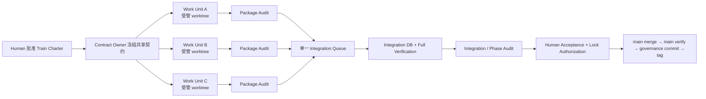

# XLB 多工程队并行施工治理设计

> 状态：`FORMALLY ADOPTED — EXECUTION SYSTEM BOOTSTRAP / NOT_ENABLED`
> 决策日期：2026-07-14（Asia/Shanghai）
> Human 决策：P-01～P-18 全部选择 A；随后明确授权植入项目执行系统并纳入正式版本控制
> 追溯：[正式项目工程治理宪法](./01_PROJECT_CONSTITUTION_DRAFT.md)、[当前施工模型](./02_CURRENT_ENGINEERING_EXECUTION_MODEL.md)、[治理差距](./03_GOVERNANCE_GAP_ANALYSIS.md)、[ADR Decision Engine](./04_ADR_DECISION_ENGINE_DESIGN.md)、[Worktree 调查](./05_WORKTREE_INVESTIGATION_REPORT.md)
> 当前权限：只允许治理文件、`AGENTS.md`、Skills、本地人工 Gate、registry/manifest/lease/reservation/queue，以及 Manifest 驱动的 Compose 静态配置验证；当前不授权创建受管验证工棚或 Docker/DB/Redis runtime resource，Runtime Canary 未授权且未执行；不修改业务 runtime、migration、hosted CI、Phase 状态或 Lock，不授权 Phase 30/31 业务 WRITE

## 0. 决策结果

Human Owner 选择的目标模型是：

> **多工棚、单总闸：多个 Work Unit 在受管隔离 worktree 中并行施工；共享契约、canonical writer、migration ledger、总装队列、main 和 Phase Lock 串行保序。**

本文件既记录政策选择，也约束本轮治理执行系统 candidate。`G:\xlb100` 保持 canonical integration root，只有 `G:\xlb100-worktrees\<train-id>\<work-unit-id>` 的登记工棚可进入受管池。candidate 在形成 immutable commit、通过独立审计并由 Human 确认前必须保持 `BOOTSTRAP / NOT_ENABLED`；任何业务 WRITE 还必须取得具体 Train Charter。（Gap: G-02, G-03, G-04, G-13）

### 0.1 P-01～P-18 Human 决策记录

| ID | Human 选择 | 已确认的设计决定 | 明确不表示 | Gap |
|---|---|---|---|---|
| P-01 | A | 多工程队隔离施工、公共管线和总闸串行 | 不允许任意 worktree 自由写 | G-02, G-03, G-04 |
| P-02 | A | 批次获批后由 General Contractor Agent 管理受管 worktree pool | 不立即创建/删除 worktree | G-04, G-08 |
| P-03 | A | 每批次指定唯一 Contract、Migration、Integration Owner | Agent role 不获得 Human/Lock authority | G-03, G-08, G-13 |
| P-04 | A | migration 提前预约；放弃编号永久留空、不复用 | 不授权当前 migration 写入 | G-03, G-12 |
| P-05 | A | 每个 WRITE worktree 使用独立 Compose project、MySQL database/volume/port 与 Redis instance/namespace/volume/port | production/staging 不在范围内 | G-02, G-03, G-12, G-13 |
| P-06 | A | 无直接依赖的后续 Work Unit 可在 predecessor Lock 前形成 candidate | candidate 不得自行 merge/Lock | G-01, G-02, G-09, G-14 |
| P-07 | A | contract/base 实质变化使旧 candidate/evidence 自动 `STALE` | Integration Owner 不得猜测兼容 | G-12, G-14 |
| P-08 | A | package audit + integration/Phase audit 两级只读审计 | package PASS 不等于 Phase PASS | G-07, G-12 |
| P-09 | A | Human 一次批准 Train Charter；章程内连续施工，异常再停线 | 不授权章程外或下一批次 | G-01, G-08, G-13 |
| P-10 | A | 局部失败只停相关 Work Unit；共享基线问题才停整个批次 | 不得掩盖跨域 P0/P1 | G-02, G-07, G-14 |
| P-11 | A | 施工并行；Phase main merge、tag、Lock 逐个串行 | 不采用多 Phase 单一大 Lock | G-06, G-09 |
| P-12 | A | 仅 Owner 可 rebase 未共享 Work Unit branch；共享历史禁止改写 | 禁止 main/shared force-push | G-05, G-12, G-14 |
| P-13 | A | 仅满足严格 closure 条件的受管 worktree 可在未来自动回收 | 历史附加 worktree 不自动处理 | G-04, G-05 |
| P-14 | A | 当前 Phase 29 不拆分；Phase 29 Lock 后以 Phase 30/31 为首个试点 | 不改变 Phase 29 scope/state | G-01, G-02, G-04 |
| P-15 | A | 每个 Train 默认最多三支并行 WRITE 工程队 | 超过三支需重新 Human 裁决 | G-02, G-08, G-12 |
| P-16 | A | P0/P1/P2 必须修复并复审；P3 可留痕后继续 | Audit PASS 不替代 Human acceptance | G-07, G-12 |
| P-17 | A | 先运行可审计人工队列试点；稳定后再单独裁决 CI 自动化 | 本轮不改 CI | G-10, G-12, G-16 |
| P-18 | A | 固定 Lock closure：验证→Human 授权→merge→main 复验→治理提交→tag；push/deploy 单独批准 | 不执行当前 Lock/push/deploy | G-06, G-08, G-13 |

## 1. 为什么要从 Phase 串行改为依赖 DAG

现行正式设计把 Phase 26→31 的 implementation、migration、merge 和 Lock 全部排成一条串行链；Phase Prompt Pack 也因为只有一个有效 worktree 而只允许并行只读工作。这是真实的现行规则。（Gap: G-01, G-02, G-03, G-04）

但当前文件不能证明 Phase 29→30、Phase 30→31 的所有代码都存在技术硬依赖：

- Risk-Control 初期只允许 observe、record、case、manual review，并禁止直接修改 Order/Payment/Ledger 等受保护域；
- Analytics/BI 以既有 source contract 为输入并写独立 read model，禁止修改来源表；
- Review signal、Marketing event、Risk metric 等可以作为有依赖的独立 adapter/work package 等待，不需要阻塞所有无关核心施工。

因此目标治理把四条顺序拆开：

| 顺序 | 目标规则 |
|---|---|
| Phase/业务验收顺序 | 继续表达业务边界和最终依赖顺序 |
| Work Unit 施工顺序 | 由 dependency DAG + frozen contract 决定，可并行 |
| 共享资源写入顺序 | Contract/Migration/Integration 单 owner 串行 |
| main/tag/Lock 顺序 | 逐 Phase 串行，不并发 |

## 2. 目标结构



并行收益来自施工、focused verification 和 package audit 的重叠；不来自放开 main、migration ledger 或 Lock。（Gap: G-02, G-03, G-06, G-07）

## 3. 治理对象与状态

### 3.1 Release Train / 施工批次

Release Train 是 Human 一次批准的并行施工范围，不替代 Phase tag，也不把多个 Phase 合成一个 Lock。Train 至少记录：

- `trainId`、目标 Phase/Work Unit 列表；
- immutable base commit/tag；
- dependency DAG；
- 各 Work Unit owner、路径 lease、contract revision、migration reservation；
- 最大 WRITE 队伍数（默认 `3`）；
- in-scope/out-of-scope 与 L3/L4 风险上限；
- evidence/audit 计划；
- package 与 train stop conditions；
- main/Lock 顺序与明确禁止的 production/Provider/push 动作。

Train 状态设计为：

```text
DRAFT
  → CHARTER_HUMAN_APPROVED
  → ASSEMBLING
  → TRAIN_VERIFIED
  → HUMAN_ACCEPTED
  → PHASE_LOCKS_COMPLETED
  → CLOSED
```

独立 validation Train 使用 `PLANNED → VALIDATION_AUTHORIZED → TRAIN_VERIFIED`，不进入业务施工链，也不产生 business WRITE authority。

`CHARTER_HUMAN_APPROVED` 只授权章程内 local construction；不自动授权 main、Lock、push、production 或下一 Train。（Gap: G-01, G-08, G-09, G-13）

### 3.2 Work Unit

Work Unit 是最小 WRITE parallel 单位。状态设计为：

```text
PLANNED
  → WAITING_DEPENDENCY | CONTRACT_FROZEN
  → CONSTRUCTION_AUTHORIZED
  → IN_CONSTRUCTION
  → PACKAGE_VERIFIED
  → PACKAGE_AUDITED
  → QUEUED
  → INTEGRATED
  → CLOSED
```

状态旁路严格按机器 transition graph 执行：

- `STALE`：仅在 candidate/package 已形成后因 base/contract/dependency/evidence revision 变化进入；
- `BLOCKED`：P0/P1/P2、lease 冲突、越 scope、migration collision 或 authority 缺失；
- `ABANDONED`：Human/Train Charter 明确取消，保留 reservation/history。

`PACKAGE_AUDITED` 或 `INTEGRATED` 不表示 Phase `LOCKED` 或 production ready。（Gap: G-01, G-07, G-09, G-14）

## 4. 角色与 Authority

| 角色 | 职责 | 无权执行 | Gap |
|---|---|---|---|
| Human Owner | 唯一 Human/Architecture/Financial/Security/Lock Authority；批准 Train Charter、异常扩大、main merge/Lock、push/production | 不需要亲自执行 Git、migration 或测试命令 | G-08, G-13 |
| General Contractor Agent | 将 Human 决定编排为 Work Units；维护 manifest/lease/status；在未来启用后管理 worktree pool | 不批准 L2～L4，不 merge main，不 Lock | G-02, G-04, G-08 |
| Construction Owner | 在唯一 Work Unit 的 lease 范围内施工、验证、修复 finding | 不写 lease 外路径，不改 shared spine/main/Lock | G-02, G-03 |
| Contract Owner | 串行冻结 shared types/validators/API/event contract revision | 不代替 domain owner 决定业务语义，不授权 runtime | G-03, G-14 |
| Migration Owner | 串行分配 reservation、核对 filename/table/collision、维护 ledger | 不并行改变 schema ledger，不执行 production migration | G-03, G-13 |
| Integration Owner | 串行处理 queue、公共入口和 integration branch；冲突退回原 Owner | 不猜测业务冲突，不直接批准 main/Lock | G-03, G-06, G-13 |
| Audit Agent | 对 immutable candidate 只读检查并复审修复；执行 package/train audit | 不写 candidate，不授予 merge/Lock | G-07, G-08 |

## 5. Managed Worktree Policy

### 5.1 目录与用途

获批的受管目录政策是：

```text
G:\xlb100                                      control / integration / main / Lock
G:\xlb100-worktrees\<train-id>\<work-unit-id>  managed construction worktree
```

`G:\xlb100` 保持唯一 canonical integration root，`refs/heads/main` 解析出的固定 commit 是唯一 committed control authority。Agent/Gate 必须从该 commit 读取 Phase、registry、Manifest、lease、reservation 与 queue，不得读取 canonical 目录当前 checkout 来替代 control ref。`AGENTS.md` 已批准上述严格路径作为唯一受管 pool 政策，但 execution registry 仍为 `BOOTSTRAP / NOT_ENABLED`；在独立审计和 Human 启用前不得据此创建可执行 Work Unit。每个未来工棚必须由 Git worktree 元数据连接同一 repository，并绑定唯一 branch/manifest。（Gap: G-04）

现有 `G:/xlb100-p0-architecture-foundation` 是历史附加 worktree；根据 05 报告，它没有新模型要求的 manifest/lease/lifecycle。P-13 明确规定它不自动纳入、不自动清理，也不能作为未来 WRITE parallel 授权先例。（Gap: G-04）

### 5.2 Work Unit Manifest 最低字段

| 字段 | 要求 |
|---|---|
| `workUnitId`, `trainId`, `targetPhase` | 稳定且唯一 |
| `owner`, `role`, `status` | 单一 Construction Owner 和当前状态 |
| `worktreePath`, `branch`, `baseCommit` | 受管路径、唯一 branch、固定 base |
| `dependencies` | Work Unit/contract/migration/source dependencies |
| `allowedPaths`, `forbiddenPaths` | 排他写 lease；实际 diff 必须是 allowedPaths 子集 |
| `semanticOwnership` | 受影响业务真相/canonical writer，即使文件不同也要声明 |
| `contractRevision` | 具体 commit/hash；material change 触发 `STALE` |
| `migrationReservation` | number、filename、tables、status；无 migration 时显式 `NONE` |
| `database`, `redisNamespace` | 隔离环境标识；不可写 shared/production |
| `evidencePlan`, `auditRefs` | focused/full/audit 要求与 candidate commit |
| `createdAt`, `expiresOrClosesAt` | 生命周期和结案条件 |

### 5.3 Worktree 自动回收条件

General Contractor 只有在未来执行模型已获批且同时满足以下条件时，才可回收受管 worktree：

1. path 位于获批 managed pool；
2. Work Unit 为 `CLOSED` 或 `ABANDONED`；
3. worktree clean 且无 untracked；
4. 无未合并/未归档 candidate commit；
5. 无其他 Work Unit 依赖该 branch/commit；
6. candidate、evidence、reservation 与 closure reason 已登记。

任一条件未知或存在 dirty/untracked 时，必须 fail closed 并提交 Human 选择题。（Gap: G-04, G-05, G-08）

## 6. File、Domain 与 Semantic Lease

并行安全同时依赖两种排他 lease：

- **Path lease**：防止两个 Work Unit 修改同一路径；
- **Semantic lease**：防止不同文件同时改变同一金额、状态机、事件版本、数据库表或 canonical workflow。

| 写入类型 | 分类 | Owner |
|---|---|---|
| domain-owned 新模块、独立页面、独立新测试 | `WORK_UNIT_WRITE_ELIGIBLE` | 对应 Construction Owner |
| shared type/validator/API/event contract 最终 revision | `SERIAL_CONTRACT_LANE` | Contract Owner |
| `packages/*/src/index.ts`、`backend/src/app.ts`、`package.json`、全局 config/fixture | `SERIAL_INTEGRATION_LANE` | Integration Owner |
| Order/Pricing/Payment/Event Outbox 等 canonical shared runtime | `SERIAL_CANONICAL_LANE` | 原 domain owner + Integration Owner |
| migration number/ledger、dictionary、共享 schema 验证 | `SERIAL_MIGRATION_LANE` | Migration Owner |
| phase/preflight gates、`CURRENT_STATE`、registry、Lock report | `SERIAL_GOVERNANCE_LANE` | Integration/Lock flow |
| main、tag、Lock、push/production | `SERIAL_OR_SEPARATE_AUTHORITY` | Human authorization required |

合并前必须证明：`actual changed paths ⊆ allowedPaths`，并证明没有越过 semantic ownership。越 lease 的 candidate 自动离开 queue，退回原 Work Unit，不由 Integration Owner 顺手扩 scope。（Gap: G-03, G-12, G-13）

### 6.1 受管串行 canonical-writer Work Unit

当一个维修单元必须修改 `scripts` 或根级 Integration Owner 保护面时，不得把它伪装成普通并行 Work Unit。当前执行模型只开放一个最小串行委派：Manifest 必须使用 owner `INTEGRATION-OWNER`、role `SERIAL_CANONICAL_WRITER`、`canonicalWriterKey=integration-queue-and-integration-branch`，并显式引用既有 `LEASE-SERIAL-INTEGRATION-QUEUE`。所有 `allowedPaths` 必须是该 writer 保护面的严格子集；`governance/execution/**` 永远禁止从施工 Worktree 自修改。

同一 canonical writer 从 `PLANNED` 起最多由一个非终态 Work Unit 单占；`BLOCKED`/`STALE` 不释放，只有 `CLOSED`/`ABANDONED` 才释放。该单元不计入最多三支 parallel WRITE 队伍，Gate 只能输出 `WORK_UNIT_SERIAL_CANONICAL_WRITER_ELIGIBLE`。它仍必须满足 Human 批准的 Train、contract freeze、隔离环境、证据与两级审计，且不获得 main、Lock、push 或 production authority。

## 7. Contract Freeze 与失效

Shared contract 采用“先冻主干，再铺支线”：

1. Contract Owner 串行提交 shared types/validators/API/event contract；
2. Contract review 形成 immutable revision；
3. Backend/App/Test 等消费者 Work Unit 绑定该 revision 并并行施工；
4. material change 发生时，所有旧 revision candidate/evidence 进入 `STALE`；
5. 原 Owner 重新同步、修复、验证并接受 package audit；
6. Integration Owner 不得创建未获 domain owner 接受的兼容猜测。

机器执行规则：每个 Business Train 以 `frozenContractRevision`、`contractAuthorityRef` 与 `contractProtectedPathsDigest` 构成唯一 current contract authority。`contractAuthorityRef` 必须是 Contract Owner 的 strict JSON record，并逐项绑定 canonical shared-contract writer lease 中的 protected paths。Gate 同时重算冻结 revision、当前 integration HEAD 与 Work Unit candidate 的 path object digest；任一不一致即 `STALE`。该检查从 Work Unit `CONTRACT_FROZEN` 起生效，不得推迟到 `PACKAGE_VERIFIED`。（Gap: G-03, G-12, G-14）

允许 additive/versioned compatibility，但不得让多个 branch 长期维持互相冲突的 canonical truth。（Gap: G-03, G-12, G-14）

## 8. Migration Reservation 与环境隔离

### 8.1 Reservation Ledger

每条 reservation 至少包含：

| 字段 | 规则 |
|---|---|
| `number`, `expectedFilename` | 全局唯一；没有 reservation 不得创建文件 |
| `trainId`, `workUnitId`, `owner` | 唯一责任链 |
| `baseCommit`, `tables`, `semanticScope` | 冲突与重放判断依据 |
| `status` | `RESERVED / MATERIALIZED / MERGED / ABANDONED` |
| `createdAt`, `closedAt`, `reason` | 审计与生命周期 |

编号一旦 `RESERVED` 就不分配给另一 Work Unit；`ABANDONED` 形成永久空洞。SQL、commit 或 evidence 形成后不得临时改号。已 Lock migration 不可修改。（Gap: G-03, G-12）

### 8.2 DB/Redis Isolation

每个 WRITE Work Unit 必须同时使用独立 Compose project、MySQL database/volume/port 与 Redis instance/namespace/volume/port；不得把“database 名不同”或“namespace 不同”当作共享容器、volume 或端口的替代。命名必须可追溯到 `trainId/workUnitId`。各队只运行自己的 migration/seed/integration test；最终 merge queue 在全新的 integration database 中串行重放完整 migration ledger。

当前部分脚本/环境仍可能硬编码 `xlb_local`、容器名或共享 Redis；在完成参数化与隔离验证前，这些命令只能进入串行测试 lane。production/staging migration、replay、backfill 和 purge 始终需要单独 L4 Human 授权。（Gap: G-02, G-03, G-12, G-13）

## 9. Parallelism Classification

### 9.1 可并行候选

只有同时满足以下条件的 Work Unit 才能在未来启用后输出 `WORK_UNIT_PARALLEL_ELIGIBLE`：

1. Train Charter 已由 Human 明确批准；
2. managed worktree/branch/owner/lease 唯一；
3. dependency 已满足或明确停在 `WAITING_DEPENDENCY`；
4. shared contract 已冻结到 revision；
5. migration 已预约或显式 `NONE`；
6. DB/Redis 隔离已证明，或该 Work Unit 不写状态；
7. 不触碰 serial lane 或其他 semantic owner；
8. evidence/audit/stop conditions 完整；
9. 同一 Train 同时 WRITE Work Unit 不超过 `3`。

缺任一条件时不得降级解释为“路径不同所以可并行”。（Gap: G-02, G-03, G-04, G-12, G-14）

### 9.2 必须串行或单独授权

- Contract finalization、migration ledger、canonical shared runtime、integration queue、shared DB full replay、global gates、main、governance metadata、tag、Lock：`SERIAL_WRITE`；
- 显式绑定 Integration Owner canonical-writer lease 的受管维修单元：`WORK_UNIT_SERIAL_CANONICAL_WRITER_ELIGIBLE`，一次一个，不属于 parallel WRITE；
- production、Provider activation、push/deploy、historical replay/backfill、purge：`SEPARATE_L4_AUTHORITY_REQUIRED`；
- 任意未登记 worktree、自由共享写、branch ownership 不明、shared DB 并发写：`BLOCKED`。

## 10. Integration Queue

Work Unit branch 不直接进入 main。单一队列执行：

1. 验证 manifest、candidate commit、lease、contract revision、migration reservation 和 package audit；
2. 同步最新 integration branch；只允许未共享 Work Unit branch 由其 Owner rebase；
3. 冲突、越 lease 或 material change 时退回原 Work Unit；
4. 运行 focused/boundary/delta tests；
5. 由 Integration Owner 串行合入 integration branch；
6. 后续 queue item 重新检查 base/contract/evidence freshness；
7. 所有 Work Unit 合入后，在 fresh integration environment 执行 migration replay、full regression、build/typecheck/preflight/E2E 等适用 evidence；
8. 独立 Integration/Phase Audit；
9. Human 接受并单独授权 main merge/Lock。

Integration Owner 不拥有业务冲突裁决权；其职责是保序和退回，不是代替 domain owner 编写修复。（Gap: G-03, G-06, G-07, G-12, G-14）

## 11. Audit、Evidence 与停线

### 11.1 两级 Audit

| Audit | 输入 | 结论范围 |
|---|---|---|
| Package Audit | immutable Work Unit candidate commit + manifest + focused evidence | 只证明该 package 在指定 base/contract/environment 下可排队 |
| Integration/Phase Audit | immutable integrated candidate + full/cross-domain evidence | 证明组合后的 Phase candidate 是否可提交 Human acceptance |

Audit Agent 必须独立于被审 candidate 的 writer，并保持只读。Writer 修复产生新 commit 后，旧 PASS 失效，必须复审。（Gap: G-07, G-12, G-14）

### 11.2 Finding Closure

- P0/P1：立即暂停受影响范围；若命中 shared truth/security/money/integration baseline，暂停整个 Train；
- P2：相关 Work Unit 不得进入 queue，必须修复并复审；
- P3：记录 owner、影响和后续处理，可在无升级风险时继续；
- Phase Lock 前未解决 P0/P1/P2 必须为零。

### 11.3 局部与全局停线

普通编译、focused test、页面或 package finding 只停相关 Work Unit。以下情况暂停整个 Train：

- shared contract material change；
- migration number/schema ledger collision；
- canonical business truth/semantic ownership 冲突；
- P0/P1 跨域安全、资金、隐私或数据一致性风险；
- integration base、source facts 或 common environment 不可信。

Human 一次批准 Train Charter 后，章程内 Work Unit 可连续施工；越 scope、新增 L3/L4 risk、重大 finding、production/Provider/Lock 请求仍需交互式选择题。（Gap: G-01, G-07, G-08, G-13, G-14）

## 12. Git 历史与 Worktree 生命周期

- 未共享 Work Unit branch：仅 Owner 可 rebase；rebase 后旧 candidate/evidence 自动失效；
- 已共享 branch、已审计 commit、integration branch、main、tag：不可改写；
- main/shared branch 禁止 force-push；
- 冲突退回 Work Unit Owner，不在 Integration Owner 窗口临时改业务语义；
- 自动回收仅适用于第 5.3 节全部条件满足的受管 worktree；
- branch 删除、remote push 和历史附加 worktree 处置不由本设计自动授权。

## 13. 固定 Phase Lock Closure

P-18 决定未来统一顺序为：

1. Work Units 全部进入 integration branch；
2. full verification 与 Integration/Phase Audit 完成，P0/P1/P2 为零；
3. Human 明确接受 candidate，并明确授权 merge/Lock；
4. Phase branch `--no-ff` 合入 main；
5. main 执行关键 post-merge verification；
6. 更新 `CURRENT_STATE`、phase registry、Lock report；
7. 提交最终 governance metadata commit；
8. canonical Phase tag 指向该最终治理 commit；
9. push/deploy 只有在 Human 另行显式授权后才能执行。

此顺序不改写既有 tag/Lock 历史，也不触发当前 Phase Lock。（Gap: G-06, G-08, G-13）

## 14. Phase 30/31 首次试点设计

### 14.1 启动前提

- Phase 29 已形成 clean、immutable、按现行 authority Lock 的 predecessor `80921871baf8647b2d3b7c97f8c0fde2a88f9400`；
- canonical tag `xlb-phase29-marketing-coupon` 解引用后必须继续等于上述 commit；
- 并行执行模型已形成 `AGENTS.md`/Skills/manifest/ledger/environment checks candidate，但仍为 `BOOTSTRAP / NOT_ENABLED`；
- Human 收到通俗 Train Charter 并单独批准实际施工。

### 14.2 候选工作包

| Work Unit | 可提前范围 | 必须等待 |
|---|---|---|
| Phase 30 Risk Core | 独立 rule revision、immutable signal/case、manual review、只读 evidence reference | 未冻结的 Marketing/Review event adapter、任何受保护域 action |
| Phase 31 BI Core | 基于已 Lock source 的 metric dictionary、read-only projection、freshness/stale contract | Risk/Marketing 新事件指标、未批准 Dashboard/transport/PII/financial policy |
| Contract/Test/Audit | frozen contract、test design、fixtures lease、package audit | material contract change 后必须重新验证 |

Phase 30 与 Phase 31 最终仍分别形成 candidate，并按 Phase 30 → Phase 31 顺序逐个 main merge、verify、governance commit 和 tag。（Gap: G-01, G-02, G-09, G-14）

## 15. 执行系统植入与 Bootstrap 状态

P-17 选择“先人工可审计队列试点，再自动化”。Human 已授权本轮形成以下执行系统 candidate：

1. `AGENTS.md` 保留 canonical root 并批准严格路径的 managed worktree pool；
2. `xlb-managed-worktree` Skill 与本地人工 Gate 检查 Charter、manifest、lease、base、contract、reservation、clean immutable candidate 和 evidence freshness；
3. `governance/execution/` 固定 manifest、migration reservation、lease、Train registry 与 serial queue 的 canonical JSON/Markdown 载体；
4. worktree Compose、MySQL、Redis 与端口按 Manifest 参数化并完成静态配置校验；实际隔离 Runtime Canary 须等待执行系统 `ENABLED`、Train `VALIDATION_AUTHORIZED`、独立 safety audit 与 Human runtime validation approval；
5. Integration Queue 只接受 clean immutable commit，冲突退回原 Owner；
6. Work Unit/Train execution registry 与 Phase registry 明确分离，package 状态不得冒充 Phase Lock；
7. hosted CI 与现有 preflight 本轮不接入新 Gate；试点稳定后另行 Human 裁决。

在 candidate commit、独立审计与 Human 启用确认完成前：

- `G:\xlb100` 是唯一 canonical control/integration/main/Lock root；validation manifest 在 Bootstrap 只表示预配置，不产生工棚创建或 runtime 验证权限；
- execution registry 输出为 `GOVERNANCE_EXECUTION_BOOTSTRAP_NOT_ENABLED`；
- 不得进行 Phase 30/31 业务 WRITE、migration、shared DB 并发测试或提前 runtime candidate；
- 不得因为本文存在而修改 Phase 29、进入 Phase 30/31、merge、Lock、push 或 production。

## 16. Gap / Dependency 处置范围

| Gap / UD | 本次 Human 决定 | 当前执行状态 |
|---|---|---|
| G-02 / parallel bottleneck | 选择 Work Unit 并行、serial integration/Lock | `ENFORCEMENT CANDIDATE — NOT_ENABLED` |
| G-03 / UD-01 | 选择 owner leases、contract lane、migration reservation、merge queue | `ENFORCEMENT CANDIDATE — NOT_ENABLED` |
| G-04 / UD-02 | 选择 managed pool、manifest、生命周期与清理条件 | `ENFORCEMENT CANDIDATE — NOT_ENABLED`；历史 worktree 不自动处置 |
| G-06 / UD-03 | 选择固定 Lock closure 和独立 push authority | `RESOLVED — DESIGN ONLY` |
| G-07 / UD-05 | 选择两级只读审计和 P0～P3 closure | `ENFORCEMENT CANDIDATE — NOT_ENABLED` |
| G-01/G-09 / UD-06 | 定义 Train/Work Unit 状态并保持 Phase Lock 独立 | execution registry candidate 已建立；Phase registry 独立 |
| G-10～G-12 / UD-07 | 使用 ADR evidence matrix 与本文件 package/train evidence | 统一工程 baseline 仍需后续植入核验 |
| G-13 / UD-08 | 分离 Charter local construction、integration、main/Lock、push/production authority | production/provider 仍需逐案 L4 授权 |
| G-14 / UD-09 | 选择 revision binding、`STALE` 与重新验证 | `ENFORCEMENT CANDIDATE — NOT_ENABLED` |

## 17. 免责声明

本文件是正式工程施工宪法的并行执行模型，但不是任何具体业务 Train 的施工许可证。本轮 Bootstrap candidate 只可修改 canonical 治理执行文件；不得创建受管 validation worktree，不得创建 disposable Docker/DB/Redis runtime resources，也不得修改 Phase 状态、业务 runtime、migration、hosted CI、main、tag 或 Lock。执行系统须经 candidate commit、独立审计与 Human 确认后才能从 `BOOTSTRAP / NOT_ENABLED` 切换；Runtime Canary 还必须另行取得 `VALIDATION_AUTHORIZED`、独立 safety audit 与 Human runtime validation approval；任何实际业务 Train 仍必须由唯一 Human Owner 通过通俗 Train Charter 明确批准。
